# NexTech Systems - Enterprise Computer & Technology E-Commerce Platform

[](https://nextjs.org/)
[](https://react.dev/)
[](https://www.typescriptlang.org/)
[](https://expressjs.com/)
[](https://tailwindcss.com/)
[](https://www.cloudflare.com/)
[](.github/workflows/ci.yml)
[](.github/workflows/codeql.yml)
[](.github/dependabot.yml)
[](SECURITY.md)
[](LICENSE)

NexTech Systems is an enterprise B2B and B2C computer hardware and technology commerce platform. Built for high-performance computing (HPC), AI workstation hardware, gaming systems, datacenter rack servers, and enterprise networking equipment, the platform incorporates a real-time PC Builder Compatibility Engine, Multi-Tenant Reseller Portals, Dynamic Multi-Currency Exchange, UAE FTA VAT 201 Compliance, Authoritative Server-Side Pricing, E-Bill Invoicing, Customer Wallet Ledger, Business Intelligence Analytics, and Cloudflare Edge Security.

---

## Table of Contents

- [Key System Capabilities](#key-system-capabilities)
- [System Architecture](#system-architecture)
  - [High-Level Architectural Topology](#high-level-architectural-topology)
  - [Multi-Tenant Reseller Subdomain Architecture](#multi-tenant-reseller-subdomain-architecture)
  - [Edge Security and Anti-DDoS Architecture](#edge-security-and-anti-ddos-architecture)
  - [Database Architecture and Dynamic API Fetching Model](#database-architecture-and-dynamic-api-fetching-model)
- [Core Business Workflows](#core-business-workflows)
  - [Admin Sales Order Creation and Stock Allocation](#admin-sales-order-creation-and-stock-allocation)
  - [Supplier Procurement and Purchase Order Lifecycle](#supplier-procurement-and-purchase-order-lifecycle)
  - [Commercial Intelligence: Sales vs. Purchase Analytics Engine](#commercial-intelligence-sales-vs-purchase-analytics-engine)
  - [PC Builder and Compatibility Matrix Flow](#pc-builder-and-compatibility-matrix-flow)
  - [Server-Side Pricing, Checkout and E-Bill Flow](#server-side-pricing-checkout-and-e-bill-flow)
  - [Excel Catalog Ingestion and Vendor Approval Pipeline](#excel-catalog-ingestion-and-vendor-approval-pipeline)
  - [Real-Time BI Analytics and Traffic Intelligence](#real-time-bi-analytics-and-traffic-intelligence)
  - [Role-Based Access Control Lifecycle](#role-based-access-control-lifecycle)
- [Technology Stack](#technology-stack)
- [Project Directory Structure](#project-directory-structure)
- [API Specification](#api-specification)
  - [Authentication and Identity](#authentication-and-identity)
  - [Products and Catalog](#products-and-catalog)
  - [Currencies and Exchange Rates](#currencies-and-exchange-rates)
  - [Hardware Specifications](#hardware-specifications)
  - [Dynamic CMS Content and Bento Trust Grid](#dynamic-cms-content-and-bento-trust-grid)
  - [PC Builder Compatibility](#pc-builder-compatibility)
  - [Cart and Pricing Engine](#cart-and-pricing-engine)
  - [Orders and Electronic E-Bills](#orders-and-electronic-e-bills)
  - [Supplier Purchase Orders and Procurement](#supplier-purchase-orders-and-procurement)
  - [Customer Wallet Ledger](#customer-wallet-ledger)
  - [VAT 201 Reporting](#vat-201-reporting)
  - [Reseller Vendor Portal](#reseller-vendor-portal)
  - [Cloudflare Security and Anti-Bot](#cloudflare-security-and-anti-bot)
  - [Admin Command Center, Backups, and Analytics](#admin-command-center-backups-and-analytics)
- [Getting Started and Local Development](#getting-started-and-local-development)
  - [Prerequisites](#prerequisites)
  - [Unified Workspace Commands](#unified-workspace-commands)
  - [Backend Setup](#backend-setup)
  - [Frontend Setup](#frontend-setup)
  - [Environment Configuration](#environment-configuration)
- [Automated Integration Test Suite](#automated-integration-test-suite)
- [Live Endpoint Verification Suite](#live-endpoint-verification-suite)
- [Security Hardening and Defense Architecture](#security-hardening-and-defense-architecture)
- [Vercel and Cloud Deployment](#vercel-and-cloud-deployment)
- [License](#license)

---

## Key System Capabilities

1. **Real-Time PC Builder Compatibility Engine**:
   - Hardware validation evaluating CPU socket compatibility (`LGA1700`, `AM5`, etc.), memory standards (`DDR5` vs `DDR4`), and motherboard form factors.
   - Cumulative TDP consumption calculations featuring an automated +30% safety headroom recommendation for Power Supply Units (PSU).
   - Direct bundle export enabling one-click transfer of all validated hardware components into the active cart.

2. **Real-Time Multi-Currency Conversion Engine**:
   - Dynamic foreign exchange rate integration using open exchange rate feeds with cached fallback mechanisms.
   - Real-time conversion across major currencies (AED, USD, EUR, GBP, SAR, KWD, QAR, OMR, BHD, JPY, CAD, AUD, INR) with AED as the base currency.
   - User-selectable currency dropdown in the primary navigation bar with instant client-side price recalculations and persistent preferences.

3. **UAE FTA VAT 201 Tax Reporting Engine**:
   - Authoritative calculation of Standard-Rated Supplies (5%), Zero-Rated Supplies, Exempt Supplies, and Reverse Charge Provisions.
   - Periodic return calculation tracking Output Tax, Recoverable Input Tax, and Net Tax Payable/Refundable.
   - Protected administrative summary endpoint (`/api/vat/summary`) adhering to UAE Federal Tax Authority guidelines.

4. **Multi-Tenant Reseller Portals**:
   - Isolated tenant routing (`/reseller/[code]/dashboard` or dedicated subdomain) with partner-specific branding, sales attribution, and commission auditing.
   - Excel Batch Importer (`.xlsx`): Resellers download standard templates, upload catalog spreadsheets, inspect auto-validated records, and submit hardware items into the moderation queue.

5. **Authoritative Server-Side Pricing and E-Bill Invoicing**:
   - Strict server-side tax computations, voucher validation (`TECH10`, `FALL2026`), and insured delivery rules.
   - Generation of official Electronic Tax Invoices (E-Bills) complete with verification seals, Tax Registration Numbers (TRN), and itemized vendor breakdowns suitable for accounting review and PDF export.

6. **Customer Wallet Ledger**:
   - Integrated store credit system supporting real-time top-ups, transaction auditing, and split payments (Wallet Balance + Credit Card).
   - Secondary administrative security PIN verification guarding high-value balance adjustments and approvals.

7. **Business Intelligence and Telemetry Dashboard**:
   - Executive dashboard presenting Gross Merchandise Value, Net Margins, Order Velocity, Conversion Rates, and Average Order Value (AOV).
   - Timeseries sales distributions, category breakdowns, price-to-performance scatter plots (Cinebench, 3DMark), top-performing SKUs, and low-stock alerts.
   - Visitor traffic distribution analysis covering GCC regional zones and international geographies.

8. **Vercel-Optimized Cloud Resilience**:
   - Built-in Next.js serverless route handlers for taxonomy resolution (`/api/admin/categories`, `/api/admin/brands`, `/api/products/categories`, `/api/products/brands`).
   - Enterprise taxonomy presets ensuring hardware catalog dropdowns and selection modals remain populated regardless of backend cold starts or deployment environments.
   - Reverse proxy rewrites preventing browser Mixed Content blocking across HTTPS deployments.

9. **Admin Direct Sales Order Creation & Stock Allocation**:
   - Interactive modal workflow on [`/admin/orders`](http://localhost:3000/admin/orders) allowing administrators to dispatch hardware orders directly for enterprise and corporate clients.
   - Client consignee selector with database customer auto-fill or custom/guest corporate consignee address entry.
   - Dynamic hardware line item selector with live stock constraints, instant price calculations, UAE VAT (5%), insured shipping fees, and grand total computation.
   - Authoritative backend order creation (`POST /api/admin/orders`) that verifies catalog stock, decrements inventory, generates order numbers (`ORD-YYYY-XXXXXX`), and records security audit events.

10. **Supplier Purchase Orders & Wholesale Procurement**:
    - Dedicated wholesale procurement management portal on [`/admin/purchase-orders`](http://localhost:3000/admin/purchase-orders) to issue, monitor, and receive component shipments from hardware manufacturers (Intel, NVIDIA, Corsair, Samsung, Dell, Asus).
    - Line item tracking with unit cost price, order quantities, warehouse target allocation, and receiving statuses (`DRAFT`, `ISSUED`, `PARTIALLY_RECEIVED`, `RECEIVED`, `CANCELLED`).

11. **Executive Commercial Intelligence (Customer Sales vs. Supplier Procurement)**:
    - High-level commercial intelligence deck on [`/admin`](http://localhost:3000/admin) and [`/admin/analytics`](http://localhost:3000/admin/analytics) comparing Outgoing Sales Revenue against Inbound Supplier Procurement Spend.
    - Real-time Merchandise Gross Margin Spread (%) and Sales-to-Purchase Multiplier Ratio tracking capital recovery.
    - Side-by-side live feeds streaming the latest customer sales transactions alongside recent supplier purchase orders.

12. **Global Command Palette (`Cmd+K` / `Ctrl+K`)**:
    - Omnipresent keyboard-accessible command bar (`GlobalCommandPalette.tsx`) providing fast keyboard navigation, real-time product search with SKU thumbnails, category jumping, and administrative shortcuts.

13. **Dynamic Visual CMS & Bento Trust Architecture**:
    - Interactive homepage section arranger (`/admin/cms`) allowing administrators to reorder homepage layout sections, toggle visibility, and configure promotional banners.
    - Bento Trust Grid ("Why Tech Teams Trust NexTech") featuring customizable hardware assurance cards, SLA guarantees, and enterprise badges with administrative CRUD endpoints.

14. **Database Snapshot Backups & Recovery**:
    - Administrative backup suite (`/admin/backups`) for generating and tracking full JSON database snapshots with record counts, metadata, and timestamps.

15. **Dynamic Identity & Database Decoupling**:
    - Eradication of hardcoded admin email strings; all administrative controllers dynamically resolve identities via `req.user?.email || ENV.ADMIN_DEFAULT_EMAIL` with dedicated `/api/admin/profile` introspection.
    - Clean architectural separation: [`backend/src/seed/seed-data.ts`](backend/src/seed/seed-data.ts) serves solely as a bootstrap fixture for `npm run seed`, while all frontend views query live data from Node.js Express REST APIs backed by database repositories.

---

## System Architecture

### High-Level Architectural Topology

```mermaid
graph LR
    subgraph Client_Layer["1. Client Presentation Layer"]
        B2C["Storefront Catalog"]
        PCB["PC Builder Matrix"]
        CMP["Hardware Compare"]
        CUST["Customer Dashboard"]
        ADM["Admin Command Center"]
        RES["Reseller Vendor Portal"]
    end

    subgraph Edge_Layer["2. Edge and Security Layer"]
        CF_CDN["Cloudflare Global CDN"]
        CF_WAF["WAF and Anti-DDoS"]
        CF_BOT["Turnstile Bot Shield"]
        MW["Next.js Edge Middleware"]
    end

    subgraph Frontend_App["3. Next.js 15 Web Application"]
        AUTH_CTX["Auth Context Provider"]
        CART_CTX["Cart Context Provider"]
        CURR_CTX["Currency Context Provider"]
        PAGES["App Router and SSR"]
        API_CLIENT["Type-Safe ApiClient"]
    end

    subgraph API_Gateway["4. Express API Gateway"]
        SEC["Helmet and CORS Security"]
        ROUTER["REST Master Router"]
        AUTH_MW["JWT Auth Guard"]
        RBAC["RBAC and Tenant Guard"]
    end

    subgraph Services_Layer["5. Core Domain Services"]
        SVC_PRICE["Pricing and VAT Engine"]
        SVC_CURR["Currency Exchange Service"]
        SVC_PCB["PC Compatibility Engine"]
        SVC_ORD["Order and Inventory Service"]
        SVC_EBILL["E-Bill Invoicing Service"]
        SVC_IMP["Excel Ingestion Service"]
        SVC_ANALYTICS["BI Analytics Service"]
        SVC_WALLET["Customer Wallet Ledger"]
        SVC_VAT["VAT 201 Tax Service"]
        SVC_AUDIT["Audit and Security Logging"]
    end

    subgraph Persistence_Layer["6. Persistence Layer"]
        REPO["Repository Pattern"]
        DB_STORE["DbStore Engine"]
        DATA_STORE[("JSON Document Collections")]
    end

    Client_Layer --> Edge_Layer
    Edge_Layer --> Frontend_App
    Frontend_App --> API_Gateway
    API_Gateway --> Services_Layer
    Services_Layer --> Persistence_Layer
    REPO --> DB_STORE
    DB_STORE --> DATA_STORE
```

---

### Multi-Tenant Reseller Subdomain Architecture

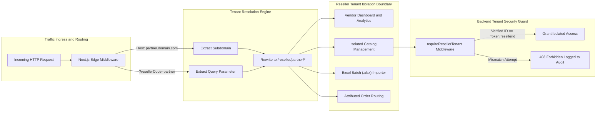

---

### Edge Security and Anti-DDoS Architecture

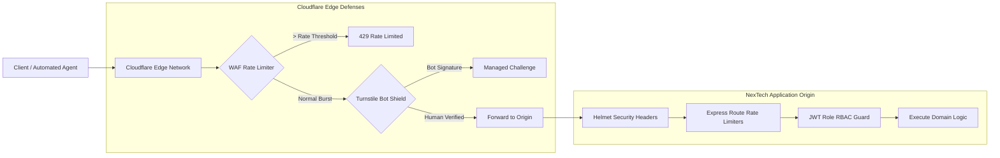

### Database Architecture and Dynamic API Fetching Model

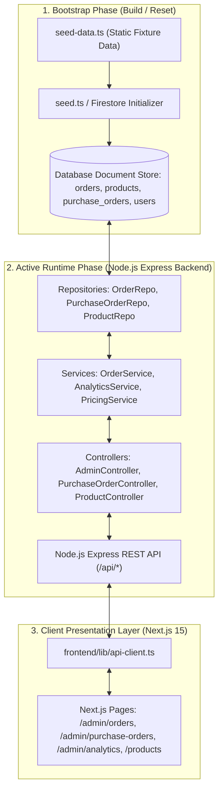

> [!IMPORTANT]
> **Architectural Separation of Seed Fixtures vs. Dynamic Database Queries:**
> - **The Role of `seed-data.ts`**: The file [`backend/src/seed/seed-data.ts`](backend/src/seed/seed-data.ts) contains static database fixture definitions. It is **never imported or executed by the frontend**. It is executed strictly by `npm run seed` or when initial database collections are empty to bootstrap test hardware SKUs, users, and transactions.
> - **Dynamic REST API Queries**: The Next.js frontend **always fetches live data dynamically from the database using Node.js Express REST APIs** via [`ApiClient`](frontend/lib/api-client.ts). When an administrator creates a sales order or supplier PO, it is committed directly to the database collection, decrements or increments stock, and updates all frontend views in real time.

---

## Core Business Workflows

### Admin Sales Order Creation and Stock Allocation

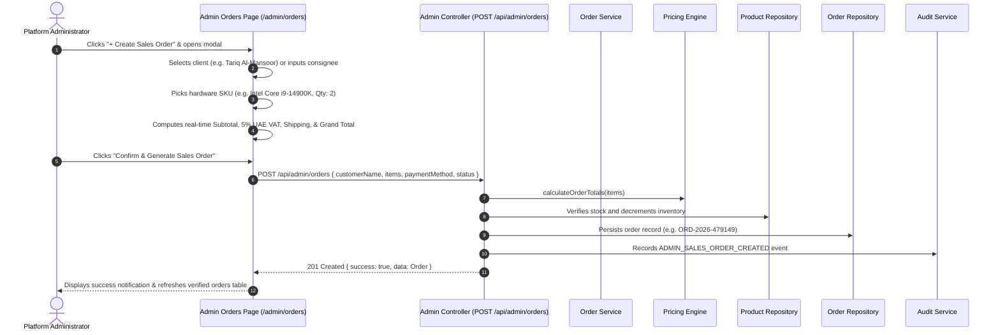

### Supplier Procurement and Purchase Order Lifecycle

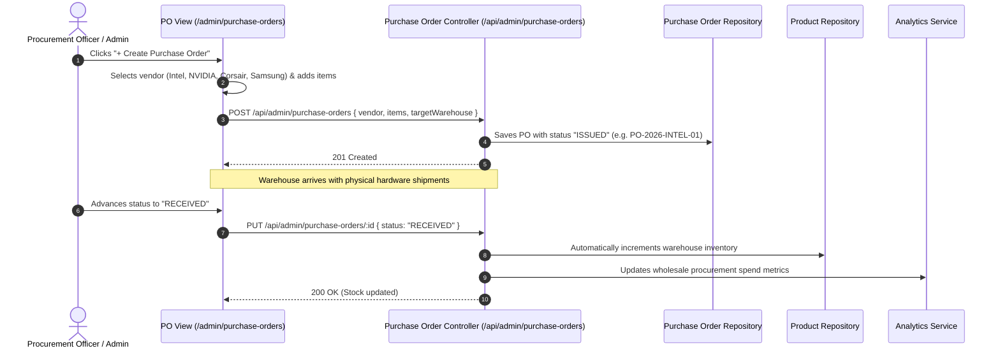

### Commercial Intelligence: Sales vs. Purchase Analytics Engine

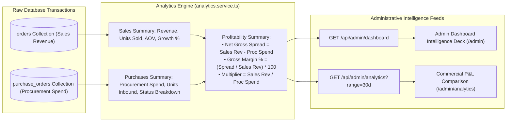

---

### PC Builder and Compatibility Matrix Flow

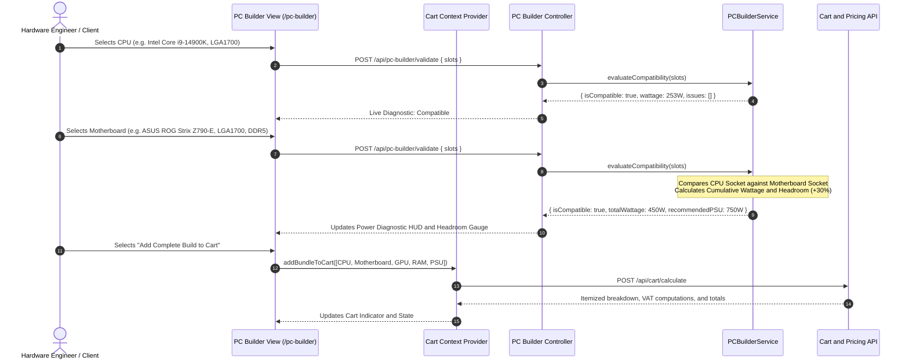

---

### Server-Side Pricing, Checkout and E-Bill Flow

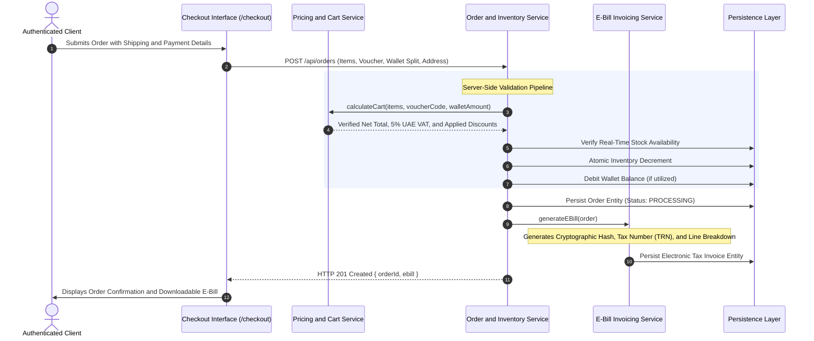

---

### Excel Catalog Ingestion and Vendor Approval Pipeline

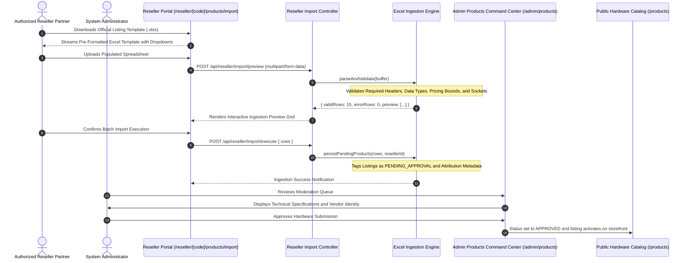

---

### Real-Time BI Analytics and Traffic Intelligence

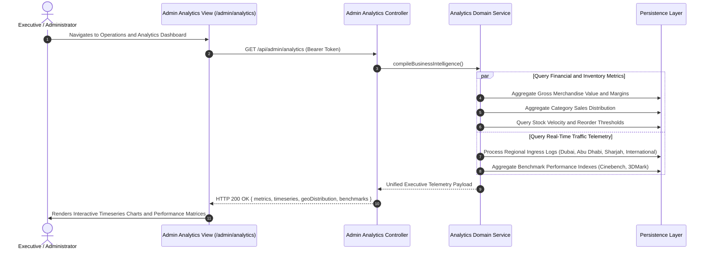

---

### Role-Based Access Control Lifecycle

```mermaid
stateDiagram-v2
    [*] --> AnonymousGuest: Visits Storefront
    
    state AnonymousGuest {
        BrowseCatalog: Browse Products and Categories
        UsePCBuilder: Configure PC Components
        CalculateCart: Cart Pricing Calculation
    }
    
    AnonymousGuest --> RegisteredCustomer: POST /api/auth/register
    AnonymousGuest --> AuthenticatedUser: POST /api/auth/login
    
    state AuthenticatedUser {
        state CustomerRole {
            ManageProfile: Account Profile and Addresses
            OrderHistory: View Personal Orders
            WalletAccess: Top-Up and Inspect Wallet
            DownloadEBill: Access Owned E-Bills
        }
        
        state ResellerRole {
            VendorDashboard: View Attributed Sales
            CatalogManagement: Add / Edit Partner SKUs
            ExcelImport: Batch Upload Hardware
            InventoryControl: Adjust Partner Stock
        }
        
        state AdminRole {
            GlobalOperations: Full Storefront Control
            SalesOrderDispatch: Direct Customer Order Creation & Dispatch
            SupplierProcurement: Issue & Receive Supplier POs
            CommercialIntelligence: Sales vs. Purchase P&L Margin Tracking
            ApproveListings: Moderate Reseller Products
            ManageTenants: Provision Reseller Accounts
            WalletAdjustments: Credit / Debit Ledgers
            AuditInspection: View Security Logs
            VatReporting: View FTA VAT 201 Summaries
            CMSArranger: Dynamic Section Ordering & Bento Trust Grid
            BackupRecovery: Instant Database Snapshots
        }
    }
```

---

## Technology Stack

| Domain | Technology / Library | Architectural Role |
| :--- | :--- | :--- |
| **Frontend Framework** | Next.js 15.2.0 (App Router), React 19.0.0 | Server-Side Rendering (SSR), Client Components, Dynamic Routing |
| **Language** | TypeScript 5.8.2 | End-to-end static type enforcement across frontend and backend |
| **Styling** | Tailwind CSS 3.4.17, Lucide Icons | Responsive enterprise interface with dark/light persistence |
| **Backend Framework** | Node.js 18+ LTS, Express 5.2.1 | High-throughput REST API gateway with modular routing |
| **Security and Edge** | Cloudflare Turnstile, Helmet, express-rate-limit | Multi-tier rate limiting, bot defense, and HTTP header hardening |
| **Cryptography** | PBKDF2 (SHA-512 / SHA-256), timingSafeEqual | Password hashing (100,000 rounds) and administrative PIN validation |
| **Data Ingestion** | XLSX (SheetJS), Multer | High-performance Excel buffer parsing and catalog ingestion |
| **Persistence** | Modular Repository Pattern, JSON DataStore | Structured document-based persistence with database interfaces |
| **Currency Feeds** | Open Exchange Rates API | Dynamic multi-currency valuation against AED base currency |

---

## Project Directory Structure

```
eCommerce_Store/
├── backend/                         # Express REST API application
│   ├── data_store/                  # Structured JSON collections
│   │   ├── audit_logs.json          # System security and administrative trail
│   │   ├── backups.json             # Database backup snapshot metadata
│   │   ├── bento_features.json      # Dynamic trust grid cards & guarantees
│   │   ├── brands.json              # Hardware manufacturer entities
│   │   ├── categories.json          # Product category definitions
│   │   ├── cms_sections.json        # Dynamic homepage section arrangement
│   │   ├── ebills.json              # Electronic tax invoices
│   │   ├── orders.json              # Customer order records
│   │   ├── products.json            # Hardware product catalog
│   │   ├── purchase_orders.json     # Supplier procurement purchase orders
│   │   ├── resellers.json           # Multi-tenant partner profiles
│   │   └── users.json               # Customer, reseller, and admin accounts
│   ├── src/
│   │   ├── config/                  # Environment and persistence config
│   │   ├── constants/               # Hardware specifications and taxonomy
│   │   ├── controllers/             # HTTP route controller implementations
│   │   ├── middleware/              # Auth, RBAC, and error handlers
│   │   ├── middlewares/             # Rate limiters and Cloudflare security
│   │   ├── repositories/            # Data access repository layer (Order, PO, Product, etc.)
│   │   ├── routes/                  # API endpoint route declarations
│   │   ├── seed/                    # Database bootstrap fixtures (seed-data.ts, seed.ts)
│   │   ├── services/                # Domain business logic (Order, Analytics, Pricing, etc.)
│   │   ├── utils/                   # Cryptographic PIN and helper utilities
│   │   ├── app.ts                   # Express server entry point
│   │   └── server.ts                # HTTP listener bootstrap
│   ├── test-suite.ts                # 38-step automated integration test suite
│   ├── package.json
│   └── tsconfig.json
├── frontend/                        # Next.js 15 App Router web application
│   ├── app/
│   │   ├── account/                 # Customer dashboard, orders, and wallet
│   │   ├── admin/                   # Admin command center and management
│   │   │   ├── analytics/           # Sales vs. Purchase commercial intelligence & P&L
│   │   │   ├── backups/             # Database snapshot backup center
│   │   │   ├── cms/                 # Visual section arranger & bento editor
│   │   │   ├── coupons/             # Promotional voucher issuance & banners
│   │   │   ├── customers/           # Client accounts and wallet controls
│   │   │   ├── orders/              # Customer orders & Admin Sales Order Creator
│   │   │   ├── products/            # Hardware SKU catalog and specifications
│   │   │   ├── purchase-orders/     # Supplier wholesale procurement orders
│   │   │   ├── resellers/           # Multi-tenant partner management
│   │   │   ├── settings/            # Platform variables and maintenance modes
│   │   │   ├── vat/                 # UAE FTA VAT 201 tax audits
│   │   │   └── page.tsx             # Master Operations Command Dashboard
│   │   ├── api/                     # Next.js serverless route handlers
│   │   ├── cart/                    # Interactive cart and price calculation
│   │   ├── checkout/                # Order placement and checkout workflow
│   │   ├── compare/                 # Side-by-side hardware comparison
│   │   ├── login/                   # Unified sign-in and registration
│   │   ├── pc-builder/              # PC Builder compatibility engine
│   │   ├── products/                # Catalog browse, filter, and detail views
│   │   ├── reseller/                # Multi-tenant reseller portal
│   │   ├── layout.tsx               # Root application layout
│   │   └── page.tsx                 # Dynamic storefront homepage
│   ├── components/                  # Reusable UI component library
│   │   ├── home/                    # Hero, Bento Grid, Taxonomy, & Solutions
│   │   ├── layout/                  # Navbar, Footer, & GlobalCommandPalette (Cmd+K)
│   │   ├── product/                 # ProductCard, Matrix Showcase, & Filters
│   │   └── ui/                      # Modals, HUD diagnostics, & notifications
│   ├── lib/                         # State providers, API client, and utilities
│   │   ├── api-client.ts            # Type-safe API client with auto-fallback
│   │   ├── auth-context.tsx         # User authentication state provider
│   │   ├── cart-context.tsx         # Shopping cart state provider
│   │   ├── currency-context.tsx     # Multi-currency state and rates provider
│   │   ├── default-taxonomy.ts      # Resilient fallback categories and brands
│   │   └── theme-context.tsx        # Dark and light appearance provider
│   ├── types/                       # Shared TypeScript interfaces
│   ├── next.config.mjs              # Next.js configuration and proxy rewrites
│   ├── package.json
│   └── tsconfig.json
├── scratch/                         # Live endpoint probes and testing scripts
├── package.json                     # Monorepo root scripts
└── README.md
```

---

## API Specification

### Authentication and Identity

| Method | Endpoint | Access Level | Description |
| :--- | :--- | :--- | :--- |
| `POST` | `/api/auth/register` | Public | Create new customer account with mandatory password validation |
| `POST` | `/api/auth/login` | Public | Authenticate user credentials and return signed JWT |
| `POST` | `/api/auth/google` | Public | Authenticate federated Google identity token |
| `GET` | `/api/auth/me` | Authenticated | Return authenticated profile and role metadata |
| `PUT` | `/api/auth/profile` | Authenticated | Update user name, contact number, and address book |

### Products and Catalog

| Method | Endpoint | Access Level | Description |
| :--- | :--- | :--- | :--- |
| `GET` | `/api/products` | Public | List hardware products with filters, sorting, and pagination |
| `GET` | `/api/products/:slug` | Public | Retrieve detailed hardware specifications by URL slug |
| `GET` | `/api/products/categories` | Public | Retrieve product category taxonomy hierarchy |
| `GET` | `/api/products/brands` | Public | Retrieve hardware manufacturer brands listing |
| `GET` | `/api/products/config` | Public | Retrieve global storefront metadata and configurations |

### Currencies and Exchange Rates

| Method | Endpoint | Access Level | Description |
| :--- | :--- | :--- | :--- |
| `GET` | `/api/currencies` | Public | Retrieve supported currencies, symbols, and rates against AED |

### Hardware Specifications

| Method | Endpoint | Access Level | Description |
| :--- | :--- | :--- | :--- |
| `GET` | `/api/specifications/presets` | Public | Retrieve technical spec schemas (socket, RAM, form factor, TDP) |
| `GET` | `/api/specifications/options` | Public | Retrieve valid option lists by category |

### Dynamic CMS Content

| Method | Endpoint | Access Level | Description |
| :--- | :--- | :--- | :--- |
| `GET` | `/api/content/homepage` | Public | Aggregated homepage hero, solution pillars, and benchmarks |
| `GET` | `/api/content/hero` | Public | Retrieve hero highlights carousel entries |
| `GET` | `/api/content/banners` | Public | Retrieve active marketing and promotional banners |
| `GET` | `/api/content/testimonials` | Public | Retrieve enterprise customer testimonials |

### PC Builder Compatibility

| Method | Endpoint | Access Level | Description |
| :--- | :--- | :--- | :--- |
| `GET` | `/api/pc-builder/components` | Public | Retrieve hardware components partitioned by component slot |
| `POST` | `/api/pc-builder/validate` | Public | Validate socket matching, memory standard, and TDP headroom |

### Cart and Pricing Engine

| Method | Endpoint | Access Level | Description |
| :--- | :--- | :--- | :--- |
| `POST` | `/api/cart/calculate` | Optional Auth | Calculate verified itemized prices, 5% UAE VAT, and discounts |
| `POST` | `/api/cart/coupon/validate` | Public | Validate promotional coupon codes and order thresholds |

### Orders and Electronic E-Bills

| Method | Endpoint | Access Level | Description |
| :--- | :--- | :--- | :--- |
| `POST` | `/api/orders` | Customer / Admin | Place new customer order with inventory deduction and E-Bill creation |
| `POST` | `/api/admin/orders` | Admin | Admin direct sales order creation with client consignee & stock deduction |
| `GET` | `/api/orders/my` | Customer | Retrieve authenticated customer order history |
| `GET` | `/api/orders/:id` | Authenticated | Retrieve order status and invoice details (Ownership verified) |
| `GET` | `/api/orders/:orderId/ebill` | Authenticated | Download official electronic tax invoice (Ownership verified) |

### Supplier Purchase Orders and Procurement

| Method | Endpoint | Access Level | Description |
| :--- | :--- | :--- | :--- |
| `GET` | `/api/admin/purchase-orders` | Admin | List all wholesale supplier POs with vendor and status filters |
| `POST` | `/api/admin/purchase-orders` | Admin | Issue new purchase order to component manufacturer (Intel, NVIDIA, etc.) |
| `PUT` | `/api/admin/purchase-orders/:id` | Admin | Update receiving status (`ISSUED`, `RECEIVED`), auto-incrementing warehouse inventory |
| `DELETE` | `/api/admin/purchase-orders/:id` | Admin | Cancel or remove supplier procurement record |

### Customer Wallet Ledger

| Method | Endpoint | Access Level | Description |
| :--- | :--- | :--- | :--- |
| `GET` | `/api/wallet` | Customer | Fetch wallet credit balance and transaction history |
| `POST` | `/api/wallet/add-funds` | Customer | Credit wallet balance with secondary PIN check on high amounts |

### VAT 201 Reporting

| Method | Endpoint | Access Level | Description |
| :--- | :--- | :--- | :--- |
| `GET` | `/api/vat/summary` | Admin | Compute UAE FTA VAT 201 periodic audit summary (Output/Input VAT) |

### Reseller Vendor Portal

| Method | Endpoint | Access Level | Description |
| :--- | :--- | :--- | :--- |
| `GET` | `/api/reseller/dashboard` | Reseller / Admin | Retrieve vendor sales volume, metrics, and commissions |
| `GET` | `/api/reseller/template/download` | Reseller | Download official `.xlsx` bulk listing template |
| `POST` | `/api/reseller/import/preview` | Reseller | Parse and validate uploaded spreadsheet buffer |
| `POST` | `/api/reseller/import/execute` | Reseller | Ingest validated rows into admin moderation queue |
| `GET` | `/api/reseller/products` | Reseller | Manage reseller-attributed hardware listings |
| `POST` | `/api/reseller/products` | Reseller | Submit new single product for administrative approval |

### Cloudflare Security and Anti-Bot

| Method | Endpoint | Access Level | Description |
| :--- | :--- | :--- | :--- |
| `GET` | `/api/security/cloudflare-status` | Public | Inspect Cloudflare CDN, WAF, and DDoS telemetry |
| `POST` | `/api/security/verify-turnstile` | Public | Validate Cloudflare Turnstile challenge token |

### Admin Command Center, Backups, and Analytics

| Method | Endpoint | Access Level | Description |
| :--- | :--- | :--- | :--- |
| `GET` | `/api/admin/profile` | Admin | Retrieve authenticated administrator profile attributes and roles |
| `GET` | `/api/admin/dashboard` | Admin | Retrieve core commercial metrics (Sales, Procurement, Margin Spread) |
| `GET` | `/api/admin/analytics` | Admin | BI timeseries, category distributions, and Sales vs. Purchase ratios |
| `GET` | `/api/admin/products` | Admin | List all hardware SKUs across admin and reseller catalogs |
| `POST` | `/api/admin/products` | Admin | Create new hardware SKU directly into active catalog |
| `PUT` | `/api/admin/products/:id` | Admin | Update product information, pricing, stock, and specs |
| `DELETE`| `/api/admin/products/:id` | Admin | Remove product listing from catalog |
| `PUT` | `/api/admin/products/:id/approval` | Admin | Approve or reject pending reseller product listings |
| `POST` | `/api/admin/resellers` | Admin | Provision new reseller partner with assigned commission rate |
| `PUT` | `/api/admin/orders/:id/status` | Admin | Advance order fulfillment status (`PROCESSING`, `SHIPPED`, etc.) |
| `POST` | `/api/admin/customers/:id/wallet-adjust` | Admin | Execute administrative balance credit or debit adjustment |
| `GET` | `/api/admin/audit-logs` | Admin | Inspect platform security and operational audit trail |
| `GET` | `/api/admin/backups` | Admin | List database snapshot archives with size and timestamp metadata |
| `POST` | `/api/admin/backups` | Admin | Generate instant full database snapshot backup |
| `DELETE` | `/api/admin/backups/:id` | Admin | Delete backup snapshot archive |
| `GET` | `/api/admin/cms/sections` | Admin | Retrieve dynamic homepage section layout arrangement |
| `PUT` | `/api/admin/cms/sections` | Admin | Reorder and update visibility of homepage sections |
| `GET` | `/api/admin/cms/bento-features` | Admin | Retrieve bento trust grid assurance cards |
| `POST` | `/api/admin/cms/bento-features` | Admin | Create new bento trust grid card |
| `PUT` | `/api/admin/cms/bento-features/:id` | Admin | Update bento trust card content or order |
| `DELETE` | `/api/admin/cms/bento-features/:id` | Admin | Remove bento trust card |

---

## Getting Started and Local Development

### Prerequisites

- **Node.js**: `v18.18+` or `v20.x+` ([Download Node.js](https://nodejs.org/))
- **npm**: `v9+` or `v10+`

---

### Unified Workspace Commands

Run commands from the repository root:

```bash
# 1. Install all dependencies across backend and frontend
npm install

# 2. Start development servers concurrently
npm run dev:backend   # Express REST API listening on http://localhost:5000
npm run dev:frontend  # Next.js 15 Web Application on http://localhost:3000

# 3. Execute automated verification test suites
npm run test:backend           # 38-Step Integration Test Suite
node scratch/test-endpoints.js # 26 Live Endpoint Probes

# 4. Compile production bundles
npm run build
```

---

### Backend Setup

```bash
cd backend
npm install
npm run dev
```

*The Express API will initialize the local JSON data store and prepare seed collections.*

---

### Frontend Setup

```bash
cd frontend
npm install
npm run dev
```

*Access the application by navigating to [http://localhost:3000](http://localhost:3000).*

---

### Environment Configuration

#### Backend Configuration (`backend/.env`):
```env
PORT=5000
NODE_ENV=development
CLIENT_URL=http://localhost:3000
JWT_SECRET=your_cryptographic_jwt_secret_key
PASSWORD_SALT=your_pbkdf2_password_salt_key
ADMIN_DEFAULT_EMAIL=admin@enterprise.local
ADMIN_SECURITY_PIN=888888

# Cloudflare Turnstile (Optional in development)
CLOUDFLARE_TURNSTILE_SECRET_KEY=1x0000000000000000000000000000000AA
CLOUDFLARE_SECURITY_ENABLED=false
```

#### Frontend Configuration (`frontend/.env.local`):
```env
NEXT_PUBLIC_API_URL=http://localhost:5000/api
NEXT_PUBLIC_CLOUDFLARE_TURNSTILE_SITE_KEY=1x00000000000000000000AA
```

---

## Automated Integration Test Suite

The platform includes an automated 38-step integration test suite verifying authentication, catalog taxonomy, PC compatibility algorithms, cart math, wallet balances, order processing, and RBAC rules.

```bash
cd backend
npx tsx test-suite.ts
```

### Integration Test Scenarios

| Number | Domain | Scenario Tested | Target Endpoint | Pass Criteria |
| :---: | :--- | :--- | :--- | :--- |
| **01** | Core Gateway | Liveness and health probe | `GET /api/health` | HTTP 200 with status `'healthy'` |
| **02** | Identity | Administrator credential verification | `POST /api/auth/login` | Signed JWT token with `ADMIN` claim |
| **03** | Identity | Customer registration and password check | `POST /api/auth/register` | Entity creation, hashed password, customer JWT |
| **04** | Identity | Reseller partner authentication | `POST /api/auth/login` | Reseller tenant attribution and role claim |
| **05** | Identity | Profile token introspection | `GET /api/auth/me` | Bearer token validation and entity return |
| **06** | Catalog | Dynamic filter and facet query | `GET /api/products` | Accurate filtering by category and brand |
| **07** | Catalog | Technical specifications by slug | `GET /api/products/:slug` | Benchmark data and stock level return |
| **08** | Catalog | Category and brand taxonomy | `GET /api/products/categories` | Complete taxonomy hierarchy return |
| **09** | PC Compatibility | Component matrix generation | `GET /api/pc-builder/components` | Partitioned components by hardware slot |
| **10** | PC Compatibility | Valid socket and DDR build evaluation | `POST /api/pc-builder/validate` | `isCompatible: true` and +30% PSU headroom |
| **11** | PC Compatibility | Socket mismatch rejection guard | `POST /api/pc-builder/validate` | `isCompatible: false` with socket issue |
| **12** | PC Compatibility | Insufficient PSU rating detection | `POST /api/pc-builder/validate` | Warning when estimated TDP exceeds PSU rating |
| **13** | Pricing and Cart | Server-side cart and VAT computation | `POST /api/cart/calculate` | Accurate unit calculations and 5% UAE VAT |
| **14** | Pricing and Cart | Promotional coupon validation | `POST /api/cart/coupon/validate` | Discount calculation and minimum spend check |
| **15** | Wallet Ledger | Customer balance credit top-up | `POST /api/wallet/add-funds` | Balance credit and transaction persistence |
| **16** | Wallet Ledger | Balance inquiry and audit entries | `GET /api/wallet` | Accurate ledger transaction list return |
| **17** | Wallet Ledger | Invalid top-up rejection guard | `POST /api/wallet/add-funds` | HTTP 400 rejection on non-positive amounts |
| **18** | Order Processing | Hybrid checkout (Wallet + Card) | `POST /api/orders` | Inventory decrement, wallet debit, persistence |
| **19** | Order Processing | Out of stock inventory guard | `POST /api/orders` | Order rejection when quantity exceeds stock |
| **20** | Order Processing | Customer order history query | `GET /api/orders/my` | Authenticated order retrieval |
| **21** | E-Bill Invoicing | Digital tax invoice summary | `GET /api/orders/:id` | Line item breakdown and UAE VAT values |
| **22** | E-Bill Invoicing | Printable E-Bill payload | `GET /api/orders/:id/ebill` | Verification hash and TRN number return |
| **23** | Reseller Portal | Vendor sales velocity metrics | `GET /api/reseller/dashboard` | Revenue calculations and listing counts |
| **24** | Reseller Portal | Vendor product submission | `POST /api/reseller/products` | Created with `PENDING_APPROVAL` status |
| **25** | Reseller Portal | Inventory stock level update | `PUT /api/reseller/products/:id/stock` | Stock adjustment restricted to owned items |
| **26** | Reseller Portal | Excel bulk template generation | `GET /api/reseller/template/download` | Valid `.xlsx` spreadsheet buffer streamed |
| **27** | Admin Center | Platform operational summary | `GET /api/admin/dashboard` | Gross revenue, order volume, pending approvals |
| **28** | Admin Center | Listing approval workflow | `PUT /api/admin/products/:id/approval` | Status transition to `APPROVED` |
| **29** | Admin Center | Listing rejection with reason | `PUT /api/admin/products/:id/approval` | Status set to `REJECTED` with audit reason |
| **30** | Admin Center | Order status lifecycle transition | `PUT /api/admin/orders/:id/status` | Transition across fulfillment phases |
| **31** | Admin Center | Customer and tenant directory | `GET /api/admin/customers` | Admin listing of all registered users |
| **32** | Admin Center | Security and audit trail review | `GET /api/admin/audit-logs` | Immutable audit log record retrieval |
| **33** | RBAC Security | Unauthenticated admin endpoint guard | `GET /api/admin/dashboard` | HTTP 401 Unauthorized rejection |
| **34** | RBAC Security | Non-admin token access guard | `GET /api/admin/dashboard` | HTTP 403 Forbidden rejection |
| **35** | Dynamic CMS | Aggregated homepage content feed | `GET /api/content/homepage` | Hero items, pillars, and benchmarks return |
| **36** | Dynamic CMS | Specific content feed queries | `GET /api/content/hero` | Domain content retrieval from database |
| **37** | BI Analytics | Real-time analytics telemetry | `GET /api/admin/analytics` | Timeseries, category sales, and geo traffic |
| **38** | Edge Security | Turnstile bot token validation | `POST /api/security/verify-turnstile` | Challenge token verification processing |

---

## Live Endpoint Verification Suite

Live end-to-end probes can be run against active frontend and backend instances:

```bash
node scratch/test-endpoints.js
```

### Verified Live Endpoints (26/26 Operational)

| Index | System Layer | Target Endpoint / Route | HTTP Status |
| :---: | :--- | :--- | :---: |
| **01** | Backend Gateway | `http://localhost:5000/api/health` | 200 OK |
| **02** | Backend Catalog | `http://localhost:5000/api/products` | 200 OK |
| **03** | Backend Taxonomy | `http://localhost:5000/api/products/categories` | 200 OK |
| **04** | Backend Taxonomy | `http://localhost:5000/api/products/brands` | 200 OK |
| **05** | Frontend Storefront | `http://localhost:3000/` | 200 OK |
| **06** | Frontend Catalog | `http://localhost:3000/products` | 200 OK |
| **07** | Frontend Detail | `http://localhost:3000/products/asus-rog-strix-geforce-rtx-4090-oc-24gb` | 200 OK |
| **08** | Frontend Configurator | `http://localhost:3000/pc-builder` | 200 OK |
| **09** | Frontend Compare | `http://localhost:3000/compare` | 200 OK |
| **10** | Frontend Cart | `http://localhost:3000/cart` | 200 OK |
| **11** | Frontend Checkout | `http://localhost:3000/checkout` | 200 OK |
| **12** | Customer Portal | `http://localhost:3000/account` | 200 OK |
| **13** | Customer Portal | `http://localhost:3000/account/orders` | 200 OK |
| **14** | Customer Portal | `http://localhost:3000/account/orders/ORD-2026-933963` | 200 OK |
| **15** | Customer Portal | `http://localhost:3000/account/wallet` | 200 OK |
| **16** | Customer Portal | `http://localhost:3000/account/wishlist` | 200 OK |
| **17** | Admin Center | `http://localhost:3000/admin` | 200 OK |
| **18** | Admin Center | `http://localhost:3000/admin/products` | 200 OK |
| **19** | Admin Center | `http://localhost:3000/admin/resellers` | 200 OK |
| **20** | Admin Center | `http://localhost:3000/admin/orders` | 200 OK |
| **21** | Admin Center | `http://localhost:3000/admin/coupons` | 200 OK |
| **22** | Admin Center | `http://localhost:3000/admin/audit-logs` | 200 OK |
| **23** | Reseller Portal | `http://localhost:3000/reseller/comnet101/dashboard` | 200 OK |
| **24** | Reseller Portal | `http://localhost:3000/reseller/comnet101/products/import` | 200 OK |
| **25** | Reseller Portal | `http://localhost:3000/reseller/comnet101/inventory` | 200 OK |
| **26** | Reseller Portal | `http://localhost:3000/reseller/comnet101/orders` | 200 OK |

---

## Security Hardening and Defense Architecture

1. **Cryptographic Password Protection**:
   - Password hashing utilizes PBKDF2 with 100,000 iterations, 64-byte key length, and SHA-512 digest.
   - Salt values are configurable via the `PASSWORD_SALT` environment variable.
   - Passwords are required upon registration with length and complexity enforcement.
   - Controller responses strip password hashes using dedicated sanitization helpers (`sanitizeUser()`).

2. **Secondary Administrative PIN Security**:
   - High-value wallet adjustments (> 2,500 AED) and privileged actions enforce a secondary administrative PIN check.
   - Verification uses constant-time comparison (`timingSafeEqual`) to prevent timing side-channel attacks.
   - System PIN is parameterizable via `ADMIN_SECURITY_PIN` without hardcoded fallback exposure.

3. **Insecure Direct Object Reference (IDOR) Mitigation**:
   - `/api/orders/:orderId/ebill` and `/api/orders/:id` verify ownership:
     - `CUSTOMER`: Can only query invoices associated with their own user identifier.
     - `RESELLER`: Can only view orders containing products provisioned by their vendor ID.
     - `ADMIN`: Maintains global access for operational review.

4. **Tax Summary Access Control**:
   - The UAE FTA VAT 201 accounting calculation endpoint (`/api/vat/summary`) is protected with JWT authentication and strict `ADMIN` role-based access control.

5. **Edge Rate Limiting and Bot Mitigation**:
   - Route-level sliding-window rate limiters prevent brute-force attacks across authentication, orders, and administrative endpoints.
   - Cloudflare Turnstile token validation blocks automated scraping and scripted abuse.

6. **Input Sanitization and Inventory Integrity**:
   - Strict numeric validation (`1 <= quantity <= 999`) prevents negative-quantity cart manipulation.
   - Wallet top-ups enforce positive finite thresholds with currency precision rounding.

---

## Vercel and Cloud Deployment

### Frontend Deployment (Vercel)

1. **Framework Preset**: Next.js
2. **Root Directory**: `.` (Monorepo root) or `./frontend`
3. **Build Command**: `npm --workspace=frontend run build`
4. **Environment Variables**:
   - `NEXT_PUBLIC_API_URL`: Upstream backend URL (e.g., `https://api.domain.com/api`)
   - `BACKEND_URL`: Internal proxy target for Next.js rewrites
   - `NEXT_PUBLIC_CLOUDFLARE_TURNSTILE_SITE_KEY`: Turnstile public key
5. **Fallback Resilience**:
   - Next.js serverless route handlers serve default enterprise taxonomies even when an upstream backend is starting or offline.
   - Browser requests default to same-origin `/api` avoiding Mixed Content protocol errors on HTTPS deployments.

### Backend Deployment (Node.js / Container)

1. **Runtime**: Node.js 18+ LTS
2. **Build Command**: `npm --workspace=backend run build`
3. **Start Command**: `npm --workspace=backend run start`
4. **Environment Variables**:
   - `PORT`: `5000`
   - `JWT_SECRET`: Production-grade cryptographic key
   - `PASSWORD_SALT`: Dedicated PBKDF2 salt string
   - `ADMIN_DEFAULT_EMAIL`: Production administrative email address
   - `ADMIN_SECURITY_PIN`: Privileged secondary security PIN
   - `CLIENT_URL`: Deployed frontend URL for CORS origin validation
   - `ALLOWED_ORIGINS`: Comma-delimited list of authorized origins

---

## License

This project is licensed under the MIT License. Refer to the [LICENSE](LICENSE) file for complete terms and conditions.
