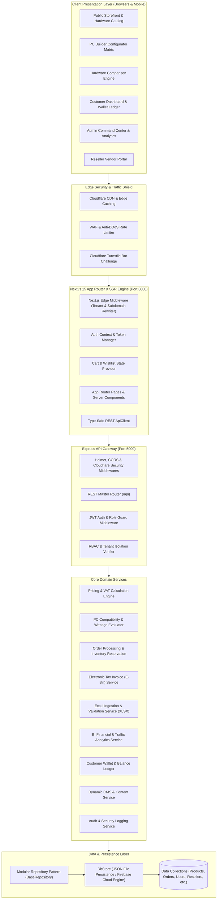
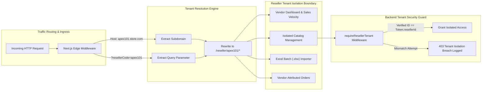
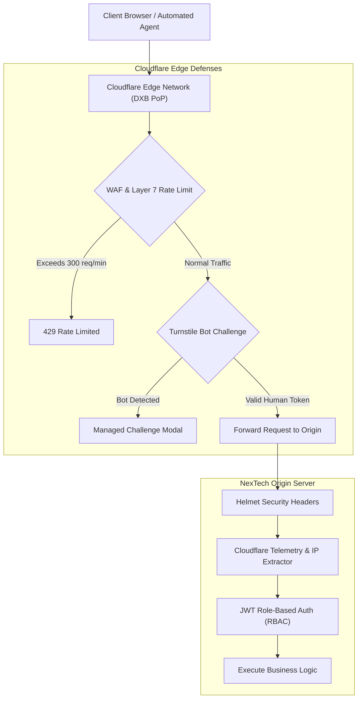
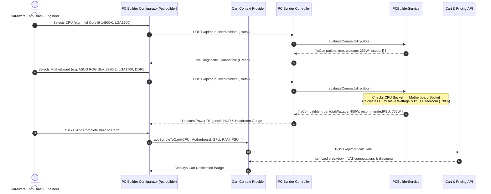
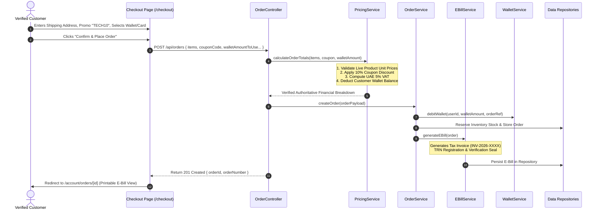
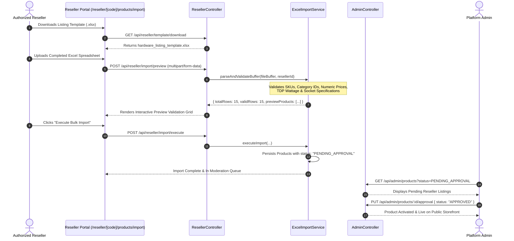
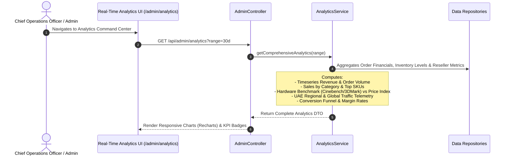
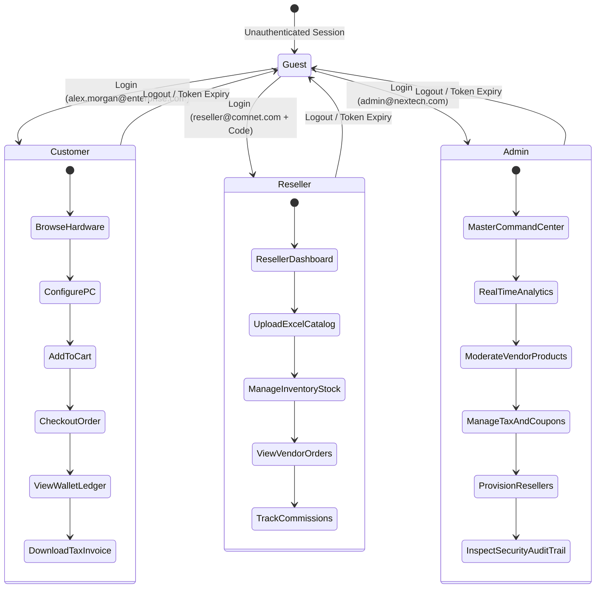

# NexTech Systems • Enterprise Computer & Technology E-Commerce Platform

[](https://nextjs.org/)
[](https://react.dev/)
[](https://www.typescriptlang.org/)
[](https://expressjs.com/)
[](https://tailwindcss.com/)
[](https://www.cloudflare.com/)
[](backend/test-suite.ts)
[](LICENSE)

> **NexTech Systems** is a state-of-the-art enterprise B2B/B2C computer hardware and technology commerce platform. Built for high-performance computing (HPC), AI workstation hardware, gaming rigs, datacenter rack servers, and enterprise networking gear, it incorporates a real-time **PC Builder Compatibility Engine**, **Multi-Tenant Reseller Portals**, **Authoritative Server-Side Pricing & E-Bill Invoicing**, **Customer Wallet Ledger**, **Real-Time BI Analytics**, and **Cloudflare Enterprise Security & Anti-Bot Protection**.

---

## 📑 Table of Contents

- [NexTech Systems • Enterprise Computer \& Technology E-Commerce Platform](#nextech-systems--enterprise-computer--technology-e-commerce-platform)
  - [📑 Table of Contents](#-table-of-contents)
  - [🌟 Key System Capabilities](#-key-system-capabilities)
  - [🏛️ System Architecture \& Design](#️-system-architecture--design)
    - [1. High-Level Architectural Topology](#1-high-level-architectural-topology)
    - [2. Multi-Tenant Reseller Subdomain Architecture](#2-multi-tenant-reseller-subdomain-architecture)
    - [3. Edge Security \& Anti-DDoS Architecture](#3-edge-security--anti-ddos-architecture)
  - [🔄 Core Business Workflows](#-core-business-workflows)
    - [1. PC Builder \& Real-Time Compatibility Matrix Flow](#1-pc-builder--real-time-compatibility-matrix-flow)
    - [2. Server-Side Pricing, Checkout \& E-Bill Generation Flow](#2-server-side-pricing-checkout--e-bill-generation-flow)
    - [3. Excel Catalog Ingestion \& Vendor Approval Pipeline](#3-excel-catalog-ingestion--vendor-approval-pipeline)
    - [4. Real-Time BI Analytics \& Traffic Intelligence Flow](#4-real-time-bi-analytics--traffic-intelligence-flow)
    - [5. Role-Based Access Control (RBAC) Lifecycle](#5-role-based-access-control-rbac-lifecycle)
  - [💻 Technology Stack](#-technology-stack)
  - [📂 Project Directory Structure](#-project-directory-structure)
  - [🔌 Comprehensive API Specification](#-comprehensive-api-specification)
    - [1. Authentication \& Identity](#1-authentication--identity)
    - [2. Products \& Catalog](#2-products--catalog)
    - [3. Dynamic CMS Content](#3-dynamic-cms-content)
    - [4. PC Builder Compatibility](#4-pc-builder-compatibility)
    - [5. Cart \& Pricing Engine](#5-cart--pricing-engine)
    - [6. Orders \& Electronic E-Bills](#6-orders--electronic-e-bills)
    - [7. Customer Wallet Ledger](#7-customer-wallet-ledger)
    - [8. Reseller Vendor Portal](#8-reseller-vendor-portal)
    - [9. Cloudflare Security \& Anti-Bot](#9-cloudflare-security--anti-bot)
    - [10. Admin Command Center \& Analytics](#10-admin-command-center--analytics)
  - [🚀 Getting Started \& Local Development](#-getting-started--local-development)
    - [Prerequisites](#prerequisites)
    - [1. Backend Setup](#1-backend-setup)
    - [2. Frontend Setup](#2-frontend-setup)
    - [3. Environment Configuration](#3-environment-configuration)
  - [🧪 Demo Accounts \& Credentials](#-demo-accounts--credentials)
  - [🛡️ Automated Integration Test Suite](#️-automated-integration-test-suite)
  - [📄 License](#-license)

---

## 🌟 Key System Capabilities

1. **⚡ Real-Time PC Builder Compatibility Engine**:
   - Hardware validation comparing CPU socket types (`LGA1700`, `AM5`, etc.), RAM generations (`DDR5` vs `DDR4`), and form factor constraints.
   - Dynamic TDP cumulative power consumption calculation with **+30% safety headroom recommendations** for Power Supply Units (PSU).
   - 1-Click complete build bundling directly into the shopping cart.

2. **🏢 Multi-Tenant Reseller Vendor Portals**:
   - Isolated tenant routing (`/reseller/[code]/dashboard` or `*.store.com`) with vendor-specific branding, revenue tracking, and commission management.
   - **Excel Batch Importer (`.xlsx`)**: Resellers can download standard templates, upload bulk sheets, preview auto-validated fields, and submit products into the admin approval queue.

3. **📊 Real-Time Business Intelligence & Analytics Engine**:
   - Executive dashboard tracking Gross Platform Sales, Net Margin, Order Velocity, Conversion Rates, and Average Order Value (AOV).
   - Timeseries volume charts, sales by hardware category, benchmark vs. price performance scatter metrics (Cinebench 2024, 3DMark), top-selling SKUs, and inventory stock alert levels.
   - Real-time visitor traffic telemetry categorized by UAE regions (Dubai, Abu Dhabi, Sharjah) and global geography.

4. **🛡️ Cloudflare Enterprise Security & Anti-Bot Defense**:
   - Multi-layer DDoS mitigation with WAF mode, rate-limiting policies, Layer 3/4 & Layer 7 defense.
   - **Cloudflare Turnstile** bot challenge token verification to secure sensitive actions against automated crawlers and brute-force attempts.

5. **🧾 Authoritative Server-Side Pricing & E-Bill Invoicing**:
   - Server-side tax computations (UAE 5% VAT), promotional coupon logic (`TECH10`, `FALL2026`), and insured express delivery thresholds.
   - Generates official system-verified **Electronic Tax Invoices (E-Bills)** with unique verification hashes, Tax Registration Numbers (TRN), and itemized vendor breakdowns suitable for corporate printing and PDF export.

6. **💳 Customer Wallet & Credit Ledger**:
   - Integrated store credit wallet supporting instant top-ups, transaction logs, and hybrid checkout (Wallet Balance + Credit Card).

7. **🌐 Dynamic Database-Driven CMS Content Engine**:
   - Fully dynamic homepage hero highlights, benchmark showcases, solution pillars, customer testimonials, and marketing banners served directly from the database with administrative controls.

8. **🌓 Standardized UI/UX Design System**:
   - Sleek dark and light mode toggle with smooth persistence across sessions.
   - High-elevation modal layering (`z-[100]`), backdrop blur, custom scrollbars, and standardized **UAE Dirham (`د.إ` / AED)** currency formatting throughout.

---

## 🏛️ System Architecture & Design

### 1. High-Level Architectural Topology



---

### 2. Multi-Tenant Reseller Subdomain Architecture



---

### 3. Edge Security & Anti-DDoS Architecture



---

## 🔄 Core Business Workflows

### 1. PC Builder & Real-Time Compatibility Matrix Flow



---

### 2. Server-Side Pricing, Checkout & E-Bill Generation Flow



---

### 3. Excel Catalog Ingestion & Vendor Approval Pipeline



---

### 4. Real-Time BI Analytics & Traffic Intelligence Flow



---

### 5. Role-Based Access Control (RBAC) Lifecycle



---

## 💻 Technology Stack

| Domain | Technology / Library | Version | Purpose |
| :--- | :--- | :--- | :--- |
| **Frontend Framework** | [Next.js](https://nextjs.org/) | `15.2.0` | App Router, Server-Side Rendering (SSR), Edge Middleware routing |
| **UI Library & State** | [React](https://react.dev/) | `19.0.0` | Component hierarchy, Client Context Providers (Auth, Cart, Theme) |
| **Styling & Design System** | [Tailwind CSS](https://tailwindcss.com/) | `3.4.17` | Dark mode, glassmorphism, responsive grids, custom scrollbars |
| **Icons & Iconography** | [Lucide React](https://lucide.dev/) | `^1.16.0` | Consistent, lightweight vector icons |
| **Data Visualization** | [Recharts](https://recharts.org/) | `2.15.1` | Timeseries revenue curves, conversion funnels, benchmark scatter charts |
| **Backend Runtime** | [Node.js](https://nodejs.org/) & [Express](https://expressjs.com/) | `4.21.2` | High-throughput modular REST API Gateway |
| **TypeScript Engine** | [TypeScript](https://www.typescriptlang.org/) & [TSX](https://github.com/privatenumber/tsx) | `5.8.2` | Strict end-to-end type safety and rapid dev runtime execution |
| **Spreadsheet Ingestion** | [SheetJS (xlsx)](https://sheetjs.com/) | `0.18.5` | Binary Excel (`.xlsx`) template generation and file parsing |
| **Security & Auth** | [JWT](https://jwt.io/), [Helmet](https://helmetjs.github.io/), [Turnstile](https://www.cloudflare.com/) | `9.0.2` | Stateless auth tokens, RBAC guards, Cloudflare bot defense |
| **Validation Engine** | [Zod](https://zod.dev/) | `3.24.2` | Runtime schema validation and data sanitization |
| **Persistence Layer** | Hybrid In-Memory JSON Store / [Firebase Admin](https://firebase.google.com/) | `13.2.0` | Instant zero-config local file persistence with cloud scaling |

---

## 📂 Project Directory Structure

```
eCommerce_Store/
├── backend/                              # Express.js REST API Gateway Server
│   ├── data_store/                       # Database collection storage (JSON persistence)
│   │   ├── audit_logs.json               # Security & administrative event logs
│   │   ├── banners.json                  # Storefront promotional banners
│   │   ├── categories.json               # Hardware taxonomy categories
│   │   ├── coupons.json                  # Active promotional vouchers
│   │   ├── ebills.json                   # Verified electronic tax invoices
│   │   ├── orders.json                   # Orders and fulfillment records
│   │   ├── products.json                 # Hardware catalog & technical specifications
│   │   ├── resellers.json                # Multi-tenant vendor profiles & commission tiers
│   │   ├── users.json                    # Customer, Admin & Reseller accounts
│   │   └── wallets.json                  # Customer credit balances & transaction ledgers
│   ├── src/
│   │   ├── config/                       # Environment, DB-Store & Firebase configurations
│   │   ├── controllers/                  # API Controllers (Admin, Auth, Cart, Content, Orders, PC-Builder, Reseller)
│   │   ├── middleware/                   # JWT Auth, Role RBAC & Cloudflare Security guards
│   │   ├── repositories/                 # BaseRepository and domain entity data mappers
│   │   ├── routes/                       # Express route definitions
│   │   ├── seed/                         # Initial enterprise hardware seed dataset
│   │   ├── services/                     # Business logic (Pricing, PC-Builder, Excel Import, E-Bill, Analytics, CMS)
│   │   ├── types/                        # Shared TypeScript models and interfaces
│   │   ├── app.ts                        # Express application factory & middleware chain
│   │   └── server.ts                     # HTTP Server listener
│   ├── test-suite.ts                     # Comprehensive 38-step automated end-to-end test suite
│   ├── package.json                      # Backend dependencies and scripts
│   └── tsconfig.json                     # Backend TypeScript compiler settings
│
├── frontend/                             # Next.js 15 App Router Web Application
│   ├── app/                              # App Router routing tree
│   │   ├── account/                      # Customer Portal (Orders, Wallet, Wishlist, Profile)
│   │   ├── admin/                        # Admin Command Center & Analytics
│   │   │   ├── analytics/                # Real-Time BI & Traffic Intelligence Dashboard
│   │   │   ├── audit-logs/               # Security & Administrative Audit Trail
│   │   │   ├── banners/                  # Storefront Banner Management
│   │   │   ├── brands/                   # Manufacturer Brand Registry
│   │   │   ├── categories/               # Categories Taxonomy Management
│   │   │   ├── coupons/                  # Promotional Discount Vouchers
│   │   │   ├── customers/                # Customer Directory & Wallet Adjustment
│   │   │   ├── orders/                   # Global Order Inspection & Status Transitions
│   │   │   ├── products/                 # Hardware SKU Management & Vendor Approvals
│   │   │   └── resellers/                # Multi-Tenant Reseller Provisioning
│   │   ├── cart/                         # Authoritative Shopping Cart
│   │   ├── checkout/                     # Checkout & Payment Selection
│   │   ├── compare/                      # Hardware Spec Comparison Tool
│   │   ├── login/ & register/            # Unified Authentication Pages
│   │   ├── pc-builder/                   # PC Builder Compatibility Matrix Configurator
│   │   ├── products/                     # Catalog Browser & Dynamic Product Detail [slug]
│   │   ├── reseller/                     # Multi-Tenant Reseller Vendor Portal ([code]/dashboard)
│   │   ├── globals.css                   # Global styling, animations & custom design tokens
│   │   ├── layout.tsx                    # Root layout with Theme, Auth, Cart Providers & Role Switcher
│   │   └── page.tsx                      # High-Impact Storefront Homepage
│   ├── components/                       # Reusable UI & Layout Components
│   │   ├── layout/                       # Navbar, Navigation Drawer, Footer
│   │   ├── product/                      # ProductCard, Badges, Price tags
│   │   └── ui/                           # RoleSwitcherModal, ThemeToggle, Dialog Modals
│   ├── lib/                              # Frontend Client Utilities
│   │   ├── api-client.ts                 # Type-Safe Fetch HTTP Wrapper
│   │   ├── auth-context.tsx              # Auth state & quick role switchers
│   │   ├── cart-context.tsx              # Cart state & coupon sync
│   │   └── utils.ts                      # Currency formatting (`د.إ`), date formatters & helpers
│   ├── middleware.ts                     # Subdomain & Tenant routing edge middleware
│   ├── package.json                      # Frontend dependencies and scripts
│   └── tailwind.config.ts                # Tailwind CSS theme configuration
│
└── README.md                             # Comprehensive Platform Documentation
```

---

## 🔌 Comprehensive API Specification

### 1. Authentication & Identity
| Method | Endpoint | Access Level | Description |
| :--- | :--- | :--- | :--- |
| `POST` | `/api/auth/register` | Public | Register a new customer account |
| `POST` | `/api/auth/login` | Public | Authenticate user & return signed JWT token |
| `GET` | `/api/auth/me` | Authenticated | Retrieve authenticated user profile & permissions |

### 2. Products & Catalog
| Method | Endpoint | Access Level | Description |
| :--- | :--- | :--- | :--- |
| `GET` | `/api/products` | Public | Retrieve catalog with pagination, filters, and facets |
| `GET` | `/api/products/:slug` | Public | Get detailed product specifications, benchmarks, and reviews |
| `GET` | `/api/products/categories` | Public | List hardware category taxonomy |
| `GET` | `/api/products/brands` | Public | List partner manufacturer brands |

### 3. Dynamic CMS Content
| Method | Endpoint | Access Level | Description |
| :--- | :--- | :--- | :--- |
| `GET` | `/api/content/homepage` | Public | Aggregated dynamic homepage payload |
| `GET` | `/api/content/hero` | Public | Dynamic hero section highlights & metrics |
| `GET` | `/api/content/solutions` | Public | Enterprise solution cards & pillars |
| `GET` | `/api/content/benchmarks` | Public | Hardware performance benchmark comparisons |
| `GET` | `/api/content/testimonials`| Public | Verified client and enterprise reviews |

### 4. PC Builder Compatibility
| Method | Endpoint | Access Level | Description |
| :--- | :--- | :--- | :--- |
| `GET` | `/api/pc-builder/components` | Public | Retrieve hardware components partitioned by slot |
| `POST` | `/api/pc-builder/validate` | Public | Validate sockets, RAM generation & TDP power headroom |

### 5. Cart & Pricing Engine
| Method | Endpoint | Access Level | Description |
| :--- | :--- | :--- | :--- |
| `POST` | `/api/cart/calculate` | Optional Auth | Authoritative server-side pricing, discounts, and 5% VAT |
| `POST` | `/api/cart/coupon/validate`| Public | Validate discount vouchers & minimum order spend thresholds |

### 6. Orders & Electronic E-Bills
| Method | Endpoint | Access Level | Description |
| :--- | :--- | :--- | :--- |
| `POST` | `/api/orders` | Customer / Admin | Place new order with inventory reserve & E-Bill generation |
| `GET` | `/api/orders/my` | Customer | Retrieve customer order history |
| `GET` | `/api/orders/:id` | Authenticated | Get detailed order status and E-Bill invoice data |
| `GET` | `/api/orders/:orderId/ebill`| Authenticated | Download official electronic tax invoice data |

### 7. Customer Wallet Ledger
| Method | Endpoint | Access Level | Description |
| :--- | :--- | :--- | :--- |
| `GET` | `/api/wallet` | Customer | Fetch current wallet balance and transaction ledger |
| `POST` | `/api/wallet/add-funds` | Customer | Add demo credit funds to customer wallet |

### 8. Reseller Vendor Portal
| Method | Endpoint | Access Level | Description |
| :--- | :--- | :--- | :--- |
| `GET` | `/api/reseller/dashboard` | Reseller / Admin | Retrieve vendor sales velocity and inventory metrics |
| `GET` | `/api/reseller/template/download`| Reseller | Download standard `.xlsx` bulk upload template |
| `POST` | `/api/reseller/import/preview` | Reseller | Parse & validate uploaded Excel buffer |
| `POST` | `/api/reseller/import/execute` | Reseller | Submit validated products into pending approval queue |

### 9. Cloudflare Security & Anti-Bot
| Method | Endpoint | Access Level | Description |
| :--- | :--- | :--- | :--- |
| `GET` | `/api/security/cloudflare-status` | Public | Real-time Cloudflare CDN, WAF & Anti-DDoS telemetry |
| `POST` | `/api/security/verify-turnstile` | Public | Validate Cloudflare Turnstile bot verification token |

### 10. Admin Command Center & Analytics
| Method | Endpoint | Access Level | Description |
| :--- | :--- | :--- | :--- |
| `GET` | `/api/admin/dashboard` | Admin | Master operational & financial platform summary |
| `GET` | `/api/admin/analytics` | Admin | Deep real-time BI analytics, timeseries & traffic telemetry |
| `PUT` | `/api/admin/products/:id/approval`| Admin | Approve or reject pending reseller product listings |
| `POST` | `/api/admin/resellers` | Admin | Provision new reseller vendor accounts with custom commission |
| `PUT` | `/api/admin/orders/:id/status`| Admin | Transition order fulfillment status (`PROCESSING`, `SHIPPED`, etc.) |
| `POST` | `/api/admin/customers/:id/wallet-adjust`| Admin | Credit or debit customer wallet balances |
| `GET` | `/api/admin/audit-logs` | Admin | Inspect platform security and administrative audit trail |

---

## 🚀 Getting Started & Local Development

### Prerequisites

- **Node.js**: `v18.18+` or `v20.x+` installed ([Download Node.js](https://nodejs.org/))
- **npm**: `v9+` or `v10+`

---

### 1. Backend Setup

```bash
# Navigate to backend directory
cd backend

# Install dependencies
npm install

# Start Express development server with live reload (Port 5000)
npm run dev
```

*The API server will automatically initialize the local JSON datastore and seed enterprise hardware products, categories, coupons, and demo users.*

---

### 2. Frontend Setup

```bash
# Open a new terminal and navigate to frontend directory
cd frontend

# Install dependencies
npm install

# Start Next.js development server (Port 3000)
npm run dev
```

*Open [http://localhost:3000](http://localhost:3000) in your browser.*

---

### 3. Environment Configuration

#### Backend (`backend/.env`):
```env
PORT=5000
NODE_ENV=development
CLIENT_URL=http://localhost:3000
JWT_SECRET=tech_ecommerce_super_secret_jwt_key_2026_production

# Persistence Engine (In-memory/JSON store fallback for rapid zero-config dev)
USE_EMULATOR_OR_MOCK=true

# Cloudflare Turnstile & Security (Optional production keys)
CLOUDFLARE_TURNSTILE_SECRET_KEY=1x0000000000000000000000000000000AA
CLOUDFLARE_UNDER_ATTACK_MODE=false
```

#### Frontend (`frontend/.env.local`):
```env
NEXT_PUBLIC_API_URL=http://localhost:5000/api
NEXT_PUBLIC_CLOUDFLARE_TURNSTILE_SITE_KEY=1x00000000000000000000AA
```

---

## 🧪 Demo Accounts & Credentials

Pre-seeded accounts are configured out-of-the-box for instant platform testing across all roles:

| Role | Email | Password | Access Area |
| :--- | :--- | :--- | :--- |
| **System Administrator** | `admin@nextech.com` | `password123` | [Admin Command Center](http://localhost:3000/admin) |
| **Authorized Reseller** | `reseller@comnet.com` *(Code: `comnet101`)* | `password123` | [Vendor Portal](http://localhost:3000/reseller/comnet101/dashboard) |
| **Verified Customer** | `alex.morgan@enterprise.com` | `password123` | [Storefront & Account](http://localhost:3000/account) |

> 💡 **Tip:** Click the **Role Switcher** badge in the bottom-right corner of the web application at any time to switch personas with one click.

---

## 🛡️ Automated Integration Test Suite

The platform includes a 38-step automated end-to-end integration test suite validating all core domain services, compatibility matrices, financial ledgers, and edge security guards.

```bash
# Execute the automated integration test suite
cd backend
npx tsx test-suite.ts
```

### 📋 Integration Test Matrix

| # | Test Domain | Test Case / Scenario | Target Endpoint | Validation Criteria |
| :---: | :--- | :--- | :--- | :--- |
| **01** | **Core Health** | API Gateway Liveness & Health Probe | `GET /api/health` | HTTP 200, status `'healthy'`, valid ISO timestamp |
| **02** | **Identity & Auth** | Administrator Credential Authentication | `POST /api/auth/login` | Signed JWT token with `ADMIN` role claim |
| **03** | **Identity & Auth** | Unified Customer Registration & Login | `POST /api/auth/register` | User entity creation, hashed password, customer JWT |
| **04** | **Identity & Auth** | Reseller Partner Authentication | `POST /api/auth/login` | Reseller tenant attribution & `RESELLER` role claim |
| **05** | **Identity & Auth** | Authenticated Profile Token Introspection | `GET /api/auth/me` | Bearer token verification & profile data return |
| **06** | **Catalog Engine** | Product Filtering, Search & Facet Query | `GET /api/products` | Dynamic filtering by category, brand & price ranges |
| **07** | **Catalog Engine** | Product Technical Specifications by Slug | `GET /api/products/:slug` | Benchmark data, socket specs, reviews & stock status |
| **08** | **Catalog Engine** | Categories & Manufacturer Brand Taxonomy | `GET /api/products/categories` | Complete taxonomy hierarchy and brand metadata |
| **09** | **PC Compatibility** | Component Slot Matrix Generation | `GET /api/pc-builder/components` | Partitioned catalog by CPU, GPU, Motherboard, etc. |
| **10** | **PC Compatibility** | Valid LGA1700 / DDR5 Build Validation | `POST /api/pc-builder/validate` | Compatible flag `true`, TDP calculation & +30% PSU headroom |
| **11** | **PC Compatibility** | Socket Mismatch Rejection Guard | `POST /api/pc-builder/validate` | Incompatible flag `false`, socket mismatch issue logged |
| **12** | **PC Compatibility** | Insufficient PSU Wattage Guard | `POST /api/pc-builder/validate` | Warning flagged when total system TDP exceeds PSU rating |
| **13** | **Pricing & Cart** | Server-Side Cart & VAT Computation | `POST /api/cart/calculate` | Unit price verification, 5% UAE VAT, net total calculation |
| **14** | **Pricing & Cart** | Promotional Coupon Validation (`TECH10`) | `POST /api/cart/coupon/validate` | Discount rate application, minimum spend rule enforcement |
| **15** | **Wallet Ledger** | Customer Wallet Credit Top-Up | `POST /api/wallet/add-funds` | Balance credit, ledger transaction entry creation |
| **16** | **Wallet Ledger** | Wallet Balance & Transaction History | `GET /api/wallet` | Balance inquiry, itemized credit/debit transaction log |
| **17** | **Wallet Ledger** | Zero / Negative Top-Up Rejection Guard | `POST /api/wallet/add-funds` | HTTP 400 rejection on invalid fund values |
| **18** | **Order Processing**| Hybrid Checkout (Wallet Balance + Card) | `POST /api/orders` | Inventory deduction, wallet debit, order persistence |
| **19** | **Order Processing**| Out of Stock Inventory Protection | `POST /api/orders` | Order rejection when quantity exceeds stock |
| **20** | **Order Processing**| Customer Order History Inquiry | `GET /api/orders/my` | Authenticated order retrieval with fulfillment status |
| **21** | **E-Bill Invoicing** | Electronic Tax Invoice (E-Bill) Summary | `GET /api/orders/:id` | Itemized line items, UAE VAT breakdown, seller details |
| **22** | **E-Bill Invoicing** | Printable Digital E-Bill Payload | `GET /api/orders/:id/ebill` | Verification seal, TRN registration number, tax breakdown |
| **23** | **Reseller Portal** | Reseller Partner Sales Velocity Metrics | `GET /api/reseller/dashboard` | Vendor revenue, commission calculations & listing counts |
| **24** | **Reseller Portal** | Vendor Product Submission | `POST /api/reseller/products` | Creation with `PENDING_APPROVAL` moderation status |
| **25** | **Reseller Portal** | Reseller Inventory Stock Adjustment | `PUT /api/reseller/products/:id/stock`| Stock level update restricted to owned products |
| **26** | **Reseller Portal** | Excel Bulk Listing Template Download | `GET /api/reseller/template/download`| Valid `.xlsx` spreadsheet buffer generation |
| **27** | **Admin Operations**| Master Operational Analytics Summary | `GET /api/admin/dashboard` | Platform gross revenue, order volume, pending approvals |
| **28** | **Admin Operations**| Vendor Listing Approval Workflow | `PUT /api/admin/products/:id/approval`| Status transition to `APPROVED` & storefront activation |
| **29** | **Admin Operations**| Listing Rejection with Reason | `PUT /api/admin/products/:id/approval`| Rejection reason logged, status set to `REJECTED` |
| **30** | **Admin Operations**| Order Fulfillment Lifecycle Transition | `PUT /api/admin/orders/:id/status`| Transition between `PROCESSING`, `SHIPPED`, `DELIVERED` |
| **31** | **Admin Operations**| Customer Directory & Reseller Lists | `GET /api/admin/customers` | Admin visibility into all registered tenants and users |
| **32** | **Admin Operations**| Security & Admin Audit Trail Inspection | `GET /api/admin/audit-logs` | Tamper-evident audit log collection inspection |
| **33** | **RBAC Security** | Unauthenticated Admin Endpoint Guard | `GET /api/admin/dashboard` | HTTP 401 Unauthorized blocking |
| **34** | **RBAC Security** | Customer Admin Endpoint Access Guard | `GET /api/admin/dashboard` | HTTP 403 Forbidden blocking for non-admin tokens |
| **35** | **Dynamic CMS** | Aggregated Homepage Content Payload | `GET /api/content/homepage` | Hero highlights, solution cards & benchmark showcase |
| **36** | **Dynamic CMS** | Individual Domain Content Feeds | `GET /api/content/hero` | Domain-specific content retrieval from database |
| **37** | **BI Analytics** | Deep Real-Time BI & Telemetry Engine | `GET /api/admin/analytics` | Timeseries, category sales, geo traffic & benchmark scatter |
| **38** | **Edge Security** | Cloudflare Edge Status & Turnstile Bot Check | `POST /api/security/verify-turnstile` | WAF status telemetry & Turnstile bot token validation |

---

## 📄 License

This project is licensed under the MIT License — see the [LICENSE](LICENSE) file for details.
