# NexTech Systems - Enterprise Computer & Technology E-Commerce Platform

[](https://nextjs.org/)
[](https://react.dev/)
[](https://www.typescriptlang.org/)
[](https://expressjs.com/)
[](https://tailwindcss.com/)
[](https://www.cloudflare.com/)
[](.github/workflows/ci.yml)
[](.github/workflows/codeql.yml)
[](.github/dependabot.yml)
[](SECURITY.md)
[](LICENSE)

NexTech Systems is an enterprise B2B and B2C computer hardware and technology commerce platform. Built for high-performance computing (HPC), AI workstation hardware, gaming systems, datacenter rack servers, and enterprise networking equipment, the platform incorporates a real-time PC Builder Compatibility Engine, Dedicated Enterprise Hardware SKU Studio, Multi-SKU Variant Engine, Regional Multi-Warehouse Inventory Balancing, B2B Quotes & Quote-to-Order Conversion Engine, Multi-Tenant Reseller Portals, Dynamic Multi-Currency Exchange, UAE FTA VAT 201 Compliance, Authoritative Server-Side Pricing, E-Bill Invoicing, Customer Wallet Ledger, Business Intelligence Analytics, and Cloudflare Edge Security.

---

## Table of Contents

- [Key System Capabilities](#key-system-capabilities)
- [System Architecture](#system-architecture)
  - [High-Level Architectural Topology](#high-level-architectural-topology)
  - [Multi-Tenant Reseller Subdomain Architecture](#multi-tenant-reseller-subdomain-architecture)
  - [Edge Security and Anti-DDoS Architecture](#edge-security-and-anti-ddos-architecture)
  - [Database Architecture and Dynamic API Fetching Model](#database-architecture-and-dynamic-api-fetching-model)
- [Core Business Workflows](#core-business-workflows)
  - [Dedicated Hardware SKU Authoring & Variant Studio](#dedicated-hardware-sku-authoring--variant-studio)
  - [B2B Quote Engine and 1-Click Sales Order Conversion](#b2b-quote-engine-and-1-click-sales-order-conversion)
  - [Admin Sales Order Creation and Stock Allocation](#admin-sales-order-creation-and-stock-allocation)
  - [Supplier Procurement and Purchase Order Lifecycle](#supplier-procurement-and-purchase-order-lifecycle)
  - [Commercial Intelligence: Sales vs. Purchase Analytics Engine](#commercial-intelligence-sales-vs-purchase-analytics-engine)
  - [PC Builder and Compatibility Matrix Flow](#pc-builder-and-compatibility-matrix-flow)
  - [Server-Side Pricing, Checkout and E-Bill Flow](#server-side-pricing-checkout-and-e-bill-flow)
  - [Excel Catalog Ingestion and Vendor Approval Pipeline](#excel-catalog-ingestion-and-vendor-approval-pipeline)
  - [Real-Time BI Analytics and Traffic Intelligence](#real-time-bi-analytics-and-traffic-intelligence)
  - [Role-Based Access Control Lifecycle](#role-based-access-control-lifecycle)
- [Technology Stack](#technology-stack)
- [Project Directory Structure](#project-directory-structure)
- [API Specification](#api-specification)
  - [Authentication and Identity](#authentication-and-identity)
  - [Products and Catalog](#products-and-catalog)
  - [B2B Quotations and Conversions](#b2b-quotations-and-conversions)
  - [Currencies and Exchange Rates](#currencies-and-exchange-rates)
  - [Hardware Specifications](#hardware-specifications)
  - [Dynamic CMS Content and Bento Trust Grid](#dynamic-cms-content-and-bento-trust-grid)
  - [PC Builder Compatibility](#pc-builder-compatibility)
  - [Cart and Pricing Engine](#cart-and-pricing-engine)
  - [Orders and Electronic E-Bills](#orders-and-electronic-e-bills)
  - [Supplier Purchase Orders and Procurement](#supplier-purchase-orders-and-procurement)
  - [Customer Wallet Ledger](#customer-wallet-ledger)
  - [VAT 201 Reporting](#vat-201-reporting)
  - [Reseller Vendor Portal](#reseller-vendor-portal)
  - [Cloudflare Security and Anti-Bot](#cloudflare-security-and-anti-bot)
  - [Admin Command Center, Backups, and Analytics](#admin-command-center-backups-and-analytics)
- [Getting Started and Local Development](#getting-started-and-local-development)
  - [Prerequisites](#prerequisites)
  - [Unified Workspace Commands](#unified-workspace-commands)
  - [Backend Setup](#backend-setup)
  - [Frontend Setup](#frontend-setup)
  - [Environment Configuration](#environment-configuration)
- [Automated Integration Test Suite](#automated-integration-test-suite)
- [Live Endpoint Verification Suite](#live-endpoint-verification-suite)
- [Security Hardening and Defense Architecture](#security-hardening-and-defense-architecture)
- [Vercel and Cloud Deployment](#vercel-and-cloud-deployment)
- [License](#license)

---

## Key System Capabilities

1. **Enterprise Hardware SKU Authoring & Studio (`/admin/products/new`, `/admin/products/[id]/edit`)**:
   - Master 2-column authoring layout delivering spacious, uncongested catalog authoring with a live storefront card preview.
   - Dual-view mode switcher: **All Sections (Detailed Master View)** for comprehensive continuous document review and **Tabbed View** for focused step-by-step navigation.
   - Real-time SVG barcode renderer generating visual barcode strips based on 13-digit EAN/GTIN inputs.
   - 1-Click Hardware Photography presets (NVIDIA RTX 5090, Intel Core Ultra 9, HP ProBook 460 G11, Samsung 990 PRO NVMe, Corsair Dominator Titanium DDR5, Platinum Server PSU).
   - Volumetric shipping calculator `(L × W × H) / 5000` calculating courier billable weights per DHL/Aramex standards.
   - Catalog Readiness Scorecard tracking title, SKU, pricing, images, warehouse stock, and HS customs codes.

2. **Product Variants & Multi-SKU Combinations Engine**:
   - Interactive multi-option Cartesian attribute generator (e.g. Memory: 16GB, 32GB; Storage: 512GB, 1TB).
   - Auto-generates hierarchical SKUs (e.g. `NX-LPT-203484-16GB-512GB`) with unique barcodes, pricing delta, unit cost, and independent variant stock levels.
   - Full backward compatibility with single standalone hardware SKUs.

3. **Multi-Node Regional Warehousing & Backorder Governance**:
   - Tabular stock tracking across 4 physical regional facilities: **Dubai Logistics Hub (JAFZA)**, **Deira Showroom & Technical Center**, **Abu Dhabi Regional Distribution Hub**, and **Sharjah Industrial Logistics Depot**.
   - Tracks `available`, `committed`, `unavailable`, and `onHand` quantities per facility.
   - Fast bulk allocation actions ("Consolidate in Dubai Hub", "Distribute Evenly across UAE").
   - Atomic multi-location inventory locking with backorder policy enforcement (`allowBackorder: true/false`).

4. **B2B Quotations & 1-Click Sales Order Conversion Engine**:
   - Full enterprise quote drafting suite on [`/admin/quotes`](http://localhost:3000/admin/quotes) for corporate IT departments and procurement tenders.
   - Line-item customization, quantity pricing, commercial discount adjustments, and 5% UAE VAT calculations.
   - 1-Click Quote-to-Order Conversion (`POST /api/admin/quotes/:id/convert`) automatically validating stock, reserving inventory, generating order numbers (`ORD-YYYY-XXXXXX`), and issuing official E-Bills.

5. **Real-Time PC Builder Compatibility Engine**:
   - Hardware validation evaluating CPU socket compatibility (`LGA1700`, `AM5`, etc.), memory standards (`DDR5` vs `DDR4`), and motherboard form factors.
   - Cumulative TDP consumption calculations featuring an automated +30% safety headroom recommendation for Power Supply Units (PSU).
   - Direct bundle export enabling one-click transfer of all validated hardware components into the active cart.

6. **Real-Time Multi-Currency Conversion Engine**:
   - Dynamic foreign exchange rate integration using open exchange rate feeds with cached fallback mechanisms.
   - Real-time conversion across major currencies (AED, USD, EUR, GBP, SAR, KWD, QAR, OMR, BHD, JPY, CAD, AUD, INR) with AED as the base currency.
   - User-selectable currency dropdown in the primary navigation bar with instant client-side price recalculations and persistent preferences.

7. **UAE FTA VAT 201 Tax Reporting & Granular Tax Exemption Engine**:
   - Authoritative calculation of Standard-Rated Supplies (5%), Zero-Rated Supplies, Exempt Supplies, and Reverse Charge Provisions.
   - Item-level tax exemption support (`chargeTax: false`) for Designated Freezones (JAFZA, DAFZA) and direct international export shipments.
   - Periodic return calculation tracking Output Tax, Recoverable Input Tax, and Net Tax Payable/Refundable.
   - Protected administrative summary endpoint (`/api/vat/summary`) adhering to UAE Federal Tax Authority guidelines.

8. **Multi-Tenant Reseller Portals**:
   - Isolated tenant routing (`/reseller/[code]/dashboard` or dedicated subdomain) with partner-specific branding, sales attribution, and commission auditing.
   - Excel Batch Importer (`.xlsx`): Resellers download standard templates, upload catalog spreadsheets, inspect auto-validated records, and submit hardware items into the moderation queue.

9. **Authoritative Server-Side Pricing and E-Bill Invoicing**:
   - Strict server-side tax computations, voucher validation (`TECH10`, `FALL2026`), and insured delivery rules.
   - Generation of official Electronic Tax Invoices (E-Bills) complete with verification seals, Tax Registration Numbers (TRN), and itemized vendor breakdowns suitable for accounting review and PDF export.

10. **Customer Wallet Ledger**:
    - Integrated store credit system supporting real-time top-ups, transaction auditing, and split payments (Wallet Balance + Credit Card).
    - Secondary administrative security PIN verification guarding high-value balance adjustments and approvals.

11. **Business Intelligence and Telemetry Dashboard**:
    - Executive dashboard presenting Gross Merchandise Value, Net Margins, Order Velocity, Conversion Rates, and Average Order Value (AOV).
    - Timeseries sales distributions, category breakdowns, price-to-performance scatter plots (Cinebench, 3DMark), top-performing SKUs, and low-stock alerts.
    - Visitor traffic distribution analysis covering GCC regional zones and international geographies.

12. **Supplier Procurement and Wholesale Purchase Orders**:
    - Dedicated wholesale procurement management portal on [`/admin/purchase-orders`](http://localhost:3000/admin/purchase-orders) to issue, monitor, and receive component shipments from hardware manufacturers (Intel, NVIDIA, Corsair, Samsung, Dell, Asus).
    - Weighted Average Cost (WAC) tracking and automated warehouse inventory increments upon order receipt.

---

## System Architecture

### High-Level Architectural Topology

```mermaid
graph TB
    subgraph Layer1["1. Client Presentation Layer (Next.js 15 + React 19)"]
        direction TB
        subgraph Storefront_Apps["Public Storefront & Portals"]
            B2C["Storefront Catalog<br/>(/products, /shop)"]
            PCB["PC Builder Matrix<br/>(/pc-builder)"]
            CMP["Hardware Compare<br/>(/compare)"]
            CUST["Customer Account & Wallet<br/>(/account, /orders)"]
            RES["Reseller Vendor Portal<br/>(/reseller/[code]/*)"]
        end
        subgraph Admin_Apps["Admin Operations Command Center"]
            SKU_STUDIO["Hardware SKU Studio<br/>(/admin/products/new, /edit)"]
            ORDERS_DISP["Sales Orders & Dispatch<br/>(/admin/orders)"]
            QUOTES_ENG["B2B Quotes & Conversion<br/>(/admin/quotes)"]
            PO_PROC["Supplier Procurement<br/>(/admin/purchase-orders)"]
            BI_DECK["Analytics & Commercial BI<br/>(/admin/analytics)"]
            CMS_ARR["Dynamic CMS & Bento Editor<br/>(/admin/cms)"]
        end
    end

    subgraph Layer2["2. Edge, Security & Routing Layer"]
        CF_EDGE["Cloudflare Global Anycast Edge"]
        CF_WAF["Cloudflare WAF & Anti-DDoS Rate Limiter"]
        CF_BOT["Cloudflare Turnstile Bot Challenge"]
        EDGE_MW["Next.js Edge Middleware (Subdomain Rewrite & Normalization)"]
    end

    subgraph Layer3["3. Frontend Application Architecture (Next.js App Router)"]
        AUTH_CTX["Auth Context<br/>(JWT + Session)"]
        CART_CTX["Cart Context<br/>(Multi-SKU Variant Resolution)"]
        CURR_CTX["Currency Context<br/>(12 FX Currencies vs AED)"]
        API_CLIENT["Type-Safe ApiClient<br/>(Resilient Fallback & Proxy)"]
    end

    subgraph Layer4["4. API Gateway Layer (Express 5.2.1 REST API)"]
        HELMET["Helmet Security Headers & CORS Guard"]
        RATE_LIMIT["Tiered Route Rate Limiters (Auth, API, Orders)"]
        JWT_GUARD["JWT Authentication & RBAC Guard"]
        TENANT_GUARD["Reseller Subdomain & Tenant Isolation Guard"]
    end

    subgraph Layer5["5. Domain Core Services Layer"]
        SVC_PROD["Product & Multi-SKU Variant Engine<br/>(Cartesian Combinations & Hierarchical SKUs)"]
        SVC_WH["Multi-Node Regional Warehousing<br/>(DXB, AUH, SHJ Balances & Backorders)"]
        SVC_PRICE["Pricing & UAE VAT Engine<br/>(5% Standard vs 0% Tax Exemption)"]
        SVC_QUOTE["B2B Quote Conversion Service<br/>(1-Click Quote to Sales Order)"]
        SVC_PCB["PC Compatibility Engine<br/>(Socket, Form Factor & +30% Headroom)"]
        SVC_ORD["Order & Inventory Transaction Service<br/>(Atomic Decrements via runTransaction)"]
        SVC_EBILL["E-Bill Invoicing Service<br/>(TRN, QR Hash & Digital Seals)"]
        SVC_PO["Supplier Procurement & WAC Service<br/>(PO Lifecycle & Stock Ingestion)"]
        SVC_ANALYTICS["Commercial BI Analytics Service<br/>(Sales Revenue vs. Procurement Spend)"]
        SVC_WALLET["Customer Wallet Ledger<br/>(Store Credit & Split Payments)"]
        SVC_AUDIT["Audit & Operational Security Logger"]
    end

    subgraph Layer6["6. Persistence & Storage Layer"]
        REPO["Repository Pattern (Product, Order, Quote, PO, User, Reseller)"]
        TX_ENG["Atomic Transaction Manager (runTransaction)"]
        DB_STORE["DbStore Engine & Collections"]
        COLLECTIONS[("JSON Document Collections<br/>products | orders | quotes | purchase_orders<br/>users | resellers | warehouses | ebills | audit_logs")]
        BACKUPS["Database Backup Snapshots<br/>(/admin/backups)"]
    end

    %% Flow Connections
    Storefront_Apps & Admin_Apps --> CF_EDGE
    CF_EDGE --> CF_WAF --> CF_BOT --> EDGE_MW
    EDGE_MW --> Layer3
    Layer3 --> API_CLIENT
    API_CLIENT --> HELMET --> RATE_LIMIT --> JWT_GUARD --> TENANT_GUARD
    TENANT_GUARD --> Layer5
    Layer5 --> REPO
    REPO --> TX_ENG --> DB_STORE --> COLLECTIONS
    COLLECTIONS -.-> BACKUPS
```

---

### Multi-Tenant Reseller Subdomain Architecture

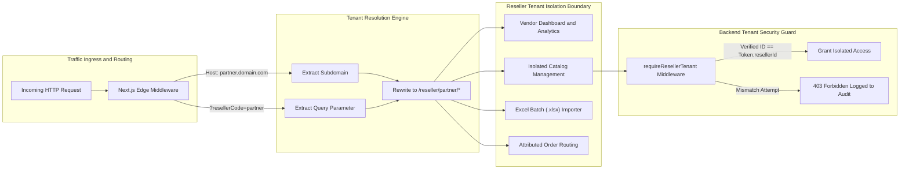

---

### Edge Security and Anti-DDoS Architecture

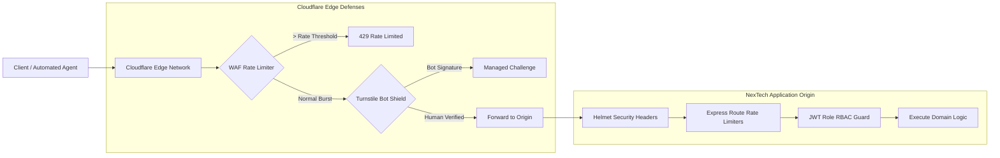

---

### Database Architecture and Dynamic API Fetching Model

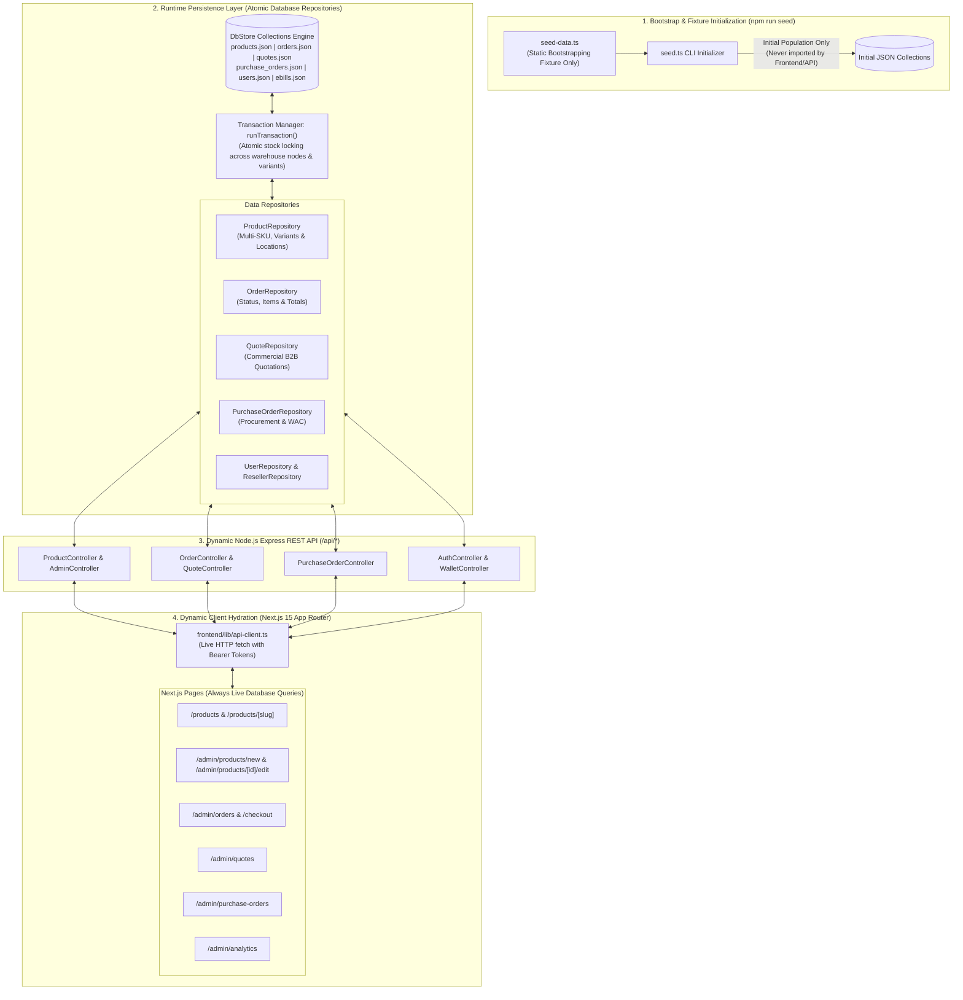

> [!IMPORTANT]
> **Architectural Separation of Seed Fixtures vs. Dynamic Database Queries:**
> - **The Role of `seed-data.ts`**: The file [`backend/src/seed/seed-data.ts`](backend/src/seed/seed-data.ts) contains static database fixture definitions. It is **never imported or executed by the frontend**. It is executed strictly by `npm run seed` or when initial database collections are empty to bootstrap initial hardware SKUs, users, and transactions.
> - **Dynamic REST API Queries**: The Next.js frontend **always fetches live data dynamically from the database using Node.js Express REST APIs** via [`ApiClient`](frontend/lib/api-client.ts). When an administrator creates a hardware SKU, issues a B2B quote, creates a sales order, or receives a supplier PO, it is committed directly to the database collection via atomic transactions, decrementing or incrementing stock, and updating all frontend views in real time.

---

## Core Business Workflows

### Dedicated Hardware SKU Authoring & Variant Studio

```mermaid
sequenceDiagram
    autonumber
    actor Admin as Hardware Catalog Engineer
    participant UI as SKU Studio (/admin/products/new)
    participant API as Admin Product Controller
    participant ProdSvc as Product Domain Service
    participant Repo as Product Repository
    participant Audit as Audit Logging Service

    Admin->>UI: Inputs Model Title, Brand, Category, & Commercial Price (AED)
    UI->>UI: Auto-generates hierarchical SKU (e.g. NX-LPT-376291) & EAN Barcode
    UI->>UI: Draws live SVG Barcode Graphic strip
    Admin->>UI: Clicks 1-Click Hardware Preset (e.g. ASUS ROG Astral RTX 5090)
    UI->>UI: Populates high-res photography, category specs, & tags
    UI->>UI: Live Storefront Mockup reflects title, price, stock, & warranty
    Admin->>UI: Enables Multi-SKU Variants Matrix (RAM: 16GB, 32GB; SSD: 512GB, 1TB)
    UI->>UI: Cartesian Engine generates 4 composite variants with unique SKUs & prices
    Admin->>UI: Allocates stock across regional warehouses (Dubai JAFZA: 25, Deira: 10)
    Admin->>UI: Inputs package dimensions (35.9 x 25.1 x 1.9 cm) & Net Weight (1.74 kg)
    UI->>UI: Computes volumetric weight (0.34 kg) and billable courier weight (1.74 kg)
    Admin->>UI: Clicks "Publish SKU" (⌘S)
    UI->>API: POST /api/admin/products { title, sku, price, locations, hasVariants, variants, specs }
    API->>ProdSvc: Validates SKU uniqueness across parent and all variants
    API->>Repo: Persists product record into products.json
    API->>Audit: Records PRODUCT_CREATED with SKU and variant counts
    API-->>UI: 201 Created { success: true, data: Product }
    UI-->>Admin: Displays success notification & redirects to hardware catalog
```

---

### B2B Quote Engine and 1-Click Sales Order Conversion

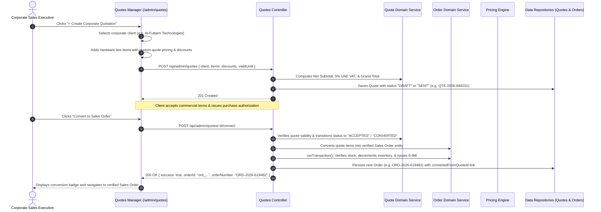

---

### Admin Sales Order Creation and Stock Allocation

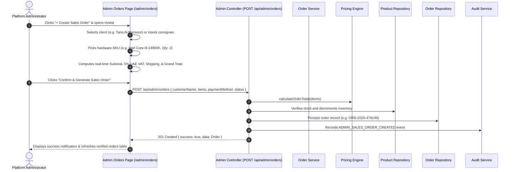

---

### Supplier Procurement and Purchase Order Lifecycle


---

### Commercial Intelligence: Sales vs. Purchase Analytics Engine

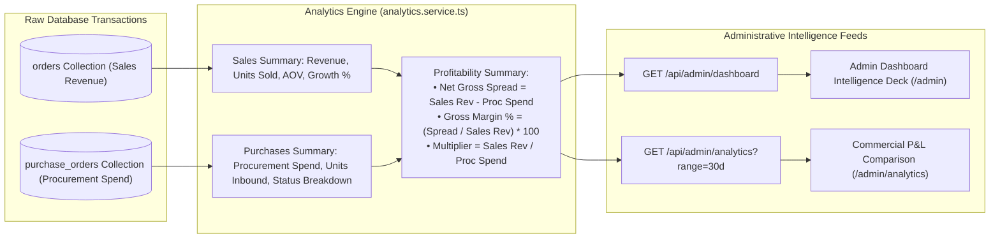

---

### PC Builder and Compatibility Matrix Flow

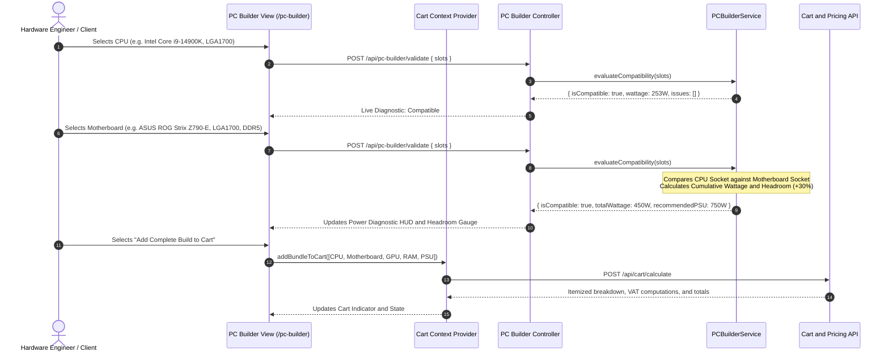

---

### Server-Side Pricing, Checkout and E-Bill Flow

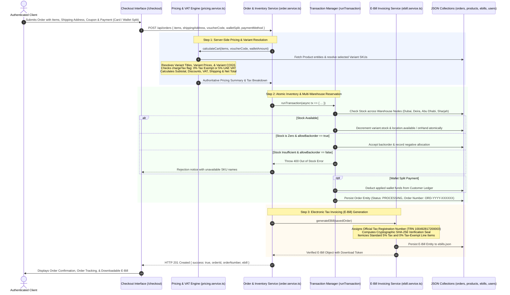

---

### Excel Catalog Ingestion and Vendor Approval Pipeline

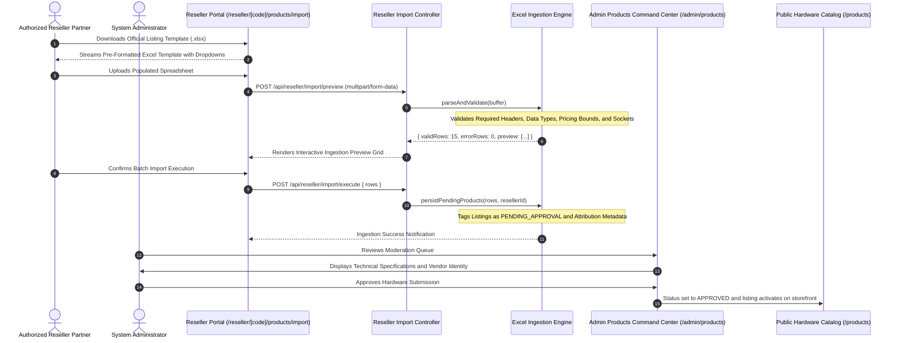

---

### Real-Time BI Analytics and Traffic Intelligence

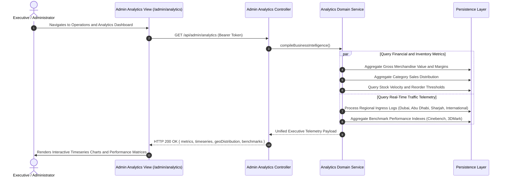

---

### Role-Based Access Control Lifecycle

```mermaid
stateDiagram-v2
    [*] --> AnonymousGuest: Visits Storefront
    
    state AnonymousGuest {
        BrowseCatalog: Browse Products, Variants & Categories
        UsePCBuilder: Configure PC Components
        CalculateCart: Cart Pricing Calculation
    }
    
    AnonymousGuest --> RegisteredCustomer: POST /api/auth/register
    AnonymousGuest --> AuthenticatedUser: POST /api/auth/login
    
    state AuthenticatedUser {
        state CustomerRole {
            ManageProfile: Account Profile and Addresses
            OrderHistory: View Personal Orders
            WalletAccess: Top-Up and Inspect Wallet
            DownloadEBill: Access Owned E-Bills
        }
        
        state ResellerRole {
            VendorDashboard: View Attributed Sales
            CatalogManagement: Add / Edit Partner SKUs
            ExcelImport: Batch Upload Hardware
            InventoryControl: Adjust Partner Stock
        }
        
        state AdminRole {
            GlobalOperations: Full Storefront Control
            SKUAuthoringStudio: Enterprise Hardware SKU & Variant Authoring
            B2BQuoteManagement: Draft Quotes & 1-Click Order Conversion
            SalesOrderDispatch: Direct Customer Order Creation & Dispatch
            SupplierProcurement: Issue & Receive Supplier POs
            CommercialIntelligence: Sales vs. Purchase P&L Margin Tracking
            ApproveListings: Moderate Reseller Products
            ManageTenants: Provision Reseller Accounts
            WalletAdjustments: Credit / Debit Ledgers
            AuditInspection: View Security Logs
            VatReporting: View FTA VAT 201 Summaries
            CMSArranger: Dynamic Section Ordering & Bento Trust Grid
            BackupRecovery: Instant Database Snapshots
        }
    }
```

---

## Technology Stack

| Domain | Technology / Library | Architectural Role |
| :--- | :--- | :--- |
| **Frontend Framework** | Next.js 15.2.0 (App Router), React 19.0.0 | Server-Side Rendering (SSR), Client Components, Dynamic Routing |
| **Language** | TypeScript 5.8.2 | End-to-end static type enforcement across frontend and backend |
| **Styling** | Tailwind CSS 3.4.17, Lucide Icons | Responsive enterprise interface with dark/light persistence |
| **Backend Framework** | Node.js 18+ LTS, Express 5.2.1 | High-throughput REST API gateway with modular routing |
| **Security and Edge** | Cloudflare Turnstile, Helmet, express-rate-limit | Multi-tier rate limiting, bot defense, and HTTP header hardening |
| **Cryptography** | PBKDF2 (SHA-512 / SHA-256), timingSafeEqual | Password hashing (100,000 rounds) and administrative PIN validation |
| **Data Ingestion** | XLSX (SheetJS), Multer | High-performance Excel buffer parsing and catalog ingestion |
| **Persistence** | Modular Repository Pattern, JSON DataStore | Structured document-based persistence with database interfaces |
| **Currency Feeds** | Open Exchange Rates API | Dynamic multi-currency valuation against AED base currency |

---

## Project Directory Structure

```
eCommerce_Store/
├── backend/                         # Express REST API application
│   ├── data_store/                  # Structured JSON collections
│   │   ├── audit_logs.json          # System security and administrative trail
│   │   ├── backups.json             # Database backup snapshot metadata
│   │   ├── bento_features.json      # Dynamic trust grid cards & guarantees
│   │   ├── brands.json              # Hardware manufacturer entities
│   │   ├── categories.json          # Product category definitions
│   │   ├── cms_sections.json        # Dynamic homepage section arrangement
│   │   ├── ebills.json              # Electronic tax invoices
│   │   ├── orders.json              # Customer order records
│   │   ├── products.json            # Hardware product catalog & variants
│   │   ├── purchase_orders.json     # Supplier procurement purchase orders
│   │   ├── quotes.json              # B2B quotation records
│   │   ├── resellers.json           # Multi-tenant partner profiles
│   │   └── users.json               # Customer, reseller, and admin accounts
│   ├── src/
│   │   ├── config/                  # Environment and persistence config
│   │   ├── constants/               # Hardware specifications and taxonomy
│   │   ├── controllers/             # HTTP route controller implementations
│   │   ├── middleware/              # Auth, RBAC, and error handlers
│   │   ├── middlewares/             # Rate limiters and Cloudflare security
│   │   ├── repositories/            # Data access repository layer (Order, PO, Product, Quote, etc.)
│   │   ├── routes/                  # API endpoint route declarations
│   │   ├── seed/                    # Database bootstrap fixtures (seed-data.ts, seed.ts)
│   │   ├── services/                # Domain business logic (Order, Analytics, Pricing, Quote, etc.)
│   │   ├── utils/                   # Cryptographic PIN and helper utilities
│   │   ├── app.ts                   # Express server entry point
│   │   └── server.ts                # HTTP listener bootstrap
│   ├── test-catalog-features.ts     # 7-step advanced catalog & multi-SKU variant test suite
│   ├── test-suite.ts                # 38-step automated integration test suite
│   ├── package.json
│   └── tsconfig.json
├── frontend/                        # Next.js 15 App Router web application
│   ├── app/
│   │   ├── account/                 # Customer dashboard, orders, and wallet
│   │   ├── admin/                   # Admin command center and management
│   │   │   ├── analytics/           # Sales vs. Purchase commercial intelligence & P&L
│   │   │   ├── backups/             # Database snapshot backup center
│   │   │   ├── cms/                 # Visual section arranger & bento editor
│   │   │   ├── coupons/             # Promotional voucher issuance & banners
│   │   │   ├── customers/           # Client accounts and wallet controls
│   │   │   ├── orders/              # Customer orders & Admin Sales Order Creator
│   │   │   ├── products/            # Hardware SKU catalog and specifications
│   │   │   │   ├── [id]/edit/       # Dedicated SKU Edit Studio Page
│   │   │   │   └── new/             # Dedicated SKU Create Studio Page
│   │   │   ├── purchase-orders/     # Supplier wholesale procurement orders
│   │   │   ├── quotes/              # B2B Quote Management & Order Conversion
│   │   │   ├── resellers/           # Multi-tenant partner management
│   │   │   ├── settings/            # Platform variables and maintenance modes
│   │   │   ├── vat/                 # UAE FTA VAT 201 tax audits
│   │   │   └── page.tsx             # Master Operations Command Dashboard
│   │   ├── api/                     # Next.js serverless route handlers
│   │   ├── cart/                    # Interactive cart and price calculation
│   │   ├── checkout/                # Order placement and checkout workflow
│   │   ├── compare/                 # Side-by-side hardware comparison
│   │   ├── login/                   # Unified sign-in and registration
│   │   ├── pc-builder/              # PC Builder compatibility engine
│   │   ├── products/                # Catalog browse, filter, and detail views
│   │   ├── reseller/                # Multi-tenant reseller portal
│   │   ├── layout.tsx               # Root application layout
│   │   └── page.tsx                 # Dynamic storefront homepage
│   ├── components/                  # Reusable UI component library
│   │   ├── admin/                   # ProductEditorPage (Master 2-Column Authoring Studio)
│   │   ├── home/                    # Hero, Bento Grid, Taxonomy, & Solutions
│   │   ├── layout/                  # Navbar, Footer, & GlobalCommandPalette (Cmd+K)
│   │   ├── product/                 # ProductCard, Matrix Showcase, & Filters
│   │   └── ui/                      # Modals, HUD diagnostics, & notifications
│   ├── lib/                         # State providers, API client, and utilities
│   │   ├── api-client.ts            # Type-safe API client with auto-fallback
│   │   ├── auth-context.tsx         # User authentication state provider
│   │   ├── cart-context.tsx         # Shopping cart state provider
│   │   ├── currency-context.tsx     # Multi-currency state and rates provider
│   │   ├── default-taxonomy.ts      # Resilient fallback categories and brands
│   │   ├── specification-presets.ts # Category spec definitions (Laptops, HDDs, GPUs, etc.)
│   │   └── theme-context.tsx        # Dark and light appearance provider
│   ├── types/                       # Shared TypeScript interfaces
│   ├── next.config.mjs              # Next.js configuration and proxy rewrites
│   ├── package.json
│   └── tsconfig.json
├── scratch/                         # Live endpoint probes and testing scripts
├── package.json                     # Monorepo root scripts
└── README.md
```

---

## API Specification

### Authentication and Identity

| Method | Endpoint | Access Level | Description |
| :--- | :--- | :--- | :--- |
| `POST` | `/api/auth/register` | Public | Create new customer account with mandatory password validation |
| `POST` | `/api/auth/login` | Public | Authenticate user credentials and return signed JWT |
| `POST` | `/api/auth/google` | Public | Authenticate federated Google identity token |
| `GET` | `/api/auth/me` | Authenticated | Return authenticated profile and role metadata |
| `PUT` | `/api/auth/profile` | Authenticated | Update user name, contact number, and address book |

### Products and Catalog

| Method | Endpoint | Access Level | Description |
| :--- | :--- | :--- | :--- |
| `GET` | `/api/products` | Public | List hardware products with filters, sorting, and pagination |
| `GET` | `/api/products/:slug` | Public | Retrieve detailed hardware specifications and variants by URL slug |
| `GET` | `/api/admin/products/:id` | Admin | Retrieve complete hardware SKU entity with locations & variants |
| `POST` | `/api/admin/products` | Admin | Create new hardware SKU with multi-node locations and variants |
| `PUT` | `/api/admin/products/:id` | Admin | Update product information, pricing, locations, and variants |
| `DELETE`| `/api/admin/products/:id` | Admin | Remove product listing from catalog |
| `GET` | `/api/products/categories` | Public | Retrieve product category taxonomy hierarchy |
| `GET` | `/api/products/brands` | Public | Retrieve hardware manufacturer brands listing |
| `GET` | `/api/products/config` | Public | Retrieve global storefront metadata and configurations |

### B2B Quotations and Conversions

| Method | Endpoint | Access Level | Description |
| :--- | :--- | :--- | :--- |
| `GET` | `/api/admin/quotes` | Admin | List all corporate quotations with status and client filters |
| `GET` | `/api/admin/quotes/:id` | Admin | Retrieve single quotation with itemized pricing and terms |
| `POST` | `/api/admin/quotes` | Admin | Create new B2B quotation with custom commercial discounts |
| `PUT` | `/api/admin/quotes/:id` | Admin | Update quotation items, discounts, or terms |
| `POST` | `/api/admin/quotes/:id/convert`| Admin | **1-Click Conversion**: Convert approved quote directly into verified Sales Order with stock deduction |

### Currencies and Exchange Rates

| Method | Endpoint | Access Level | Description |
| :--- | :--- | :--- | :--- |
| `GET` | `/api/currencies` | Public | Retrieve supported currencies, symbols, and rates against AED |

### Hardware Specifications

| Method | Endpoint | Access Level | Description |
| :--- | :--- | :--- | :--- |
| `GET` | `/api/specifications/presets` | Public | Retrieve technical spec schemas (socket, RAM, form factor, TDP) |
| `GET` | `/api/specifications/options` | Public | Retrieve valid option lists by category |

### Dynamic CMS Content

| Method | Endpoint | Access Level | Description |
| :--- | :--- | :--- | :--- |
| `GET` | `/api/content/homepage` | Public | Aggregated homepage hero, solution pillars, and benchmarks |
| `GET` | `/api/content/hero` | Public | Retrieve hero highlights carousel entries |
| `GET` | `/api/content/banners` | Public | Retrieve active marketing and promotional banners |
| `GET` | `/api/content/testimonials` | Public | Retrieve enterprise customer testimonials |

### PC Builder Compatibility

| Method | Endpoint | Access Level | Description |
| :--- | :--- | :--- | :--- |
| `GET` | `/api/pc-builder/components` | Public | Retrieve hardware components partitioned by component slot |
| `POST` | `/api/pc-builder/validate` | Public | Validate socket matching, memory standard, and TDP headroom |

### Cart and Pricing Engine

| Method | Endpoint | Access Level | Description |
| :--- | :--- | :--- | :--- |
| `POST` | `/api/cart/calculate` | Optional Auth | Calculate verified itemized prices, variant overrides, 5% UAE VAT, and discounts |
| `POST` | `/api/cart/coupon/validate` | Public | Validate promotional coupon codes and order thresholds |

### Orders and Electronic E-Bills

| Method | Endpoint | Access Level | Description |
| :--- | :--- | :--- | :--- |
| `POST` | `/api/orders` | Customer / Admin | Place new customer order with atomic inventory deduction and E-Bill creation |
| `POST` | `/api/admin/orders` | Admin | Admin direct sales order creation with client consignee & stock deduction |
| `GET` | `/api/orders/my` | Customer | Retrieve authenticated customer order history |
| `GET` | `/api/orders/:id` | Authenticated | Retrieve order status and invoice details (Ownership verified) |
| `GET` | `/api/orders/:orderId/ebill` | Authenticated | Download official electronic tax invoice (Ownership verified) |

### Supplier Purchase Orders and Procurement

| Method | Endpoint | Access Level | Description |
| :--- | :--- | :--- | :--- |
| `GET` | `/api/admin/purchase-orders` | Admin | List all wholesale supplier POs with vendor and status filters |
| `POST` | `/api/admin/purchase-orders` | Admin | Issue new purchase order to component manufacturer (Intel, NVIDIA, etc.) |
| `PUT` | `/api/admin/purchase-orders/:id` | Admin | Update receiving status (`ISSUED`, `RECEIVED`), auto-incrementing warehouse inventory & WAC |
| `DELETE` | `/api/admin/purchase-orders/:id` | Admin | Cancel or remove supplier procurement record |

### Customer Wallet Ledger

| Method | Endpoint | Access Level | Description |
| :--- | :--- | :--- | :--- |
| `GET` | `/api/wallet` | Customer | Fetch wallet credit balance and transaction history |
| `POST` | `/api/wallet/add-funds` | Customer | Credit wallet balance with secondary PIN check on high amounts |

### VAT 201 Reporting

| Method | Endpoint | Access Level | Description |
| :--- | :--- | :--- | :--- |
| `GET` | `/api/vat/summary` | Admin | Compute UAE FTA VAT 201 periodic audit summary (Output/Input VAT) |

### Reseller Vendor Portal

| Method | Endpoint | Access Level | Description |
| :--- | :--- | :--- | :--- |
| `GET` | `/api/reseller/dashboard` | Reseller / Admin | Retrieve vendor sales volume, metrics, and commissions |
| `GET` | `/api/reseller/template/download` | Reseller | Download official `.xlsx` bulk listing template |
| `POST` | `/api/reseller/import/preview` | Reseller | Parse and validate uploaded spreadsheet buffer |
| `POST` | `/api/reseller/import/execute` | Reseller | Ingest validated rows into admin moderation queue |
| `GET` | `/api/reseller/products` | Reseller | Manage reseller-attributed hardware listings |
| `POST` | `/api/reseller/products` | Reseller | Submit new single product for administrative approval |

### Cloudflare Security and Anti-Bot

| Method | Endpoint | Access Level | Description |
| :--- | :--- | :--- | :--- |
| `GET` | `/api/security/cloudflare-status` | Admin | Inspect Cloudflare CDN, WAF, and DDoS telemetry |
| `POST` | `/api/security/verify-turnstile` | Public | Validate Cloudflare Turnstile challenge token |

---

## Getting Started and Local Development

### Prerequisites

- **Node.js**: `v18.18+` or `v20.x+` ([Download Node.js](https://nodejs.org/))
- **npm**: `v9+` or `v10+`

---

### Unified Workspace Commands

Run commands from the repository root:

```bash
# 1. Install all dependencies across backend and frontend
npm install

# 2. Start development servers concurrently
npm run dev:backend   # Express REST API listening on http://localhost:5000
npm run dev:frontend  # Next.js 15 Web Application on http://localhost:3000

# 3. Execute automated verification test suites
npm run test:backend                     # 38-Step Integration Test Suite
npx --prefix backend tsx test-catalog-features.ts # 7-Step Advanced Catalog & Multi-SKU Suite
node scratch/test-endpoints.js           # 26 Live Endpoint Probes

# 4. Compile production bundles
npm run build
```

---

### Backend Setup

```bash
cd backend
npm install
npm run dev
```

*The Express API will initialize the local JSON data store and prepare seed collections.*

---

### Frontend Setup

```bash
cd frontend
npm install
npm run dev
```

*Access the application by navigating to [http://localhost:3000](http://localhost:3000).*

---

### Environment Configuration

#### Backend Configuration (`backend/.env`):
```env
PORT=5000
NODE_ENV=development
CLIENT_URL=http://localhost:3000
JWT_SECRET=your_cryptographic_jwt_secret_key
PASSWORD_SALT=your_pbkdf2_password_salt_key

# Cloudflare Turnstile (Optional in development)
CLOUDFLARE_TURNSTILE_SECRET_KEY=1x0000000000000000000000000000000AA
CLOUDFLARE_SECURITY_ENABLED=false
```

#### Frontend Configuration (`frontend/.env.local`):
```env
NEXT_PUBLIC_API_URL=http://localhost:5000/api
NEXT_PUBLIC_CLOUDFLARE_TURNSTILE_SITE_KEY=1x00000000000000000000AA
```

---

## Automated Integration Test Suite

The platform includes two automated test suites comprising **45 end-to-end scenarios** validating core business flows, catalog variations, multi-warehouse allocations, and RBAC security rules.

```bash
# 1. Run core end-to-end integration test suite (38 tests)
cd backend
npx tsx test-suite.ts

# 2. Run advanced catalog & multi-SKU variant engine test suite (7 tests)
npx tsx test-catalog-features.ts
```

### Advanced Catalog & Variant Scenarios (`test-catalog-features.ts`)

| Test Case | Feature Tested | Validation Criteria |
| :---: | :--- | :--- |
| **01** | Multi-SKU Variant Authoring | Creates laptop with RAM (16GB, 32GB) and SSD (512GB, 1TB) variants, location stock, and package dimensions |
| **02** | Collision Protection | Duplicate variant SKU attempt is rejected with 400 Bad Request |
| **03** | Public Catalog Filtering | Product query filters accurately by assigned collections and faceted tags |
| **04** | Cart Variant Pricing | Pricing engine resolves custom variant prices, titles, and hierarchical SKUs |
| **05** | Tax Exemption Engine | Items with `chargeTax: false` receive 0% UAE VAT exemption |
| **06** | Backorder Policy Enforcement | Items with `allowBackorder: true` can be purchased when available stock is 0 |
| **07** | Atomic Stock Deduction | Order placement decrements variant-specific stock and regional warehouse facility stock |

---

## Live Endpoint Verification Suite

Live end-to-end probes can be run against active frontend and backend instances:

```bash
node scratch/test-endpoints.js
```

### Verified Live Endpoints (26/26 Operational)

| Index | System Layer | Target Endpoint / Route | HTTP Status |
| :---: | :--- | :--- | :---: |
| **01** | Backend Gateway | `http://localhost:5000/api/health` | 200 OK |
| **02** | Backend Catalog | `http://localhost:5000/api/products` | 200 OK |
| **03** | Backend Taxonomy | `http://localhost:5000/api/products/categories` | 200 OK |
| **04** | Backend Taxonomy | `http://localhost:5000/api/products/brands` | 200 OK |
| **05** | Frontend Storefront | `http://localhost:3000/` | 200 OK |
| **06** | Frontend Catalog | `http://localhost:3000/products` | 200 OK |
| **07** | Frontend Detail | `http://localhost:3000/products/asus-rog-strix-geforce-rtx-4090-oc-24gb` | 200 OK |
| **08** | Frontend Configurator | `http://localhost:3000/pc-builder` | 200 OK |
| **09** | Frontend Compare | `http://localhost:3000/compare` | 200 OK |
| **10** | Frontend Cart | `http://localhost:3000/cart` | 200 OK |
| **11** | Frontend Checkout | `http://localhost:3000/checkout` | 200 OK |
| **12** | Customer Portal | `http://localhost:3000/account` | 200 OK |
| **13** | Customer Portal | `http://localhost:3000/account/orders` | 200 OK |
| **14** | Customer Portal | `http://localhost:3000/account/orders/ORD-2026-933963` | 200 OK |
| **15** | Customer Portal | `http://localhost:3000/account/wallet` | 200 OK |
| **16** | Customer Portal | `http://localhost:3000/account/wishlist` | 200 OK |
| **17** | Admin Center | `http://localhost:3000/admin` | 200 OK |
| **18** | Admin Center | `http://localhost:3000/admin/products` | 200 OK |
| **19** | Admin Center | `http://localhost:3000/admin/resellers` | 200 OK |
| **20** | Admin Center | `http://localhost:3000/admin/orders` | 200 OK |
| **21** | Admin Center | `http://localhost:3000/admin/coupons` | 200 OK |
| **22** | Admin Center | `http://localhost:3000/admin/audit-logs` | 200 OK |
| **23** | Reseller Portal | `http://localhost:3000/reseller/comnet101/dashboard` | 200 OK |
| **24** | Reseller Portal | `http://localhost:3000/reseller/comnet101/products/import` | 200 OK |
| **25** | Reseller Portal | `http://localhost:3000/reseller/comnet101/inventory` | 200 OK |
| **26** | Reseller Portal | `http://localhost:3000/reseller/comnet101/orders` | 200 OK |

---

## Security Hardening and Defense Architecture

> **Last Security Audit**: September 2026 — Full OWASP Top 10 review completed. All identified vulnerabilities patched.

### OWASP Top 10 Coverage

| # | OWASP Category | Status | Controls Applied |
|---|---------------|--------|-----------------|
| A01 | Broken Access Control | ✅ Patched | RBAC (`requireRole`), IDOR checks on orders/e-bills/reseller resources, cross-tenant isolation (`requireResellerTenant`) |
| A02 | Cryptographic Failures | ✅ Patched | PBKDF2 with **per-user random salts** (32 bytes), 100,000 iterations, SHA-512 digest, timing-safe comparison, zero-downtime hash migration |
| A03 | Injection | ✅ Patched | CSV injection sanitization (`sanitizeCsvField`), input length caps, email format validation (RFC 5322), malicious bot UA blocking |
| A04 | Insecure Design | ✅ Patched | Turnstile fail-closed posture (errors deny access), security telemetry behind ADMIN auth, IP validation before rate-key use |
| A05 | Security Misconfiguration | ✅ Patched | Helmet headers, strict CORS origin whitelist, `JWT_SECRET` hard-fails in production without env var, demo-mode Turnstile bypass disabled in production |
| A06 | Vulnerable Components | ✅ Monitored | Dependabot active (`.github/dependabot.yml`), CodeQL scanning (`.github/workflows/codeql.yml`) |
| A07 | Authentication Failures | ✅ Patched | Brute-force rate limiting (`authLimiter` 60 req/15min), minimum 8-char passwords, max 128-char limit (DoS prevention), account deactivation check, timing-safe login |
| A08 | Software & Data Integrity | ✅ Patched | Audit log on all privileged mutations, WAC stock recalibration validated on PO receipt, `sanitizeUser()` strips password hashes in all API responses |
| A09 | Security Logging & Monitoring | ✅ Implemented | `auditService` logs all ADMIN actions, role violation attempts, cross-tenant breach attempts, backup/restore events; Cloudflare telemetry |
| A10 | SSRF | ✅ N/A | No server-side URL-fetching from user-controlled input |

---

### 1. Per-User Cryptographic Password Protection (CWE-760 Fix)

- **Previous**: All passwords shared a single global PBKDF2 salt, enabling precomputed rainbow table attacks against the database.
- **Fixed**: Each password now receives a unique 32-byte cryptographically random salt generated via `crypto.randomBytes(32)`. The salt is stored inline as `<salt>:<hash>` — no separate salt column required.
- **Migration**: Existing users on the legacy hash format are transparently migrated to per-user salts on their next successful login (zero-downtime, zero user disruption).
- Password constraints: minimum **8 characters**, maximum **128 characters**.
- Controller responses strip password hashes using `sanitizeUser()` across all auth endpoints.

### 2. Authentication and Session Security

- **JWT**: Tokens signed with `JWT_SECRET` (required in production or server refuses to start). Expiry: 30 days.
- **Timing-safe comparison**: All password verification uses `crypto.timingSafeEqual` preventing timing oracle attacks.
- **Rate limiting**: `authLimiter` (60 req/15-min window, applied globally via `router.use()` — not per-route to prevent double-counting).
- **Account status checks**: Deactivated accounts (`isActive: false`) are rejected at both login and JWT validation (re-checked against DB on every authenticated request).
- **Reseller subdomain verification**: Reseller logins validate their `resellerCode` matches the tenant portal.

### 3. Insecure Direct Object Reference (IDOR) — A01 Coverage

- **`GET /api/orders/:id`** — CUSTOMER role restricted to own `userId`; RESELLER restricted to orders containing their `resellerId`; ADMIN unrestricted.
- **`GET /api/orders/:orderId/ebill`** — Same ownership enforcement as above.
- **`PUT/DELETE /api/reseller/products/:id`** — Product ownership verified against `resellerId` from authenticated token before allowing modification or deletion.
- **Admin routes** — All admin operations require `ADMIN` role enforced at the router level with an `adminLimiter` + `authenticate` + `requireRole('ADMIN')` chain applied globally.

### 4. Cloudflare Turnstile Fail-Closed Security (CWE-285 Fix)

- **Previous**: A network error during Turnstile verification silently granted access ("graceful fallback").
- **Fixed**: Errors now deny access by default (fail-closed). The catch block returns `{ success: false }`.
- Demo bypass token (`demo_verified_token_2026`) is only accepted in `development`/`test` environments. In production it is blocked.

### 5. IP Extraction and Rate Limit Integrity

- **Previous**: `getClientIp()` trusted any `x-forwarded-for` header value, enabling IP spoofing to bypass rate limits.
- **Fixed**: IP strings are validated against IPv4/IPv6 format before use. In production with Cloudflare enabled, only the `cf-connecting-ip` header (injected by Cloudflare's edge, un-spoofable by clients) is trusted.

### 6. Security Telemetry Access Control

- **Previous**: `GET /api/security/cloudflare-status` was publicly accessible, exposing attack statistics, blocked threat counts, and rate limit violations.
- **Fixed**: Endpoint now requires JWT authentication (`authenticate`) and `ADMIN` role (`requireRole('ADMIN')`).

### 7. Input Validation and Data Integrity

- **Email**: RFC 5322 simplified regex + 254-character maximum on registration.
- **Name**: 2–100 character bounds.
- **Phone**: Truncated to 20 characters.
- **Username**: Alphanumeric + underscore only, 30-character maximum.
- **Wallet adjustments**: Capped at 1,000,000 AED with `Number.isFinite()` check; precision rounded to 2 decimal places.
- **CSV Export**: All dynamic data sanitized via `sanitizeCsvField()` (strips `=`, `+`, `-`, `@` formula prefixes — CWE-1236).

### 8. Global Security Headers (Helmet + Custom)

All responses include:
```
X-Content-Type-Options: nosniff
X-Frame-Options: SAMEORIGIN
X-XSS-Protection: 1; mode=block
Referrer-Policy: strict-origin-when-cross-origin
Strict-Transport-Security: max-age=31536000; includeSubDomains; preload
```

### 9. CORS and Origin Control

- Explicit origin whitelist via `ALLOWED_ORIGINS` environment variable.
- Non-whitelisted origins receive a hard rejection (not a wildcard fallback).
- `credentials: true` with restricted allowed headers.

### 10. Rate Limiting Architecture

| Limiter | Window | Limit | Applied To |
|---------|--------|-------|-----------|
| `apiLimiter` | 15 min | 300 req | All `/api/*` routes globally |
| `authLimiter` | 15 min | 60 req | Auth routes (register, login, google, me) |
| `orderLimiter` | 15 min | 100 req | Order creation and lookup |
| `walletLimiter` | 15 min | 60 req | Wallet balance and top-up |
| `resellerLimiter` | 15 min | 200 req | Reseller portal operations |
| `adminLimiter` | 15 min | 300 req | Admin command center |
| `securityLimiter` | 15 min | 100 req | Turnstile verification |
| DDoS sliding window | 1 min | 120 req (prod) | All requests (in-memory per-IP) |

---

## Vercel and Cloud Deployment

### Frontend Deployment (Vercel)

1. **Framework Preset**: Next.js
2. **Root Directory**: `.` (Monorepo root) or `./frontend`
3. **Build Command**: `npm --workspace=frontend run build`
4. **Environment Variables**:
   - `NEXT_PUBLIC_API_URL`: Upstream backend URL (e.g., `https://api.domain.com/api`)
   - `BACKEND_URL`: Internal proxy target for Next.js rewrites
   - `NEXT_PUBLIC_CLOUDFLARE_TURNSTILE_SITE_KEY`: Turnstile public key
5. **Fallback Resilience**:
   - Next.js serverless route handlers serve default enterprise taxonomies even when an upstream backend is starting or offline.
   - Browser requests default to same-origin `/api` avoiding Mixed Content protocol errors on HTTPS deployments.

### Backend Deployment (Node.js / Container)

1. **Runtime**: Node.js 18+ LTS
2. **Build Command**: `npm --workspace=backend run build`
3. **Start Command**: `npm --workspace=backend run start`
4. **Environment Variables**:
   - `PORT`: `5000`
   - `JWT_SECRET`: Production-grade cryptographic key
   - `PASSWORD_SALT`: Dedicated PBKDF2 salt string
   - `ADMIN_DEFAULT_EMAIL`: Production administrative email address
   - `ADMIN_SECURITY_PIN`: Privileged secondary security PIN
   - `CLIENT_URL`: Deployed frontend URL for CORS origin validation
   - `ALLOWED_ORIGINS`: Comma-delimited list of authorized origins

---

## License

This project is licensed under the MIT License. Refer to the [LICENSE](LICENSE) file for complete terms and conditions.
