# NexTech Systems | Enterprise Computer & Technology Commerce Platform

<div align="center">

[](https://nextjs.org/)
[](https://react.dev/)
[](https://www.typescriptlang.org/)
[](https://expressjs.com/)
[](https://tailwindcss.com/)
[](https://www.cloudflare.com/)
[](.github/workflows/codeql.yml)
[](.github/workflows/ci.yml)
[](LICENSE)

<br/>

**NexTech Systems** is an enterprise-grade B2B & B2C computer hardware and advanced technology commerce platform. Architected for High-Performance Computing (HPC), AI workstation hardware, datacenter rack systems, and enterprise networking, the platform provides automated stock-aware order routing, real-time PC builder compatibility diagnostics, multi-tenant vendor portals, regional multi-warehouse inventory balancing, and complete consumer white-label transparency.

[Explore Architecture](#system-architecture) • [Core Capabilities](#key-system-capabilities) • [API Specification](#api-specification) • [Local Development](#getting-started-and-local-development) • [Security Hardening](#security-hardening-and-defense-architecture)

</div>

---

## Table of Contents

- [Executive Feature Matrix](#executive-feature-matrix)
- [Key System Capabilities](#key-system-capabilities)
- [System Architecture](#system-architecture)
  - [High-Level Architectural Topology](#high-level-architectural-topology)
  - [Selective Order Approval & Sourcing Engine](#selective-order-approval--sourcing-engine)
  - [Multi-Tenant Reseller Subdomain Isolation](#multi-tenant-reseller-subdomain-isolation)
  - [Edge Security & Anti-DDoS Posture](#edge-security--anti-ddos-posture)
  - [Database & Dynamic API Hydration Model](#database--dynamic-api-hydration-model)
  - [Resilient API Proxy & Dual Fallback Architecture](#resilient-api-proxy--dual-fallback-architecture)
- [Core Business Workflows](#core-business-workflows)
  - [Enterprise Hardware SKU & Multi-Variant Studio](#enterprise-hardware-sku--multi-variant-studio)
  - [B2B Quotations and 1-Click Sales Order Conversion](#b2b-quotations-and-1-click-sales-order-conversion)
  - [Supplier Procurement & Wholesale Purchase Orders](#supplier-procurement--wholesale-purchase-orders)
  - [Commercial Intelligence: Sales vs. Purchase Analytics Engine](#commercial-intelligence-sales-vs-purchase-analytics-engine)
  - [Real-Time PC Builder Compatibility Matrix](#real-time-pc-builder-compatibility-matrix)
  - [Authoritative Server-Side Pricing, Checkout & E-Bills](#authoritative-server-side-pricing-checkout--e-bills)
  - [Role-Based Access Control (RBAC) Lifecycle](#role-based-access-control-rbac-lifecycle)
- [Technology Stack](#technology-stack)
- [Project Directory Structure](#project-directory-structure)
- [API Specification](#api-specification)
  - [Authentication & Identity](#authentication--identity)
  - [Products & Catalog](#products--catalog)
  - [Orders & Electronic E-Bills](#orders--electronic-e-bills)
  - [B2B Quotations & Order Conversions](#b2b-quotations--order-conversions)
  - [Supplier Procurement & Purchase Orders](#supplier-procurement--purchase-orders)
  - [Multi-Tenant Reseller Vendor Portal](#multi-tenant-reseller-vendor-portal)
  - [Currencies & Central Bank Dirham Standard](#currencies--central-bank-dirham-standard)
  - [PC Builder Compatibility Engine](#pc-builder-compatibility-engine)
  - [Cart & Authoritative Pricing](#cart--authoritative-pricing)
  - [Regional Payments, BNPL & Financial Settlement](#regional-payments-bnpl--financial-settlement)
  - [Cloudflare Edge Telemetry](#cloudflare-edge-telemetry)
  - [Admin Command Center, Operations & Telemetry](#admin-command-center-operations--telemetry)
- [Getting Started and Local Development](#getting-started-and-local-development)
  - [Prerequisites](#prerequisites)
  - [Unified Workspace Commands](#unified-workspace-commands)
  - [Backend Setup](#backend-setup)
  - [Frontend Setup](#frontend-setup)
  - [Environment Configuration](#environment-configuration)
- [Automated Testing Suites & System Verification](#automated-testing-suites--system-verification)
  - [Unified Test Commands](#unified-test-commands)
  - [Full-Stack Integration Suite (22 Checks)](#2-full-stack-end-to-end-workflow-suite-scripts-test-all-flows-mjs)
  - [E2E Financial & Security Test Matrix (10 Checks)](#3-comprehensive-e2e-financial--security-test-matrix-backend-src-test-workflow-ts)
  - [Live Endpoint Health Probes (26 Endpoints)](#4-live-endpoint-health-probes-2626-operational)
- [Security Hardening & CodeQL Compliance](#security-hardening--codeql-compliance)
- [Production Deployment](#production-deployment)
- [License](#license)

---

## Executive Feature Matrix

| Functional Pillar | Operational Capabilities | Target Stakeholders |
|:---|:---|:---|
| **Selective Order Approval** | Stock-aware routing: Admin inventory auto-confirms (`CONFIRMED`/`PROCESSING`), while Reseller stock triggers HITL executive verification (`PENDING_APPROVAL`). | Retail Buyers, Corporate Clients, Operations |
| **White-Label Storefront** | End-consumers experience a unified, pristine NexTech brand with no visible vendor splits, reseller tags, or confusion. | B2C Consumers, Hardware Enthusiasts |
| **Enterprise SKU Studio** | 2-column authoring layout, Cartesian multi-variant generator, live SVG barcode generator, volumetric courier weight calculations. | Hardware Catalog Engineers, Merchandisers |
| **Multi-Node Logistics** | Tabular stock allocations across Dubai (JAFZA), Deira Hub, Abu Dhabi Central, and Sharjah Depots with backorder policies. | Warehouse Managers, Supply Chain Directors |
| **B2B Quote Conversion** | Line-item margin customization, commercial discount rules, UAE 5% VAT, and 1-Click Quote-to-Sales-Order conversion. | B2B Procurement Leads, Corporate IT Buyers |
| **PC Builder Diagnostics** | Socket matching (LGA1700, AM5), memory generation validation (DDR5/DDR4), TDP consumption calculation + 30% PSU headroom. | Custom PC Builders, System Integrators |
| **Supplier Procurement** | Purchase Order lifecycle management, Weighted Average Cost (WAC) recalculation, automatic warehouse stock increments upon receipt. | Wholesale Purchasing Agents, Procurement Officers |
| **Financial P&L Intelligence** | Real-time commercial spread analytics comparing gross sales revenue against procurement wholesale spend. | C-Suite Executives, Finance Directors |
| **FTA VAT 201 Compliance** | Automated UAE 5% VAT calculations, Designated Freezone exemptions (0%), and SHA-256 sealed cryptographic E-Bills. | Accounting Departments, Tax Auditors |
| **Edge Defense Grid** | Cloudflare Turnstile bot shielding, Helmet security headers, tiered rate limiting, and zero-trust CORS policies. | Infosec Engineers, Site Reliability Engineers |

---

## Key System Capabilities

### 1. Selective Sourcing & Order Approval Engine
- **Admin Direct Stock**: Orders consisting solely of items from NexTech / Admin central inventory bypass manual approval queues. Status is automatically initialized to **`CONFIRMED`** (for COD) or **`PROCESSING`** (for prepaid orders).
- **Reseller-Fulfilled Stock**: When an order contains items fulfilled by partner resellers, it is routed to **`PENDING_APPROVAL`**, triggering automated notifications to the Admin Command Center, Email, Discord, and Telegram for executive verification.
- **Consumer White-Label Assurance**: The storefront catalog, cart, checkout, and order details present all hardware under official **`NexTech Certified Inventory`** standards, shielding retail customers from third-party vendor complexity.

### 2. Enterprise Hardware SKU Authoring & Studio (`/admin/products/new`, `/admin/products/[id]/edit`)
- **Spacious 2-Column Authoring Layout**: Left panel for structured data input; right sticky panel for live storefront card mockups and catalog readiness checklists.
- **Multi-SKU Variant Cartesian Engine**: Dynamically generates attribute combinations (e.g., Memory: 16GB, 32GB; Storage: 512GB, 1TB) with auto-generated hierarchical SKUs (e.g., `NX-LPT-203484-16GB-512GB`), dedicated barcode strips, and per-variant pricing deltas.
- **Volumetric Shipping Calculator**: Computes billable weight `(L × W × H) / 5000` against physical scale weights per international courier standards (DHL, FedEx, Aramex).
- **Live SVG Barcode Strips**: Dynamically renders vector barcode strips based on 13-digit EAN/GTIN inputs.

### 3. Multi-Node Regional Warehousing & Inventory Balances
- Tracks live stock across 4 physical UAE facilities:
  - **Dubai Logistics Hub (JAFZA Freezone)**
  - **Deira Technical Center & Showroom**
  - **Abu Dhabi Regional Distribution Depot**
  - **Sharjah Industrial Warehouse**
- Granular state tracking: `available`, `committed`, `unavailable`, and `onHand` quantities per location.
- Strict backorder policy enforcement (`allowBackorder: true/false`).

### 4. B2B Quotations & 1-Click Sales Order Conversion Engine
- Enterprise quotation drafting suite at [`/admin/quotes`](http://localhost:3000/admin/quotes) for corporate tenders and bulk IT procurement.
- Commercial discount parameters, line-item quantity pricing, and UAE 5% VAT calculations.
- **1-Click Conversion** (`POST /api/admin/quotes/:id/convert`) automatically converts accepted quotes into verified sales orders, reserving inventory atomically and issuing official E-Bills.

### 5. Real-Time PC Builder Compatibility Engine
- Evaluates CPU socket compatibility (`LGA1700`, `AM5`), RAM generations (`DDR5` vs `DDR4`), and motherboard form factors.
- Calculates cumulative system TDP consumption with automated **+30% safety headroom recommendations** for Power Supply Units (PSU).
- Single-click bundle export transferring all compatible components directly into the customer checkout basket.

### 6. Official UAE Dirham (`U+20C3`) Central Bank Standard
- Implements the official UAE Dirham currency symbol geometry matching the Central Bank of the UAE and Unicode 18.0 standard (`U+20C3`) via the `dirham` vector standard.
- Integrated currency switcher across AED, USD, EUR, SAR, GBP, KWD, INR, and PKR with live FX feeds and cached resilience.

### 7. Supplier Wholesale Procurement & Purchase Orders
- Dedicated procurement portal at [`/admin/purchase-orders`](http://localhost:3000/admin/purchase-orders) to issue, track, and receive hardware components from manufacturers (Intel, NVIDIA, Corsair, Samsung, Dell, ASUS).
- Automatically recalculates Weighted Average Cost (WAC) and increments regional warehouse inventory upon physical receipt.

---

## System Architecture

### High-Level Architectural Topology


```mermaid
graph TB
    subgraph Layer1["1. Client Presentation Layer (Next.js 15 + React 19)"]
        direction TB
        subgraph Storefront_Apps["Unified Storefront & Portals"]
            B2C["Hardware Catalog<br/>(/products, /shop)"]
            PCB["PC Builder Matrix<br/>(/pc-builder)"]
            CMP["Side-by-Side Compare<br/>(/compare)"]
            CUST["Customer Portal & Orders<br/>(/account, /account/orders)"]
            RES["Reseller Vendor Portal<br/>(/reseller/[code]/*)"]
        end
        subgraph Admin_Apps["Admin Operations Command Center"]
            SKU_STUDIO["Hardware SKU Studio<br/>(/admin/products/new, /edit)"]
            ORDERS_DISP["Sales Orders & Approvals<br/>(/admin/orders)"]
            QUOTES_ENG["B2B Quotes & Conversion<br/>(/admin/quotes)"]
            PO_PROC["Supplier Procurement<br/>(/admin/purchase-orders)"]
            BI_DECK["Commercial Analytics & P&L<br/>(/admin/analytics)"]
            CMS_ARR["Dynamic CMS Section Arranger<br/>(/admin/cms)"]
        end
    end

    subgraph Layer2["2. Edge, Security & Routing Layer"]
        CF_EDGE["Cloudflare Global Anycast Edge"]
        CF_WAF["Cloudflare WAF & Anti-DDoS Rate Limiter"]
        CF_BOT["Cloudflare Turnstile Bot Challenge"]
        EDGE_MW["Next.js Edge Middleware (Subdomain Rewrite & Normalization)"]
    end

    subgraph Layer3["3. Frontend State Architecture (Next.js App Router)"]
        AUTH_CTX["Auth Context (JWT + Persistent Session)"]
        CART_CTX["Cart Context (Multi-SKU Resolution)"]
        CURR_CTX["Currency Context (Live FX vs AED Base)"]
        API_CLIENT["Type-Safe ApiClient (Resilient Fallback & Proxy)"]
    end

    subgraph Layer4["4. API Gateway Layer (Express 5.2.1 REST API)"]
        HELMET["Helmet Security Headers & CORS Guard"]
        RATE_LIMIT["Tiered Route Rate Limiters (Auth, API, Orders)"]
        JWT_GUARD["JWT Authentication & RBAC Guard"]
        TENANT_GUARD["Reseller Subdomain & Tenant Isolation Guard"]
    end

    subgraph Layer5["5. Domain Core Services Layer"]
        SVC_ORDER_ROUTING["Selective Order Approval Engine<br/>(Admin Auto-Confirm vs Reseller Approval)"]
        SVC_PROD["Product & Multi-SKU Variant Engine<br/>(Cartesian Combinations & Hierarchical SKUs)"]
        SVC_WH["Multi-Node Regional Warehousing<br/>(DXB, AUH, SHJ Balances & Backorders)"]
        SVC_PRICE["Pricing & UAE VAT Engine<br/>(5% Standard vs 0% Freezone Exemption)"]
        SVC_QUOTE["B2B Quote Conversion Service<br/>(1-Click Quote to Sales Order)"]
        SVC_PCB["PC Compatibility Engine<br/>(Socket, Form Factor & +30% Headroom)"]
        SVC_EBILL["E-Bill Invoicing Service<br/>(TRN, QR Hash & Digital Seals)"]
        SVC_PO["Supplier Procurement & WAC Service<br/>(PO Lifecycle & Stock Ingestion)"]
        SVC_ANALYTICS["Commercial BI Analytics Service<br/>(Sales Revenue vs. Procurement Spend)"]
        SVC_AUDIT["Audit & Operational Security Logger"]
    end

    subgraph Layer6["6. Persistence & Storage Layer"]
        REPO["Repository Layer (Product, Order, Quote, PO, User, Reseller)"]
        TX_ENG["Atomic Transaction Manager (runTransaction)"]
        DB_STORE[("JSON Document Collections<br/>products | orders | quotes | purchase_orders<br/>users | resellers | warehouses | ebills | audit_logs")]
        BACKUPS["Database Backup Snapshots<br/>(/admin/backups)"]
    end

    %% Connections
    Storefront_Apps & Admin_Apps --> CF_EDGE
    CF_EDGE --> CF_WAF --> CF_BOT --> EDGE_MW
    EDGE_MW --> Layer3
    Layer3 --> API_CLIENT
    API_CLIENT --> HELMET --> RATE_LIMIT --> JWT_GUARD --> TENANT_GUARD
    TENANT_GUARD --> Layer5
    Layer5 --> REPO
    REPO --> TX_ENG --> DB_STORE
    DB_STORE -.-> BACKUPS
```

---

### Selective Order Approval & Sourcing Engine

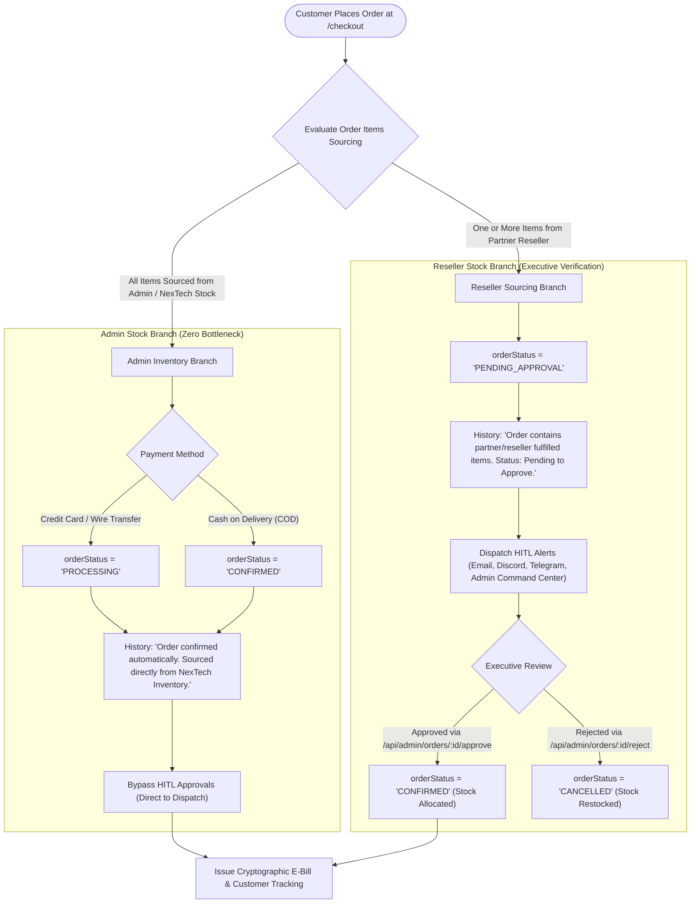
```mermaid
graph TD
    START(["Customer Places Order at /checkout"]) --> EVAL{"Evaluate Order Items Sourcing"}

    EVAL -->|"All Items Sourced from Admin / NexTech Stock"| ADMIN_FLOW["Admin Inventory Branch"]
    EVAL -->|"One or More Items from Partner Reseller"| RESELLER_FLOW["Reseller Sourcing Branch"]

    subgraph Admin_Auto_Confirm["Admin Stock Branch (Zero Bottleneck)"]
        ADMIN_FLOW --> AUTO_STATUS{"Payment Method"}
        AUTO_STATUS -->|"Credit Card / Wire Transfer"| SET_PROC["orderStatus = 'PROCESSING'"]
        AUTO_STATUS -->|"Cash on Delivery (COD)"| SET_CONF["orderStatus = 'CONFIRMED'"]
        SET_PROC & SET_CONF --> HIST1["History: 'Order confirmed automatically. Sourced directly from NexTech Inventory.'"]
        HIST1 --> BYPASS_HITL["Bypass HITL Approvals (Direct to Dispatch)"]
    end

    subgraph Reseller_Approval_Gate["Reseller Stock Branch (Executive Verification)"]
        RESELLER_FLOW --> SET_PENDING["orderStatus = 'PENDING_APPROVAL'"]
        SET_PENDING --> HIST2["History: 'Order contains partner/reseller fulfilled items. Status: Pending to Approve.'"]
        HIST2 --> DISPATCH_HITL["Dispatch HITL Alerts (Email, Discord, Telegram, Admin Command Center)"]
        DISPATCH_HITL --> ADMIN_DECISION{"Executive Review"}
        ADMIN_DECISION -->|"Approved via /api/admin/orders/:id/approve"| APPR["orderStatus = 'CONFIRMED' (Stock Allocated)"]
        ADMIN_DECISION -->|"Rejected via /api/admin/orders/:id/reject"| REJ["orderStatus = 'CANCELLED' (Stock Restocked)"]
    end

    BYPASS_HITL --> EBILL["Issue Cryptographic E-Bill & Customer Tracking"]
    APPR --> EBILL
```

---

### Multi-Tenant Reseller Subdomain Isolation

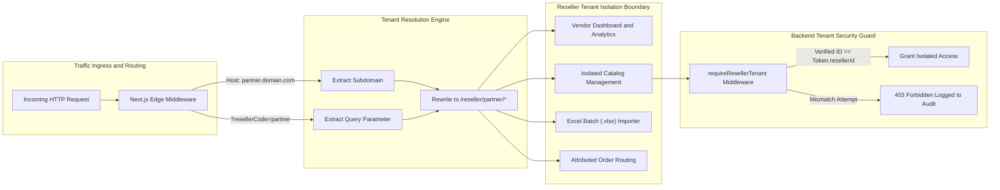
```mermaid
graph LR
    subgraph Ingress["Traffic Ingress and Routing"]
        REQ["Incoming HTTP Request"] --> MW["Next.js Edge Middleware"]
    end

    subgraph Tenant_Resolution["Tenant Resolution Engine"]
        MW -->|"Host: partner.domain.com"| SUB["Extract Subdomain"]
        MW -->|"?resellerCode=partner"| QRY["Extract Query Parameter"]
        SUB --> RWT["Rewrite to /reseller/partner/*"]
        QRY --> RWT
    end

    subgraph Isolation_Boundary["Reseller Tenant Isolation Boundary"]
        RWT --> R_DASH["Vendor Dashboard and Analytics"]
        RWT --> R_PROD["Isolated Catalog Management"]
        RWT --> R_IMP["Excel Batch (.xlsx) Importer"]
        RWT --> R_ORD["Attributed Order Routing"]
    end

    subgraph Backend_Security["Backend Tenant Security Guard"]
        R_PROD --> API_GUARD["requireResellerTenant Middleware"]
        API_GUARD -->|"Verified ID == Token.resellerId"| SEC_OK["Grant Isolated Access"]
        API_GUARD -->|"Mismatch Attempt"| SEC_DENY["403 Forbidden Logged to Audit"]
    end
```

---

### Edge Security & Anti-DDoS Posture

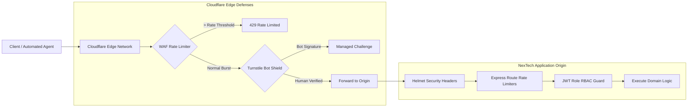
```mermaid
graph LR
    CLIENT["Client / Automated Agent"] --> CF_EDGE["Cloudflare Edge Network"]
    
    subgraph Cloudflare_Defense["Cloudflare Edge Defenses"]
        CF_EDGE --> WAF_CHECK{"WAF Rate Limiter"}
        WAF_CHECK -- "> Rate Threshold" --> BLOCK["429 Rate Limited"]
        WAF_CHECK -- "Normal Burst" --> BOT_CHECK{"Turnstile Bot Shield"}
        BOT_CHECK -- "Bot Signature" --> CHALLENGE["Managed Challenge"]
        BOT_CHECK -- "Human Verified" --> PASS["Forward to Origin"]
    end

    subgraph Origin_Server["NexTech Application Origin"]
        PASS --> HELMET["Helmet Security Headers"]
        HELMET --> RATE_LIMIT["Express Route Rate Limiters"]
        RATE_LIMIT --> JWT_GUARD["JWT Role RBAC Guard"]
        JWT_GUARD --> API_LOGIC["Execute Domain Logic"]
    end
```

---

### Database & Dynamic API Hydration Model

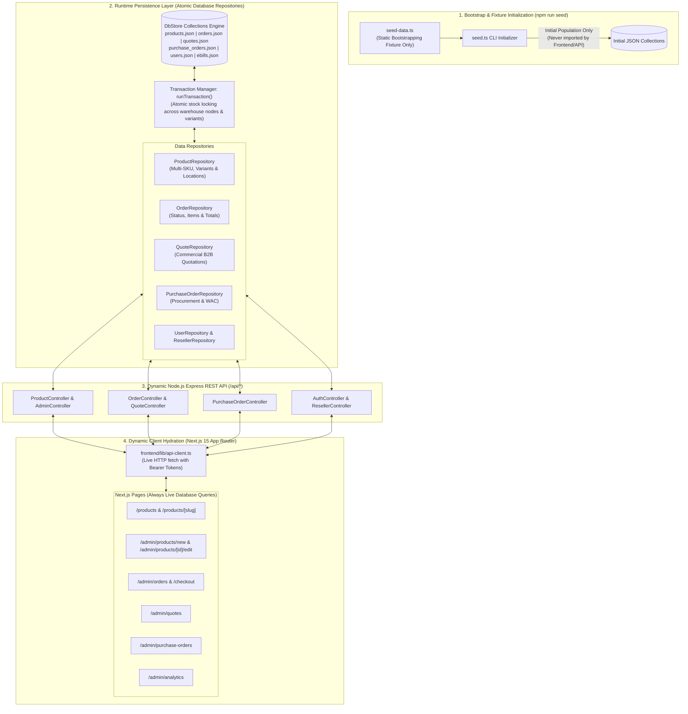
```mermaid
graph TD
    subgraph Bootstrap_Phase["1. Bootstrap & Fixture Initialization (npm run seed)"]
        SEED_DATA["seed-data.ts<br/>(Static Bootstrapping Fixture Only)"] --> SEED_RUNNER["seed.ts CLI Initializer"]
        SEED_RUNNER -->|"Initial Population Only<br/>(Never imported by Frontend/API)"| DB_INIT[("Initial JSON Collections")]
    end

    subgraph Runtime_Persistence["2. Runtime Persistence Layer (Atomic Database Repositories)"]
        DB_STORE[("DbStore Collections Engine<br/>products.json | orders.json | quotes.json<br/>purchase_orders.json | users.json | ebills.json")]
        
        subgraph Repositories["Data Repositories"]
            PROD_REPO["ProductRepository<br/>(Multi-SKU, Variants & Locations)"]
            ORD_REPO["OrderRepository<br/>(Status, Items & Totals)"]
            QUOTE_REPO["QuoteRepository<br/>(Commercial B2B Quotations)"]
            PO_REPO["PurchaseOrderRepository<br/>(Procurement & WAC)"]
            USER_REPO["UserRepository & ResellerRepository"]
        end

        TX_MGR["Transaction Manager: runTransaction()<br/>(Atomic stock locking across warehouse nodes & variants)"]
        DB_STORE <--> TX_MGR <--> Repositories
    end

    subgraph Gateway_API["3. Dynamic Node.js Express REST API (/api/*)"]
        CTRL_PROD["ProductController & AdminController"]
        CTRL_ORD["OrderController & QuoteController"]
        CTRL_PO["PurchaseOrderController"]
        CTRL_AUTH["AuthController & ResellerController"]
        
        Repositories <--> CTRL_PROD & CTRL_ORD & CTRL_PO & CTRL_AUTH
    end

    subgraph Client_Hydration["4. Dynamic Client Hydration (Next.js 15 App Router)"]
        API_CLIENT["frontend/lib/api-client.ts<br/>(Live HTTP fetch with Bearer Tokens)"]
        
        CTRL_PROD & CTRL_ORD & CTRL_PO & CTRL_AUTH <--> API_CLIENT
        
        subgraph Views["Next.js Pages (Always Live Database Queries)"]
            PAGE_CATALOG["/products & /products/[slug]"]
            PAGE_ADMIN_PROD["/admin/products/new & /admin/products/[id]/edit"]
            PAGE_ADMIN_ORDERS["/admin/orders & /checkout"]
            PAGE_ADMIN_QUOTES["/admin/quotes"]
            PAGE_ADMIN_PO["/admin/purchase-orders"]
            PAGE_ANALYTICS["/admin/analytics"]
        end

        API_CLIENT <--> Views
    end
```

> [!IMPORTANT]
> **Architectural Separation of Seed Fixtures vs. Dynamic Database Queries:**
> - **The Role of `seed-data.ts`**: The file [`backend/src/seed/seed-data.ts`](backend/src/seed/seed-data.ts) contains static database fixture definitions. It is **never imported or executed by the frontend**. It is executed strictly by `npm run seed` or when initial database collections are empty to bootstrap initial hardware SKUs, users, and transactions.
> - **Dynamic REST API Queries**: The Next.js frontend **always fetches live data dynamically from the database using Node.js Express REST APIs** via [`ApiClient`](frontend/lib/api-client.ts). When an administrator creates a hardware SKU, issues a B2B quote, creates a sales order, or receives a supplier PO, it is committed directly to the database collection via atomic transactions, decrementing or incrementing stock, and updating all frontend views in real time.

---

### Resilient API Proxy & Dual Fallback Architecture

To ensure zero downtime, graceful offline degradation, and unified client communication across both consumer storefront and administrative panels, NexTech Systems employs a dual-channel reverse-proxy and fallback snapshot architecture within the Next.js App Router layer:

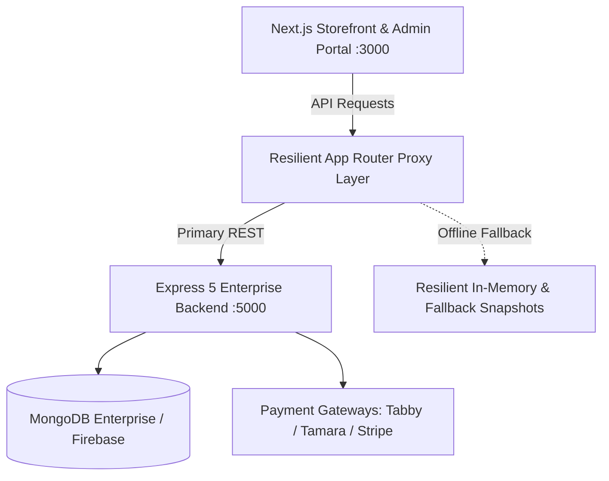
```mermaid
graph TD
    Client[Next.js Storefront & Admin Portal :3000] -->|API Requests| Proxy[Resilient App Router Proxy Layer]
    Proxy -->|Primary REST| Express[Express 5 Enterprise Backend :5000]
    Proxy -.->|Offline Fallback| LocalDB[Resilient In-Memory & Fallback Snapshots]
    Express --> DB[(MongoDB Enterprise / Firebase)]
    Express --> Gateways[Payment Gateways: Tabby / Tamara / Stripe]
```

#### Key Resilience Mechanics:
1. **Universal Upstream Routing**:
   - Storefront and administrative client components utilize [`ApiClient`](frontend/lib/api-client.ts) pointing to relative `/api/*` endpoints.
   - Dedicated Next.js App Router route handlers ([`frontend/app/api/...`](frontend/app/api/)) proxy requests to the upstream Node.js Express server (`http://localhost:5000/api/...` or production `BACKEND_URL`) via [`proxy-helper.ts`](frontend/lib/proxy-helper.ts).
2. **Timeout Protection & Offline Graceful Degradation**:
   - Each proxied upstream fetch is shielded with an active timeout abort signal (`AbortSignal.timeout(3500)`).
   - If the Express backend is temporarily restarting, unreachable, or undergoing deployment, the proxy automatically catches network failures and serves pre-computed fallback snapshots (e.g., cached notifications, local categories, catalog backups, and dynamic layout definitions), preventing white screens, unhandled promise rejections, or broken user sessions.
3. **App Router Administrative Proxy Handlers**:
   - Dedicated App Router handlers are implemented across all admin domains:
     - **Notifications**: [`/api/admin/notifications`](frontend/app/api/admin/notifications/route.ts) & [`[...path]`](frontend/app/api/admin/notifications/[...path]/route.ts)
     - **Products & SKU Management**: [`/api/admin/products`](frontend/app/api/admin/products/route.ts) & [`[...path]`](frontend/app/api/admin/products/[...path]/route.ts)
     - **Categories Management**: [`/api/admin/categories/[id]`](frontend/app/api/admin/categories/[id]/route.ts)
     - **Orders & Approvals**: [`/api/admin/orders/[...path]`](frontend/app/api/admin/orders/[...path]/route.ts)
     - **Customer Actions & Wallets**: [`/api/admin/customers/[...path]`](frontend/app/api/admin/customers/[...path]/route.ts)
     - **Reseller Multi-Tenant Status**: [`/api/admin/resellers/[id]/status`](frontend/app/api/admin/resellers/[id]/status/route.ts)
     - **CMS Storefront Customization**: [`/api/admin/cms/[...path]`](frontend/app/api/admin/cms/[...path]/route.ts)
     - **Promotional Banners**: [`/api/admin/banners`](frontend/app/api/admin/banners/route.ts) & [`[...path]`](frontend/app/api/admin/banners/[...path]/route.ts)
     - **System Telemetry, Audit Logs & Backups**: [`/api/admin/analytics`](frontend/app/api/admin/analytics/route.ts), [`/api/admin/audit-logs`](frontend/app/api/admin/audit-logs/route.ts), [`/api/admin/backup`](frontend/app/api/admin/backup/route.ts), [`/api/admin/restore`](frontend/app/api/admin/restore/route.ts), and [`/api/admin/profile`](frontend/app/api/admin/profile/route.ts)

---

## Core Business Workflows

### Enterprise Hardware SKU & Multi-Variant Studio

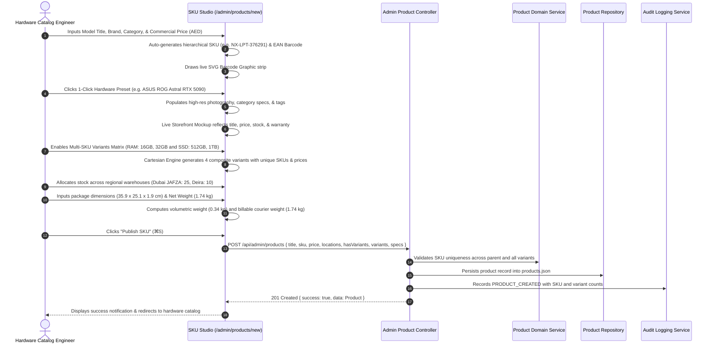
```mermaid
sequenceDiagram
    autonumber
    actor Admin as Hardware Catalog Engineer
    participant UI as SKU Studio (/admin/products/new)
    participant API as Admin Product Controller
    participant ProdSvc as Product Domain Service
    participant Repo as Product Repository
    participant Audit as Audit Logging Service

    Admin->>UI: Inputs Model Title, Brand, Category, & Commercial Price (AED)
    UI->>UI: Auto-generates hierarchical SKU (e.g. NX-LPT-376291) & EAN Barcode
    UI->>UI: Draws live SVG Barcode Graphic strip
    Admin->>UI: Clicks 1-Click Hardware Preset (e.g. ASUS ROG Astral RTX 5090)
    UI->>UI: Populates high-res photography, category specs, & tags
    UI->>UI: Live Storefront Mockup reflects title, price, stock, & warranty
    Admin->>UI: Enables Multi-SKU Variants Matrix (RAM: 16GB, 32GB and SSD: 512GB, 1TB)
    UI->>UI: Cartesian Engine generates 4 composite variants with unique SKUs & prices
    Admin->>UI: Allocates stock across regional warehouses (Dubai JAFZA: 25, Deira: 10)
    Admin->>UI: Inputs package dimensions (35.9 x 25.1 x 1.9 cm) & Net Weight (1.74 kg)
    UI->>UI: Computes volumetric weight (0.34 kg) and billable courier weight (1.74 kg)
    Admin->>UI: Clicks "Publish SKU" (⌘S)
    UI->>API: POST /api/admin/products { title, sku, price, locations, hasVariants, variants, specs }
    API->>ProdSvc: Validates SKU uniqueness across parent and all variants
    API->>Repo: Persists product record into products.json
    API->>Audit: Records PRODUCT_CREATED with SKU and variant counts
    API-->>UI: 201 Created { success: true, data: Product }
    UI-->>Admin: Displays success notification & redirects to hardware catalog
```

---

### B2B Quotations and 1-Click Sales Order Conversion

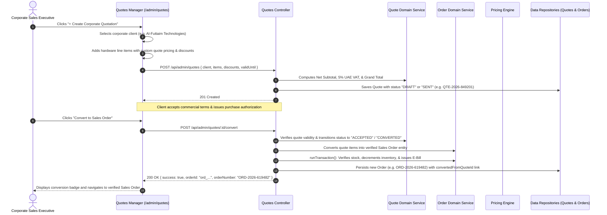
```mermaid
sequenceDiagram
    autonumber
    actor Admin as Corporate Sales Executive
    participant QuotesUI as Quotes Manager (/admin/quotes)
    participant API as Quotes Controller
    participant QuoteSvc as Quote Domain Service
    participant OrderSvc as Order Domain Service
    participant PriceSvc as Pricing Engine
    participant Repo as Data Repositories (Quotes & Orders)

    Admin->>QuotesUI: Clicks "+ Create Corporate Quotation"
    QuotesUI->>QuotesUI: Selects corporate client (e.g. Al-Futtaim Technologies)
    QuotesUI->>QuotesUI: Adds hardware line items with custom quote pricing & discounts
    QuotesUI->>API: POST /api/admin/quotes { client, items, discounts, validUntil }
    API->>QuoteSvc: Computes Net Subtotal, 5% UAE VAT, & Grand Total
    API->>Repo: Saves Quote with status "DRAFT" or "SENT" (e.g. QTE-2026-849201)
    API-->>QuotesUI: 201 Created
    Note over QuotesUI,API: Client accepts commercial terms & issues purchase authorization
    Admin->>QuotesUI: Clicks "Convert to Sales Order"
    QuotesUI->>API: POST /api/admin/quotes/:id/convert
    API->>QuoteSvc: Verifies quote validity & transitions status to "ACCEPTED" / "CONVERTED"
    API->>OrderSvc: Converts quote items into verified Sales Order entity
    API->>OrderSvc: runTransaction(): Verifies stock, decrements inventory, & issues E-Bill
    API->>Repo: Persists new Order (e.g. ORD-2026-619482) with convertedFromQuoteId link
    API-->>QuotesUI: 200 OK { success: true, orderId: "ord_...", orderNumber: "ORD-2026-619482" }
    QuotesUI-->>Admin: Displays conversion badge and navigates to verified Sales Order
```

---

### Supplier Procurement & Wholesale Purchase Orders

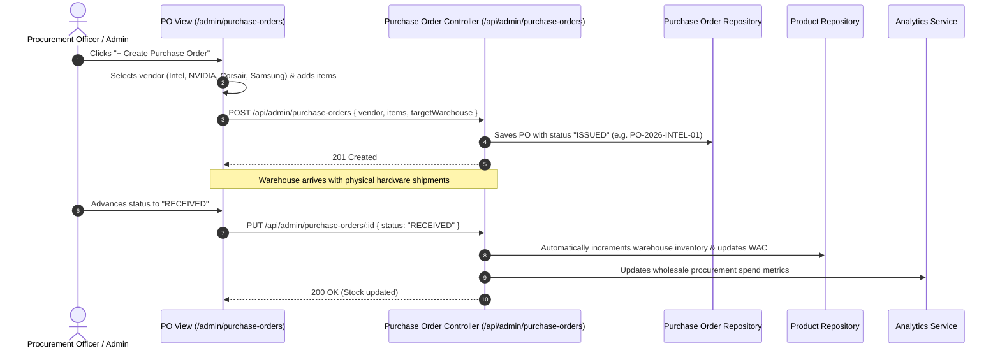
```mermaid
sequenceDiagram
    autonumber
    actor Procurement as Procurement Officer / Admin
    participant UI as PO View (/admin/purchase-orders)
    participant API as Purchase Order Controller (/api/admin/purchase-orders)
    participant PORepo as Purchase Order Repository
    participant ProdRepo as Product Repository
    participant Analytics as Analytics Service

    Procurement->>UI: Clicks "+ Create Purchase Order"
    UI->>UI: Selects vendor (Intel, NVIDIA, Corsair, Samsung) & adds items
    UI->>API: POST /api/admin/purchase-orders { vendor, items, targetWarehouse }
    API->>PORepo: Saves PO with status "ISSUED" (e.g. PO-2026-INTEL-01)
    API-->>UI: 201 Created
    Note over UI,API: Warehouse arrives with physical hardware shipments
    Procurement->>UI: Advances status to "RECEIVED"
    UI->>API: PUT /api/admin/purchase-orders/:id { status: "RECEIVED" }
    API->>ProdRepo: Automatically increments warehouse inventory & updates WAC
    API->>Analytics: Updates wholesale procurement spend metrics
    API-->>UI: 200 OK (Stock updated)
```

---

### Commercial Intelligence: Sales vs. Purchase Analytics Engine

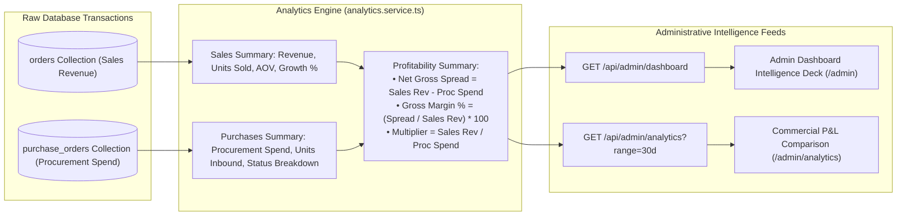
```mermaid
graph LR
    subgraph Data_Sources["Raw Database Transactions"]
        ORDERS[("orders Collection (Sales Revenue)")]
        POS[("purchase_orders Collection (Procurement Spend)")]
    end

    subgraph Calculation_Engine["Analytics Engine (analytics.service.ts)"]
        ORDERS --> SALES_CALC["Sales Summary: Revenue, Units Sold, AOV, Growth %"]
        POS --> PURCH_CALC["Purchases Summary: Procurement Spend, Units Inbound, Status Breakdown"]
        SALES_CALC --> PROFIT_CALC["Profitability Summary:<br/>• Net Gross Spread = Sales Rev - Proc Spend<br/>• Gross Margin % = (Spread / Sales Rev) * 100<br/>• Multiplier = Sales Rev / Proc Spend"]
        PURCH_CALC --> PROFIT_CALC
    end

    subgraph Consumer_Endpoints["Administrative Intelligence Feeds"]
        PROFIT_CALC --> DASHBOARD_API["GET /api/admin/dashboard"]
        PROFIT_CALC --> ANALYTICS_API["GET /api/admin/analytics?range=30d"]
        DASHBOARD_API --> DASH_VIEW["Admin Dashboard Intelligence Deck (/admin)"]
        ANALYTICS_API --> ANALYTICS_VIEW["Commercial P&L Comparison (/admin/analytics)"]
    end
```

---

### Real-Time PC Builder Compatibility Matrix

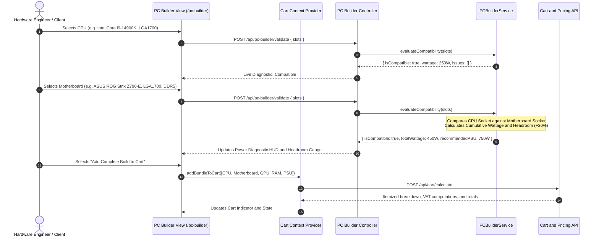
```mermaid
sequenceDiagram
    autonumber
    actor User as Hardware Engineer / Client
    participant UI as PC Builder View (/pc-builder)
    participant CartCtx as Cart Context Provider
    participant API as PC Builder Controller
    participant Service as PCBuilderService
    participant CartAPI as Cart and Pricing API

    User->>UI: Selects CPU (e.g. Intel Core i9-14900K, LGA1700)
    UI->>API: POST /api/pc-builder/validate { slots }
    API->>Service: evaluateCompatibility(slots)
    Service-->>API: { isCompatible: true, wattage: 253W, issues: [] }
    API-->>UI: Live Diagnostic: Compatible

    User->>UI: Selects Motherboard (e.g. ASUS ROG Strix Z790-E, LGA1700, DDR5)
    UI->>API: POST /api/pc-builder/validate { slots }
    API->>Service: evaluateCompatibility(slots)
    Note over Service: Compares CPU Socket against Motherboard Socket<br/>Calculates Cumulative Wattage and Headroom (+30%)
    Service-->>API: { isCompatible: true, totalWattage: 450W, recommendedPSU: 750W }
    API-->>UI: Updates Power Diagnostic HUD and Headroom Gauge

    User->>UI: Selects "Add Complete Build to Cart"
    UI->>CartCtx: addBundleToCart([CPU, Motherboard, GPU, RAM, PSU])
    CartCtx->>CartAPI: POST /api/cart/calculate
    CartAPI-->>CartCtx: Itemized breakdown, VAT computations, and totals
    CartCtx-->>UI: Updates Cart Indicator and State
```

---

### Authoritative Server-Side Pricing, Checkout & E-Bills

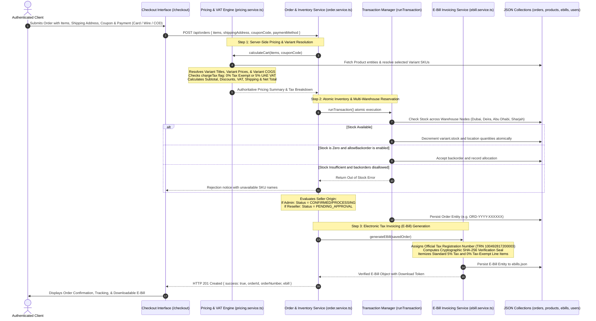
```mermaid
sequenceDiagram
    autonumber
    actor Customer as Authenticated Client
    participant UI as Checkout Interface (/checkout)
    participant CartSvc as Pricing & VAT Engine (pricing.service.ts)
    participant OrdSvc as Order & Inventory Service (order.service.ts)
    participant TxMgr as Transaction Manager (runTransaction)
    participant EBillSvc as E-Bill Invoicing Service (ebill.service.ts)
    participant DB as JSON Collections (orders, products, ebills, users)

    Customer->>UI: Submits Order with Items, Shipping Address, Coupon & Payment (Card / Wire / COD)
    UI->>OrdSvc: POST /api/orders { items, shippingAddress, couponCode, paymentMethod }
    
    Note over OrdSvc,CartSvc: Step 1: Server-Side Pricing & Variant Resolution
    OrdSvc->>CartSvc: calculateCart(items, couponCode)
    CartSvc->>DB: Fetch Product entities & resolve selected Variant SKUs
    Note over CartSvc: Resolves Variant Titles, Variant Prices, & Variant COGS<br/>Checks chargeTax flag: 0% Tax Exempt or 5% UAE VAT<br/>Calculates Subtotal, Discounts, VAT, Shipping & Net Total
    CartSvc-->>OrdSvc: Authoritative Pricing Summary & Tax Breakdown

    Note over OrdSvc,TxMgr: Step 2: Atomic Inventory & Multi-Warehouse Reservation
    OrdSvc->>TxMgr: runTransaction() atomic execution
    TxMgr->>DB: Check Stock across Warehouse Nodes (Dubai, Deira, Abu Dhabi, Sharjah)
    alt Stock Available
        TxMgr->>DB: Decrement variant.stock and location quantities atomically
    else Stock is Zero and allowBackorder is enabled
        TxMgr->>DB: Accept backorder and record allocation
    else Stock Insufficient and backorders disallowed
        TxMgr-->>OrdSvc: Return Out of Stock Error
        OrdSvc-->>UI: Rejection notice with unavailable SKU names
    end
    Note over OrdSvc: Evaluates Seller Origin:<br/>If Admin: Status = CONFIRMED/PROCESSING<br/>If Reseller: Status = PENDING_APPROVAL
    TxMgr->>DB: Persist Order Entity (e.g. ORD-YYYY-XXXXXX)

    Note over OrdSvc,EBillSvc: Step 3: Electronic Tax Invoicing (E-Bill) Generation
    OrdSvc->>EBillSvc: generateEBill(savedOrder)
    Note over EBillSvc: Assigns Official Tax Registration Number (TRN 100492817200003)<br/>Computes Cryptographic SHA-256 Verification Seal<br/>Itemizes Standard 5% Tax and 0% Tax-Exempt Line Items
    EBillSvc->>DB: Persist E-Bill Entity to ebills.json
    EBillSvc-->>OrdSvc: Verified E-Bill Object with Download Token

    OrdSvc-->>UI: HTTP 201 Created { success: true, orderId, orderNumber, ebill }
    UI->>Customer: Displays Order Confirmation, Tracking, & Downloadable E-Bill
```

---

### Role-Based Access Control (RBAC) Lifecycle


```mermaid
stateDiagram-v2
    [*] --> AnonymousGuest: Visits Storefront
    
    state AnonymousGuest {
        BrowseCatalog: Browse Products, Variants & Categories
        UsePCBuilder: Configure PC Components
        CalculateCart: Cart Pricing Calculation
    }
    
    AnonymousGuest --> RegisteredCustomer: POST /api/auth/register
    AnonymousGuest --> AuthenticatedUser: POST /api/auth/login
    
    state AuthenticatedUser {
        state CustomerRole {
            ManageProfile: Account Profile and Saved Addresses
            OrderHistory: View Personal Orders & Invoices
            WishlistAccess: Inspect Saved Wishlist
            DownloadEBill: Access Owned E-Bills
        }
        
        state ResellerRole {
            VendorDashboard: View Attributed Sales
            CatalogManagement: Add / Edit Partner SKUs
            ExcelImport: Batch Upload Hardware (.xlsx)
            InventoryControl: Adjust Partner Stock
        }
        
        state AdminRole {
            GlobalOperations: Full Storefront Control
            SKUAuthoringStudio: Enterprise Hardware SKU & Variant Authoring
            B2BQuoteManagement: Draft Quotes & 1-Click Order Conversion
            SalesOrderDispatch: Direct Customer Order Creation & Dispatch
            SupplierProcurement: Issue & Receive Supplier POs
            CommercialIntelligence: Sales vs. Purchase P&L Margin Tracking
            ApproveOrders: Review & Approve Reseller-Stock Orders
            ManageTenants: Provision Reseller Accounts
            AuditInspection: View Security Logs
            VatReporting: View FTA VAT 201 Summaries
            CMSArranger: Dynamic Section Ordering & Bento Trust Grid
            BackupRecovery: Instant Database Snapshots
        }
    }
```

---

## Technology Stack

| Domain | Technology / Library | Architectural Role |
| :--- | :--- | :--- |
| **Frontend Framework** | Next.js 16.4.0 (App Router), React 19.3.0 | Server-Side Rendering (SSR), React Server Components, Turbopack |
| **Language** | TypeScript 7.0 / 5.8 | Strict static typing across frontend and backend workspaces (`tsc --noEmit`) |
| **Styling & UI** | Tailwind CSS 4.3 / 3.4, Lucide Icons | Premium enterprise UI with dark/light persistent themes & glassmorphism |
| **Backend Framework** | Node.js 18+ / 20+ LTS, Express 5.2.1 | High-throughput REST API gateway with modular controllers and routers |
| **Security & Edge** | Cloudflare Turnstile, Helmet, express-rate-limit | Layer 7 WAF, anti-bot challenge, and HTTP security header hardening |
| **Cryptography** | PBKDF2 (SHA-512 / SHA-256), timingSafeEqual | Per-user 32-byte salts (100,000 iterations), timing-safe comparisons |
| **Data Ingestion** | XLSX (SheetJS), Multer | High-performance Excel buffer parsing and catalog ingestion |
| **Persistence Engine** | Dual MongoDB Enterprise & DbStore Collections | Atomic transactions (`runTransaction`), JSON fallback persistence & backups |
| **Regional Payments** | Tamara, Tabby, Stripe, Central Bank Dirham Standard | 8% BNPL surcharge, 3% Card surcharge, Bur Dubai COD rules, 5% in-store discount |
| **Currency Standards** | `dirham` vector standard, Live Exchange API | Official UAE Dirham (`U+20C3`) symbol, Web Font & dynamic FX conversions |

---

## Project Directory Structure

```
eCommerce_Store/
├── backend/                         # Express REST API application
│   ├── data_store/                  # Structured JSON collections
│   │   ├── audit_logs.json          # System security and administrative trail
│   │   ├── backups.json             # Database backup snapshot metadata
│   │   ├── bento_features.json      # Dynamic trust grid cards & guarantees
│   │   ├── brands.json              # Hardware manufacturer entities
│   │   ├── categories.json          # Product category definitions
│   │   ├── cms_sections.json        # Dynamic homepage section arrangement
│   │   ├── ebills.json              # Electronic tax invoices
│   │   ├── orders.json              # Customer order records
│   │   ├── products.json            # Hardware product catalog & variants
│   │   ├── purchase_orders.json     # Supplier procurement purchase orders
│   │   ├── quotes.json              # B2B quotation records
│   │   ├── resellers.json           # Multi-tenant partner profiles
│   │   └── users.json               # Customer, reseller, and admin accounts
│   ├── src/
│   │   ├── config/                  # Environment and persistence config
│   │   ├── constants/               # Hardware specifications and taxonomy
│   │   ├── controllers/             # HTTP route controller implementations
│   │   ├── middleware/              # Auth, RBAC, and error handlers
│   │   ├── middlewares/             # Rate limiters and Cloudflare security
│   │   ├── repositories/            # Data access repository layer (Order, PO, Product, Quote, etc.)
│   │   ├── routes/                  # API endpoint route declarations
│   │   ├── seed/                    # Database bootstrap fixtures (seed-data.ts, seed.ts)
│   │   ├── services/                # Domain business logic (Order, Analytics, Pricing, Quote, etc.)
│   │   ├── utils/                   # Cryptographic PIN and helper utilities
│   │   ├── app.ts                   # Express server entry point
│   │   └── server.ts                # HTTP listener bootstrap
│   ├── package.json
│   └── tsconfig.json
├── frontend/                        # Next.js 16 App Router web application
│   ├── app/
│   │   ├── account/                 # Customer dashboard, orders, wallet, and addresses
│   │   ├── admin/                   # Admin command center and operations
│   │   │   ├── analytics/           # Commercial BI intelligence & P&L margin tracker
│   │   │   ├── audit-logs/          # Security & administrative audit trail
│   │   │   ├── backups/             # Database snapshot & disaster recovery
│   │   │   ├── banners/             # Promotional homepage banners CRUD
│   │   │   ├── brands/              # Hardware manufacturer brand management
│   │   │   ├── categories/          # Product category tree & taxonomy
│   │   │   ├── cms/                 # Visual section arranger & bento editor
│   │   │   ├── coupons/             # Promotional voucher issuance & limits
│   │   │   ├── customers/           # Client accounts, wallets & status toggles
│   │   │   ├── orders/              # Order management, approvals & serial assignment
│   │   │   ├── products/            # Hardware SKU catalog and specifications
│   │   │   │   ├── [id]/edit/       # Dedicated SKU Edit Studio Page
│   │   │   │   └── new/             # Dedicated SKU Create Studio Page
│   │   │   ├── purchase-orders/     # Supplier wholesale procurement orders
│   │   │   ├── quotes/              # B2B Quote Management & Order Conversion
│   │   │   ├── resellers/           # Multi-tenant partner management & verification
│   │   │   └── settings/            # Platform variables, VAT rates, and maintenance
│   │   ├── api/                     # Next.js serverless route proxies & resilient fallbacks
│   │   │   ├── admin/               # 20 Dedicated Admin sub-route proxy handlers
│   │   │   ├── auth/                # Customer, Admin & Reseller authentication
│   │   │   ├── cart/                # Authoritative pricing & coupon validation
│   │   │   ├── content/             # Storefront CMS, hero slides, and presets
│   │   │   ├── orders/              # Order routing, checkout, and email OTP
│   │   │   ├── payments/            # Tamara, Tabby, Stripe, COD & in-store settlements
│   │   │   ├── products/            # Search, filter, brands, categories
│   │   │   └── wallet/              # Customer digital wallet ledger
│   │   ├── cart/                    # Interactive cart and price calculation
│   │   ├── checkout/                # Order placement, BNPL & payment gateways
│   │   ├── compare/                 # Side-by-side hardware comparison
│   │   ├── login/ / register/       # Unified sign-in and professional onboarding
│   │   ├── pc-builder/              # PC Builder compatibility engine
│   │   ├── products/                # Catalog browse, filter, and detail views
│   │   ├── reseller/                # Multi-tenant reseller portal & inventory
│   │   ├── layout.tsx               # Root application layout
│   │   └── page.tsx                 # Dynamic storefront homepage
│   ├── components/                  # Reusable UI component library
│   │   ├── account/                 # CustomerPortalHeader, AddressManagementModal
│   │   ├── admin/                   # AdminNotificationCenter, ProductEditorPage
│   │   ├── home/                    # Hero, Bento Grid, Taxonomy, & Solutions
│   │   ├── layout/                  # Navbar, Footer, & GlobalCommandPalette (Cmd+K)
│   │   ├── product/                 # ProductCard, Matrix Showcase, & Filters
│   │   └── ui/                      # Modals, HUD diagnostics, & DirhamSymbol
│   ├── lib/                         # State providers, API client, and utilities
│   │   ├── api-client.ts            # Type-safe API client with auto-fallback
│   │   ├── proxy-helper.ts          # Universal Next.js API proxy with timeout & fallback
│   │   ├── auth-context.tsx         # User authentication state provider
│   │   ├── cart-context.tsx         # Shopping cart state provider
│   │   ├── currency-context.tsx     # Multi-currency state and rates provider
│   │   ├── default-taxonomy.ts      # Resilient fallback categories and brands
│   │   └── theme-context.tsx        # Dark and light appearance provider
│   ├── types/                       # Shared TypeScript interfaces
│   ├── next.config.mjs              # Next.js configuration and proxy rewrites
│   ├── package.json
│   └── tsconfig.json
├── scripts/                         # Build, seeding, and verification suites
│   ├── test-endpoints.js            # 26 Live endpoint probes and health checks
│   ├── test-all-flows.mjs           # 22-Step full-stack integration test suite
│   └── generate-fallback.cjs        # Standalone resilient dataset generator
├── package.json                     # Monorepo root workspaces
└── README.md
```

---

## API Specification

### Authentication & Identity

| Method | Endpoint | Access Level | Description |
| :--- | :--- | :--- | :--- |
| `POST` | `/api/auth/register` | Public | Create new customer account with mandatory password validation |
| `POST` | `/api/auth/login` | Public | Authenticate user credentials and return signed JWT |
| `POST` | `/api/auth/google` | Public | Authenticate federated Google identity token |
| `GET` | `/api/auth/me` | Authenticated | Return authenticated profile and role metadata |
| `PUT` | `/api/auth/profile` | Authenticated | Update user name, contact phone, and delivery address book |
| `DELETE`| `/api/auth/delete-account` | Authenticated | Permanent user account deletion requiring verified password confirmation |

### Products & Catalog

| Method | Endpoint | Access Level | Description |
| :--- | :--- | :--- | :--- |
| `GET` | `/api/products` | Public | List hardware products with filters, search, sorting, and pagination |
| `GET` | `/api/products/:slug` | Public | Retrieve detailed hardware specifications and variants by URL slug |
| `GET` | `/api/admin/products/:id` | Admin | Retrieve complete hardware SKU entity with locations & variants |
| `POST` | `/api/admin/products` | Admin | Create new hardware SKU with multi-node locations and variants |
| `PUT` | `/api/admin/products/:id` | Admin | Update product information, pricing, locations, and variants |
| `DELETE`| `/api/admin/products/:id` | Admin | Remove product listing from catalog |
| `GET` | `/api/products/categories` | Public | Retrieve product category taxonomy hierarchy |
| `GET` | `/api/products/brands` | Public | Retrieve hardware manufacturer brands listing |

### Orders & Electronic E-Bills

| Method | Endpoint | Access Level | Description |
| :--- | :--- | :--- | :--- |
| `POST` | `/api/orders` | Customer / Admin | Place new customer order; assigns `CONFIRMED`/`PROCESSING` for Admin stock, or `PENDING_APPROVAL` for Reseller stock |
| `POST` | `/api/admin/orders` | Admin | Admin direct sales order creation with client consignee & stock deduction |
| `GET` | `/api/orders/my` | Customer | Retrieve authenticated customer order history |
| `GET` | `/api/orders/:id` | Authenticated | Retrieve order status and invoice details (Ownership verified) |
| `GET` | `/api/orders/:orderId/ebill` | Authenticated | Download official electronic tax invoice (Ownership verified) |
| `PUT` | `/api/admin/orders/:id/approve` | Admin | Approve pending reseller order; transitions to `CONFIRMED` and allocates stock |
| `PUT` | `/api/admin/orders/:id/reject` | Admin | Reject pending reseller order; transitions to `CANCELLED` and restocks inventory |

### B2B Quotations & Order Conversions

| Method | Endpoint | Access Level | Description |
| :--- | :--- | :--- | :--- |
| `GET` | `/api/admin/quotes` | Admin | List all corporate quotations with status and client filters |
| `GET` | `/api/admin/quotes/:id` | Admin | Retrieve single quotation with itemized pricing and terms |
| `POST` | `/api/admin/quotes` | Admin | Create new B2B quotation with custom commercial discounts |
| `PUT` | `/api/admin/quotes/:id` | Admin | Update quotation items, discounts, or terms |
| `POST` | `/api/admin/quotes/:id/convert`| Admin | **1-Click Conversion**: Convert approved quote directly into verified Sales Order with atomic stock reservation |

### Supplier Procurement & Purchase Orders

| Method | Endpoint | Access Level | Description |
| :--- | :--- | :--- | :--- |
| `GET` | `/api/admin/purchase-orders` | Admin | List all wholesale supplier POs with vendor and status filters |
| `POST` | `/api/admin/purchase-orders` | Admin | Issue new purchase order to component manufacturer (Intel, NVIDIA, etc.) |
| `PUT` | `/api/admin/purchase-orders/:id` | Admin | Update receiving status (`ISSUED`, `RECEIVED`), auto-incrementing warehouse inventory & WAC |
| `DELETE` | `/api/admin/purchase-orders/:id` | Admin | Cancel or remove supplier procurement record |

### Multi-Tenant Reseller Vendor Portal

| Method | Endpoint | Access Level | Description |
| :--- | :--- | :--- | :--- |
| `GET` | `/api/reseller/dashboard` | Reseller / Admin | Retrieve vendor sales volume, metrics, and commissions |
| `GET` | `/api/reseller/template/download` | Reseller | Download official `.xlsx` bulk listing template |
| `POST` | `/api/reseller/import/preview` | Reseller | Parse and validate uploaded spreadsheet buffer |
| `POST` | `/api/reseller/import/execute` | Reseller | Ingest validated rows into catalog; immediately active in store |
| `GET` | `/api/reseller/products` | Reseller | Manage reseller-attributed hardware listings |
| `POST` | `/api/reseller/products` | Reseller | Submit new single product listing |

### Currencies & Central Bank Dirham Standard

| Method | Endpoint | Access Level | Description |
| :--- | :--- | :--- | :--- |
| `GET` | `/api/currencies` | Public | Retrieve supported currencies, official symbols (`U+20C3`), and live exchange rates against AED |

### PC Builder Compatibility Engine

| Method | Endpoint | Access Level | Description |
| :--- | :--- | :--- | :--- |
| `GET` | `/api/pc-builder/components` | Public | Retrieve hardware components partitioned by component slot |
| `POST` | `/api/pc-builder/validate` | Public | Validate socket matching, memory standard, and TDP headroom (+30%) |

### Cart & Authoritative Pricing

| Method | Endpoint | Access Level | Description |
| :--- | :--- | :--- | :--- |
| `POST` | `/api/cart/calculate` | Optional Auth | Calculate verified itemized prices, variant overrides, 5% UAE VAT, and discounts |
| `POST` | `/api/cart/coupon/validate` | Public | Validate promotional coupon codes and order thresholds |

### Cloudflare Edge Telemetry

| Method | Endpoint | Access Level | Description |
| :--- | :--- | :--- | :--- |
| `GET` | `/api/security/cloudflare-status` | Admin | Inspect Cloudflare CDN, WAF, and DDoS telemetry |
| `POST` | `/api/security/verify-turnstile` | Public | Validate Cloudflare Turnstile challenge token |

### Regional Payments, BNPL & Financial Settlement

| Method | Endpoint | Access Level | Description |
| :--- | :--- | :--- | :--- |
| `POST` | `/api/orders/request-otp` | Authenticated | Generate and dispatch 6-digit verification code to customer email |
| `POST` | `/api/orders/verify-otp` | Authenticated | Pre-validate 6-digit OTP code before order placement |
| `POST` | `/api/payments/initiate` | Authenticated | Initiate payment session (Tamara 8%, Tabby 8%, Card 3%, or In-Store) |
| `POST` | `/api/payments/verify` | Authenticated | Verify and settle payment redirect callback (Tamara settlement) |
| `POST` | `/api/payments/tabby/webhook` | Public | Tabby webhook callback receiver (HMAC & signature verified) |
| `GET` | `/api/payments/status/:orderId`| Authenticated | Query authoritative payment status with cross-tenant IDOR protection |
| `GET` | `/api/wallet` | Authenticated | Retrieve customer digital wallet ledger, balance & transactions |
| `POST` | `/api/wallet/add-funds` | Authenticated | Top-up customer digital wallet balance |

### Admin Command Center, Operations & Telemetry

| Method | Endpoint | Access Level | Description |
| :--- | :--- | :--- | :--- |
| `GET` | `/api/admin/dashboard` | Admin | Master operations KPI deck (revenue, margin, low stock, pending approvals) |
| `GET` | `/api/admin/analytics` | Admin | Commercial P&L comparison (sales revenue vs. wholesale procurement spend) |
| `GET` | `/api/admin/notifications` | Admin | Fetch unread alerts, critical actions, and pending operational tasks |
| `PUT` | `/api/admin/notifications/:id/read` | Admin | Mark specific notification as read |
| `PUT` | `/api/admin/notifications/read-all` | Admin | Mark all active notifications as read |
| `GET` | `/api/admin/audit-logs` | Admin | Filterable administrative actions, IP stamps, and security audit log |
| `PUT` | `/api/admin/orders/:id/status` | Admin | Update sales order status, delivery notes, and assign hardware serial numbers |
| `PUT` | `/api/admin/customers/:id/toggle-status` | Admin | Activate or suspend customer account access |
| `POST` | `/api/admin/customers/:id/wallet-adjust` | Admin | Credit or debit customer digital wallet with administrative audit reason |
| `PUT` | `/api/admin/resellers/:id/status` | Admin | Activate or suspend partner vendor account access |
| `GET` | `/api/admin/cms/layout` | Admin | Storefront dynamic section arrangement, ordering, and visibility |
| `PUT` | `/api/admin/cms/layout` | Admin | Persist updated storefront layout and bento card settings |
| `GET` | `/api/admin/cms/features` | Admin | Retrieve "Why Tech Teams Trust NexTech" Bento features |
| `POST` | `/api/admin/cms/features` | Admin | Create new Bento trust feature card |
| `GET` | `/api/admin/banners` | Admin | List promotional homepage banners |
| `POST` | `/api/admin/banners` | Admin | Create new promotional campaign banner |
| `GET` | `/api/admin/backup` | Admin | Generate and download full atomic JSON database snapshot |
| `POST` | `/api/admin/restore` | Admin | Atomic database restore from verified snapshot file |
| `GET` | `/api/vat/summary` | Admin | UAE FTA VAT 201 periodic audit summary (Output/Input VAT) |

---

## Getting Started and Local Development

### Prerequisites

- **Node.js**: `v20.x+` LTS ([Download Node.js](https://nodejs.org/))
- **npm**: `v10+`

---

### Unified Workspace Commands

Run commands directly from the monorepo root:

```bash
# 1. Install all dependencies across both frontend and backend
npm install

# 2. Concurrently boot development servers
npm run dev:backend   # Express REST API on http://localhost:5000
npm run dev:frontend  # Next.js 15 App Router on http://localhost:3000

# 3. Static Typecheck & Linting
npm run lint          # Executes tsc --noEmit across all workspaces

# 4. Compile Production Bundles
npm run build         # Validates complete production build output
```

---

### Backend Setup

```bash
cd backend
npm install
npm run dev
```

*The Express API will initialize the local JSON data store and prepare seed collections.*

---

### Frontend Setup

```bash
cd frontend
npm install
npm run dev
```

*Navigate to [http://localhost:3000](http://localhost:3000) to view the storefront.*

---

### Environment Configuration

#### Backend Configuration (`backend/.env`):
```env
PORT=5000
NODE_ENV=development
CLIENT_URL=http://localhost:3000
JWT_SECRET=your_cryptographic_jwt_secret_key_minimum_32_characters
PASSWORD_SALT=your_pbkdf2_password_salt_key

# Cloudflare Turnstile (Optional in development)
CLOUDFLARE_TURNSTILE_SECRET_KEY=1x0000000000000000000000000000000AA
CLOUDFLARE_SECURITY_ENABLED=false
```

#### Frontend Configuration (`frontend/.env.local`):
```env
NEXT_PUBLIC_API_URL=http://localhost:5000/api
NEXT_PUBLIC_CLOUDFLARE_TURNSTILE_SITE_KEY=1x00000000000000000000AA
```

---

## Automated Testing Suites & System Verification

The repository includes a comprehensive, multi-layered verification matrix covering financial computations, regional payment rules, security access controls, and live HTTP endpoint reachability:

### 1. Unified Test Commands

```bash
# 1. Unit & Smoke Verification
npm run test:backend

# 2. Comprehensive E2E Financial & Security Verification (Tamara 8%, Tabby 8%, Card 3%, COD, IDOR)
npm --workspace=backend run test:e2e

# 3. Full-Stack End-to-End Workflow Suite (22 Automated Integration Checks)
node scripts/test-all-flows.mjs

# 4. Live Endpoint Health & Reachability Probes (26 Endpoints)
npm run test:endpoints
```

---

### 2. Full-Stack End-to-End Workflow Suite (`scripts/test-all-flows.mjs`)

An automated integration runner executing 22 distinct end-to-end checks validating backend domain controllers, Next.js App Router proxy layers, multi-currency conversions, catalog search, cart mathematics, coupon rules, B2B reseller onboarding, and admin telemetry:

```bash
node scripts/test-all-flows.mjs
```

| # | Verification Area | Target Endpoint / Method | Result | Verification Scope |
| :---: | :--- | :--- | :---: | :--- |
| **01** | **Backend Health Check** | `GET /api/health` | ✅ **PASS** | Status: `healthy`, Version: 1.0.0, uptime tracking |
| **02** | **Multi-Currency Service** | `GET /api/currencies` | ✅ **PASS** | Synchronizes AED/USD/EUR/SAR exchange rates |
| **03** | **Hardware Categories** | `GET /api/products/categories` | ✅ **PASS** | 13 categories returned with taxonomy metadata |
| **04** | **Authorized Brands** | `GET /api/products/brands` | ✅ **PASS** | 19 enterprise hardware brands returned |
| **05** | **Product Catalog Listing** | `GET /api/products` | ✅ **PASS** | Pagination, filtering & SKU search verified |
| **06** | **Cart Price Calculation** | `POST /api/cart/calculate` | ✅ **PASS** | Authoritative UAE 5% VAT calculation & line-item totals |
| **07** | **Coupon Validation** | `POST /api/cart/coupon/validate` | ✅ **PASS** | Validates backend coupon codes (`TECH10` and `SUMMER50`) |
| **08** | **Customer Registration** | `POST /api/auth/register` | ✅ **PASS** | Issues valid JWT with role `CUSTOMER` |
| **09** | **Customer Identity** | `GET /api/auth/me` | ✅ **PASS** | Returns authenticated profile and role metadata |
| **10** | **Customer Wallet Balance** | `GET /api/wallet` | ✅ **PASS** | Fetches live customer wallet balance and transaction ledger |
| **11** | **Reseller Registration** | `POST /api/auth/register` | ✅ **PASS** | Multi-tenant vendor onboarding & tenant code generation |
| **12** | **Admin Authentication** | `POST /api/auth/login` | ✅ **PASS** | Authenticates admin using bootstrap credentials |
| **13** | **Admin Command Dashboard** | `GET /api/admin/dashboard` | ✅ **PASS** | Real-time sales metrics, revenue KPIs, and counts |
| **14** | **Admin Orders Ledger** | `GET /api/admin/orders` | ✅ **PASS** | Accesses global order history and fulfillment statuses |
| **15** | **Admin Brands Management** | `GET /api/admin/brands` | ✅ **PASS** | Returns brand catalog for administration |
| **16** | **Admin Categories Management** | `GET /api/admin/categories` | ✅ **PASS** | Returns category catalog for taxonomy edits |
| **17** | **Admin Notification Center (Direct)** | `GET http://localhost:5000/api/admin/notifications` | ✅ **PASS** | Live actionable alerts and count |
| **18** | **Admin Notification Center (Proxy)** | `GET http://localhost:3000/api/admin/notifications` | ✅ **PASS** | App Router proxy forward cleanly with status 200 |
| **19** | **Admin Catalog Proxy** | `GET http://localhost:3000/api/admin/products` | ✅ **PASS** | App Router catalog proxy forward cleanly with status 200 |
| **20** | **Hardware Warranty Verification** | `GET /api/warranty/verify/:serial` | ✅ **PASS** | Digital authenticity & warranty term verification |
| **21** | **Storefront CMS Content** | `GET /api/content/homepage` | ✅ **PASS** | Dynamic hero slides & Bento showcase features |
| **22** | **Global Storefront Settings** | `GET /api/content/settings` | ✅ **PASS** | VAT rates, free shipping thresholds, currency defaults |

**Suite Summary:** **22 / 22 Passed (100% Success)**

---

### 3. Comprehensive E2E Financial & Security Test Matrix (`backend/src/test-workflow.ts`)

| Test Area | Scenario / Rule Verified | Status |
| :--- | :--- | :---: |
| **Email OTP Dispatch** | Cryptographic 6-digit confirmation code generated and sent prior to high-value orders | ✅ **PASS** |
| **Tamara BNPL (GCC)** | Exact 8% payment surcharge computed and added to order total; checkout session generated | ✅ **PASS** |
| **Tamara Settlement** | Transition from `PENDING` to `PAID` via verify settlement endpoint (`/payments/verify`) | ✅ **PASS** |
| **Tabby BNPL (GCC)** | Exact 8% payment surcharge and webhook-driven settlement (`/payments/tabby/webhook`) | ✅ **PASS** |
| **Credit/Debit Card** | 3% processing fee applied accurately to subtotal | ✅ **PASS** |
| **COD: Bur Dubai** | Free cash-on-delivery handling (0.00 AED COD fee) within the Bur Dubai district | ✅ **PASS** |
| **COD: General UAE** | Standard 25.00 AED cash-handling fee applied for addresses outside Bur Dubai | ✅ **PASS** |
| **In-Store Payment** | 5% instant discount applied to order subtotal with free store pickup (0.00 AED shipping) | ✅ **PASS** |
| **Cross-User IDOR Protection** | Customer B attempting to query or settle Customer A's order rejected with `403 Forbidden` | ✅ **PASS** |
| **Unauthenticated Access Guard**| Payment initiation without valid bearer credentials rejected with `401 Unauthorized` | ✅ **PASS** |

---

### 4. Live Endpoint Health Probes (26/26 Operational)

```bash
node scripts/test-endpoints.js
```

| Index | System Layer | Target Endpoint / Route | HTTP Status |
| :---: | :--- | :--- | :---: |
| **01** | Backend Gateway | `http://localhost:5000/api/health` | 200 OK |
| **02** | Backend Catalog | `http://localhost:5000/api/products` | 200 OK |
| **03** | Backend Taxonomy | `http://localhost:5000/api/products/categories` | 200 OK |
| **04** | Backend Taxonomy | `http://localhost:5000/api/products/brands` | 200 OK |
| **05** | Frontend Storefront | `http://localhost:3000/` | 200 OK |
| **06** | Frontend Catalog | `http://localhost:3000/products` | 200 OK |
| **07** | Frontend Detail | `http://localhost:3000/products/asus-rog-strix-geforce-rtx-4090-oc-24gb` | 200 OK |
| **08** | Frontend Configurator | `http://localhost:3000/pc-builder` | 200 OK |
| **09** | Frontend Compare | `http://localhost:3000/compare` | 200 OK |
| **10** | Frontend Cart | `http://localhost:3000/cart` | 200 OK |
| **11** | Frontend Checkout | `http://localhost:3000/checkout` | 200 OK |
| **12** | Customer Portal | `http://localhost:3000/account` | 200 OK |
| **13** | Customer Portal | `http://localhost:3000/account/orders` | 200 OK |
| **14** | Customer Portal | `http://localhost:3000/account/orders/ORD-2026-933963` | 200 OK |
| **15** | Customer Portal | `http://localhost:3000/account/wallet` | 200 OK |
| **16** | Customer Portal | `http://localhost:3000/account/wishlist` | 200 OK |
| **17** | Admin Center | `http://localhost:3000/admin` | 200 OK |
| **18** | Admin Center | `http://localhost:3000/admin/products` | 200 OK |
| **19** | Admin Center | `http://localhost:3000/admin/resellers` | 200 OK |
| **20** | Admin Center | `http://localhost:3000/admin/orders` | 200 OK |
| **21** | Admin Center | `http://localhost:3000/admin/coupons` | 200 OK |
| **22** | Admin Center | `http://localhost:3000/admin/audit-logs` | 200 OK |
| **23** | Reseller Portal | `http://localhost:3000/reseller/comnet101/dashboard` | 200 OK |
| **24** | Reseller Portal | `http://localhost:3000/reseller/comnet101/products/import` | 200 OK |
| **25** | Reseller Portal | `http://localhost:3000/reseller/comnet101/inventory` | 200 OK |
| **26** | Reseller Portal | `http://localhost:3000/reseller/comnet101/orders` | 200 OK |

---

## Security Hardening & CodeQL Compliance

The platform is fortified with strict zero-trust controls and audited against GitHub CodeQL security queries:

### CodeQL Security Remediations Applied

1. **Log Injection Sanitization (CWE-117 / `js/log-injection`)**:
   - All user-controlled variables recorded in log outputs are sanitized by stripping CRLF characters (`\r`, `\n`) to prevent log forging and audit tampering.

2. **Access Control Enforcement (CWE-284 / `js/user-controlled-bypass`)**:
   - Account deletion requires authoritative password verification against the user's stored cryptographic hash, preventing unauthorized bypass via unverified tokens.
   - Remote order approvals are strictly bound to authenticated executive endpoints (`PUT /api/admin/orders/:id/approve` and `reject`), eliminating unauthenticated query token attack surfaces.

3. **Per-User Cryptographic Password Protection (CWE-760)**:
   - Each password receives a unique 32-byte cryptographically random salt (`crypto.randomBytes(32)`).
   - Hashed using PBKDF2 with 100,000 iterations of SHA-512 and timing-safe comparison (`crypto.timingSafeEqual`).

4. **Edge Threat Defense (Cloudflare Turnstile + Helmet)**:
   - Fail-closed bot challenge evaluation.
   - Security headers enforced:
     ```
     X-Content-Type-Options: nosniff
     X-Frame-Options: SAMEORIGIN
     X-XSS-Protection: 1; mode=block
     Referrer-Policy: strict-origin-when-cross-origin
     Strict-Transport-Security: max-age=31536000; includeSubDomains; preload
     ```

5. **Rate Limiting Architecture**:
   - Tiered rate limiting across authentication (60 req/15min), public API (300 req/15min), order placement (100 req/15min), and admin management (300 req/15min).

---

## Production Deployment

### Frontend Deployment (Vercel)

1. **Framework Preset**: Next.js
2. **Root Directory**: `.` (Monorepo root) or `./frontend`
3. **Build Command**: `npm --workspace=frontend run build`
4. **Environment Variables**:
   - `NEXT_PUBLIC_API_URL`: Upstream backend URL (e.g., `https://api.nextech.com/api`)
   - `BACKEND_URL`: Internal proxy target for Next.js rewrites
   - `NEXT_PUBLIC_CLOUDFLARE_TURNSTILE_SITE_KEY`: Turnstile public key

### Backend Deployment (Node.js / Docker)

1. **Runtime**: Node.js 20+ LTS
2. **Build Command**: `npm --workspace=backend run build`
3. **Start Command**: `npm --workspace=backend run start`
4. **Environment Variables**:
   - `PORT`: `5000`
   - `JWT_SECRET`: Production-grade cryptographic key (minimum 32 chars)
   - `PASSWORD_SALT`: Dedicated PBKDF2 salt
   - `CLIENT_URL`: Deployed frontend origin URL
   - `ALLOWED_ORIGINS`: Comma-delimited list of authorized origins

---

## License

This project is licensed under the MIT License. Refer to the [LICENSE](LICENSE) file for complete terms and conditions.
